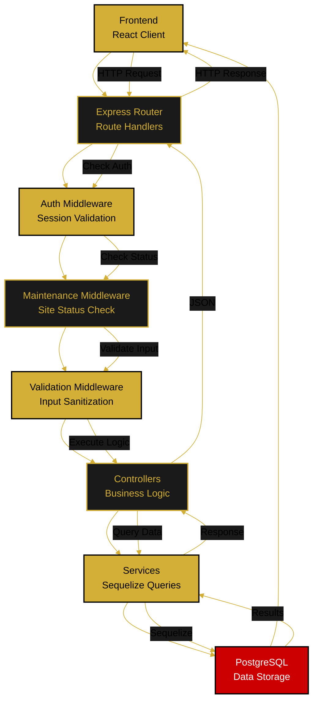

---

<!--
  ORBIS API Architecture & Specification
  
  Document Type: API Reference & Design
  Purpose: Complete REST API design, endpoints, contracts, and patterns
  Last Updated: January 4, 2026
  Version: 2.0 (Sequelize ORM)
-->

# 🔌 API Architecture & Design

Complete REST API specification for the Orbis backend, including endpoint documentation, request/response contracts, error handling, and design patterns.

---

## 📋 Overview

### API Characteristics
- **Type:** RESTful Web Service
- **Protocol:** HTTP/HTTPS
- **Base URL:** `http://localhost:3000/api` (dev) / `https://api.orbis.com` (prod)
- **Authentication:** Session-based with httpOnly cookies
- **Content-Type:** application/json
- **CORS:** Enabled for frontend origin

### Design Principles
1. **Stateless Requests** - Each request contains all needed context
2. **Meaningful HTTP Verbs** - GET, POST, PATCH, DELETE used correctly
3. **Consistent Response Format** - All responses follow same structure
4. **Error Standardization** - Consistent error response format
5. **Versioning** - Currently v1 (potential for v2, v3 in future)

---

## 📤 Response Format

### Success Response
```json
{
  "success": true,
  "status": 200,
  "data": { /* endpoint specific */ },
  "message": "Optional success message"
}
```

### Error Response
```json
{
  "success": false,
  "status": 400,
  "message": "Description of what went wrong",
  "errors": [ /* validation errors if applicable */ ]
}
```

### Status Codes
- **200 OK** - Request successful
- **201 Created** - Resource created
- **204 No Content** - Successful with no return data
- **400 Bad Request** - Invalid input
- **401 Unauthorized** - Not authenticated
- **403 Forbidden** - Not authorized
- **404 Not Found** - Resource doesn't exist
- **409 Conflict** - Resource conflict (duplicate email)
- **500 Internal Server Error** - Server error
- **503 Service Unavailable** - Maintenance

---

## 🔐 Authentication Endpoints

### Register (Create Account)
```
POST /api/auth/register

Request Body:
{
  "email": "user@example.com",
  "password": "SecurePass123!",
  "firstName": "John",
  "lastName": "Doe"
}

Response (201 Created):
{
  "success": true,
  "data": {
    "id": "uuid",
    "email": "user@example.com",
    "firstName": "John",
    "lastName": "Doe",
    "nickname": null,
    "avatar_url": null,
    "role": "user",
    "created_at": "2025-12-29T10:00:00Z"
  }
}

Error Cases:
- 400: Email already exists
- 400: Password too weak
- 400: Missing required fields
```

### Login (Authenticate)
```
POST /api/auth/login

Request Body:
{
  "email": "user@example.com",
  "password": "SecurePass123!"
}

Response (200 OK):
{
  "success": true,
  "data": {
    "id": "uuid",
    "email": "user@example.com",
    "firstName": "John",
    "lastName": "Doe",
    "role": "user",
    "avatar_url": "https://..."
  },
  "message": "Login successful"
}

Headers Set:
- Set-Cookie: sessionId=...; HttpOnly; Secure; SameSite=Strict

Error Cases:
- 401: Invalid email or password
- 429: Too many login attempts
```

### Logout (End Session)
```
DELETE /api/auth/logout

Request: No body required
Authentication: Required (session cookie)

Response (200 OK):
{
  "success": true,
  "message": "Logged out successfully"
}

Cookies Cleared:
- sessionId removed
```

### Get Session
```
GET /api/auth/session

Request: No body
Authentication: Required (session cookie)

Response (200 OK):
{
  "success": true,
  "data": {
    "isAuthenticated": true,
    "user": {
      "id": "uuid",
      "email": "user@example.com",
      "role": "user",
      "firstName": "John"
    }
  }
}

Response if Not Authenticated (401):
{
  "success": false,
  "status": 401,
  "data": { "isAuthenticated": false },
  "message": "No active session"
}
```

---

## 👤 Profile Endpoints

### Get Profile
```
GET /api/profile

Authentication: Required
Role: User

Response (200 OK):
{
  "success": true,
  "data": {
    "id": "uuid",
    "email": "user@example.com",
    "firstName": "John",
    "lastName": "Doe",
    "nickname": "Johnny",
    "avatar_url": "https://...",
    "created_at": "2025-12-29T10:00:00Z",
    "personal": {
      "firstName": "John",
      "lastName": "Doe",
      "email": "user@example.com"
    },
    "address": {
      "street": "123 Main St",
      "apartment": "Apt 4B",
      "city": "New York",
      "state": "NY",
      "zip": "10001",
      "country": "USA"
    }
  }
}
```

### Update Personal Info
```
PATCH /api/profile/personal

Authentication: Required
Request Body:
{
  "firstName": "John",
  "lastName": "Doe",
  "nickname": "Johnny"
}

Response (200 OK):
{
  "success": true,
  "data": {
    "firstName": "John",
    "lastName": "Doe",
    "nickname": "Johnny"
  }
}

Error Cases:
- 400: Duplicate email
- 400: Invalid data
```

### Update Address
```
PATCH /api/profile/address

Authentication: Required
Request Body:
{
  "street": "123 Main St",
  "apartment": "Apt 4B",
  "city": "New York",
  "state": "NY",
  "zip": "10001",
  "country": "USA"
}

Response (200 OK):
{
  "success": true,
  "data": { /* updated address */ }
}
```

### Upload Avatar
```
POST /api/profile/avatar

Authentication: Required
Content-Type: multipart/form-data
Body: File (max 5MB, image only)

Response (201 Created):
{
  "success": true,
  "data": {
    "avatar_url": "https://..."
  }
}

Error Cases:
- 400: Invalid file type
- 413: File too large
```

### Delete Avatar
```
DELETE /api/profile/avatar

Authentication: Required

Response (200 OK):
{
  "success": true,
  "message": "Avatar deleted"
}
```

### Change Password
```
POST /api/profile/password

Authentication: Required
Request Body:
{
  "currentPassword": "OldPass123!",
  "newPassword": "NewPass456!"
}

Response (200 OK):
{
  "success": true,
  "message": "Password changed successfully"
}

Error Cases:
- 400: Current password incorrect
- 400: New password too weak
- 400: New password same as old
```

---

## 🛍️ Product Endpoints

### List Products
```
GET /api/products?category=electronics&sort=price&order=asc&page=1&limit=20

Query Parameters:
- category (optional): Filter by category
- sort (optional): price, name, newest
- order (optional): asc, desc
- search (optional): Search term
- page (optional): Page number (default 1)
- limit (optional): Items per page (default 20)

Authentication: Not required

Response (200 OK):
{
  "success": true,
  "data": {
    "products": [
      {
        "id": "uuid",
        "name": "Product Name",
        "description": "Description",
        "price": 99.99,
        "inventory": 50,
        "category": "electronics",
        "image_url": "https://...",
        "created_at": "2025-12-29T10:00:00Z"
      }
    ],
    "pagination": {
      "page": 1,
      "limit": 20,
      "total": 150,
      "pages": 8
    }
  }
}
```

### Get Single Product
```
GET /api/products/:productId

Authentication: Not required

Response (200 OK):
{
  "success": true,
  "data": {
    "id": "uuid",
    "name": "Product Name",
    "description": "Full description",
    "price": 99.99,
    "inventory": 50,
    "category": "electronics",
    "image_url": "https://...",
    "inWishlist": false,
    "inCart": false
  }
}

Error Cases:
- 404: Product not found
```

### Get Categories
```
GET /api/products/categories

Authentication: Not required

Response (200 OK):
{
  "success": true,
  "data": [
    {
      "id": "uuid",
      "name": "Electronics",
      "count": 45
    },
    {
      "id": "uuid",
      "name": "Clothing",
      "count": 78
    }
  ]
}
```

### Search Products
```
GET /api/products/search?q=laptop&limit=10

Query Parameters:
- q (required): Search term
- limit (optional): Max results (default 10)

Authentication: Not required

Response (200 OK):
{
  "success": true,
  "data": [
    {
      "id": "uuid",
      "name": "Laptop Computer",
      "price": 999.99,
      "image_url": "https://..."
    }
  ]
}
```

---

## 🛒 Cart Endpoints

### Get Cart
```
GET /api/cart

Authentication: Required for registered users, optional for guests
Session: Required for guest cart

Response (200 OK):
{
  "success": true,
  "data": {
    "id": "uuid",
    "items": [
      {
        "id": "item-uuid",
        "product": {
          "id": "uuid",
          "name": "Product",
          "price": 99.99,
          "image_url": "https://..."
        },
        "quantity": 2,
        "subtotal": 199.98
      }
    ],
    "subtotal": 199.98,
    "tax": 15.99,
    "shipping": 9.99,
    "total": 225.96,
    "itemCount": 2
  }
}
```

### Add to Cart
```
POST /api/cart

Authentication: Optional
Request Body:
{
  "productId": "uuid",
  "quantity": 2
}

Response (201 Created):
{
  "success": true,
  "data": {
    "item": {
      "id": "item-uuid",
      "productId": "uuid",
      "quantity": 2
    },
    "cart": { /* updated cart */ }
  }
}

Error Cases:
- 404: Product not found
- 400: Quantity exceeds inventory
```

### Update Cart Item
```
PATCH /api/cart/:cartItemId

Authentication: Required
Request Body:
{
  "quantity": 5
}

Response (200 OK):
{
  "success": true,
  "data": { /* updated cart */ }
}

Error Cases:
- 404: Cart item not found
- 400: Quantity exceeds inventory
```

### Remove from Cart
```
DELETE /api/cart/:cartItemId

Authentication: Required

Response (200 OK):
{
  "success": true,
  "data": { /* updated cart */ }
}

Error Cases:
- 404: Cart item not found
```

### Clear Cart
```
DELETE /api/cart

Authentication: Required

Response (200 OK):
{
  "success": true,
  "message": "Cart cleared"
}
```

---

## 📦 Order Endpoints

### Create Order
```
POST /api/orders

Authentication: Required
Request Body:
{
  "shippingAddress": {
    "street": "123 Main St",
    "apartment": "Apt 4B",
    "city": "New York",
    "state": "NY",
    "zip": "10001"
  },
  "paymentMethod": "credit_card"
}

Response (201 Created):
{
  "success": true,
  "data": {
    "id": "order-uuid",
    "userId": "uuid",
    "items": [ /* from cart */ ],
    "total": 225.96,
    "status": "pending",
    "created_at": "2025-12-29T10:00:00Z"
  }
}

Error Cases:
- 400: Cart is empty
- 400: Invalid address
- 409: Payment failed
```

### Get Orders List
```
GET /api/orders?page=1&limit=10&status=all

Query Parameters:
- page (optional): Page number
- limit (optional): Items per page
- status (optional): pending, shipped, delivered, all

Authentication: Required

Response (200 OK):
{
  "success": true,
  "data": {
    "orders": [
      {
        "id": "order-uuid",
        "items": [ /* items */ ],
        "total": 225.96,
        "status": "shipped",
        "created_at": "2025-12-29T10:00:00Z"
      }
    ],
    "pagination": { /* pagination info */ }
  }
}
```

### Get Order Details
```
GET /api/orders/:orderId

Authentication: Required (user must own order)

Response (200 OK):
{
  "success": true,
  "data": {
    "id": "order-uuid",
    "user": {
      "id": "uuid",
      "email": "user@example.com"
    },
    "items": [ /* detailed items */ ],
    "shippingAddress": { /* address */ },
    "total": 225.96,
    "status": "shipped",
    "created_at": "2025-12-29T10:00:00Z"
  }
}
```

### Download Invoice
```
GET /api/orders/:orderId/invoice

Authentication: Required
Accept: application/pdf

Response: PDF file
```

---

## ❤️ Wishlist Endpoints

### Get Wishlist
```
GET /api/wishlist

Authentication: Required

Response (200 OK):
{
  "success": true,
  "data": {
    "id": "wishlist-uuid",
    "items": [
      {
        "id": "uuid",
        "name": "Product",
        "price": 99.99,
        "image_url": "https://..."
      }
    ],
    "itemCount": 5
  }
}
```

### Add to Wishlist
```
POST /api/wishlist

Authentication: Required
Request Body:
{
  "productId": "uuid"
}

Response (201 Created):
{
  "success": true,
  "data": { /* updated wishlist */ }
}

Error Cases:
- 404: Product not found
- 409: Already in wishlist
```

### Remove from Wishlist
```
DELETE /api/wishlist/:productId

Authentication: Required

Response (200 OK):
{
  "success": true,
  "data": { /* updated wishlist */ }
}
```

---

## 👨‍💼 Admin Endpoints

### User Management

#### Get All Users
```
GET /api/admin/users?page=1&limit=20&role=user&country=New%20Zealand

Authentication: Required
Authorization: Admin role required

Query Parameters:
- page (optional): Page number
- limit (optional): Items per page
- role (optional): Filter by role
- country (optional): Filter by country

Response (200 OK):
{
  "success": true,
  "data": {
    "users": [ /* user list with country field */ ],
    "pagination": { /* info */ }
  }
}
```

#### Update User
```
PATCH /api/admin/users/:userId

Authentication: Required
Authorization: Admin role required

Request Body:
{
  "role": "user",
  "status": "active"
}

Response (200 OK):
{
  "success": true,
  "data": { /* updated user */ }
}
```

#### Delete User
```
DELETE /api/admin/users/:userId

Authentication: Required
Authorization: Admin role required

Response (200 OK):
{
  "success": true,
  "message": "User deleted"
}
```

### Dashboard Statistics

#### Get Dashboard Stats
```
GET /api/admin/stats

Authentication: Required
Authorization: Admin role required

Response (200 OK):
{
  "success": true,
  "data": {
    "totalUsers": 150,
    "activeUsers": 145,
    "totalOrders": 450,
    "totalRevenue": 45000.00,
    "averageOrderValue": 100.00,
    "totalProducts": 200,
    "totalReviews": 320,
    "pendingReviews": 15
  }
}
```

---

## 📦 Admin Order Endpoints ✨

### Get All Orders
```
GET /api/admin/orders?page=1&limit=20&status=pending&paymentStatus=completed

Authentication: Required
Authorization: Admin role required

Query Parameters:
- page: Page number (default: 1)
- limit: Items per page (default: 20)
- status: Filter by order status (pending, processing, shipped, delivered, cancelled)
- paymentStatus: Filter by payment status (pending, completed, failed, refunded)
- sortBy: Sort field (created_at, total, status)
- sortOrder: Sort direction (asc, desc)

Response (200 OK):
{
  "success": true,
  "data": {
    "orders": [
      {
        "order_id": "uuid",
        "user_id": "uuid",
        "customer": {
          "email": "user@example.com",
          "first_name": "John",
          "last_name": "Doe",
          "country": "New Zealand"
        },
        "total": 299.99,
        "status": "pending",
        "payment_status": "completed",
        "shipping_address": { /* address object */ },
        "created_at": "2026-01-04T10:00:00Z",
        "items_count": 3
      }
    ],
    "pagination": { "page": 1, "limit": 20, "total": 150, "totalPages": 8 }
  }
}
```

### Get Order Details
```
GET /api/admin/orders/:orderId

Authentication: Required
Authorization: Admin role required

Response (200 OK):
{
  "success": true,
  "data": {
    "order_id": "uuid",
    "user_id": "uuid",
    "customer": { /* customer details */ },
    "items": [
      {
        "product_id": "uuid",
        "name": "Product Name",
        "quantity": 2,
        "price": 99.99,
        "image_url": "https://..."
      }
    ],
    "subtotal": 199.98,
    "freight_cost": 15.00,
    "total": 214.98,
    "status": "processing",
    "payment_status": "completed",
    "shipping_address": { /* full address */ },
    "created_at": "2026-01-04T10:00:00Z"
  }
}
```

### Update Order Status
```
PUT /api/admin/orders/:orderId/status

Authentication: Required
Authorization: Admin role required

Request Body:
{
  "status": "shipped"
}

Valid Status Values:
- pending
- processing
- shipped
- delivered
- cancelled

Response (200 OK):
{
  "success": true,
  "data": { /* updated order */ },
  "message": "Order status updated"
}
```

### Update Payment Status
```
PUT /api/admin/orders/:orderId/payment

Authentication: Required
Authorization: Admin role required

Request Body:
{
  "payment_status": "completed"
}

Valid Payment Status Values:
- pending
- completed
- failed
- refunded

Response (200 OK):
{
  "success": true,
  "data": { /* updated order */ },
  "message": "Payment status updated"
}
```

### Delete Order
```
DELETE /api/admin/orders/:orderId

Authentication: Required
Authorization: Admin role required

Response (200 OK):
{
  "success": true,
  "message": "Order deleted successfully"
}
```

---

## ⭐ Admin Review Endpoints ✨

### Get All Reviews
```
GET /api/admin/reviews?page=1&limit=20&status=pending&rating=5

Authentication: Required
Authorization: Admin role required

Query Parameters:
- page: Page number
- limit: Items per page
- status: Filter by approval status (pending, approved)
- rating: Filter by rating (1-5)
- sortBy: Sort field (created_at, rating)
- sortOrder: Sort direction (asc, desc)

Response (200 OK):
{
  "success": true,
  "data": {
    "reviews": [
      {
        "review_id": "uuid",
        "product_id": "uuid",
        "user_id": "uuid",
        "product": { "name": "Product Name", "sku": "SKU001" },
        "user": { 
          "email": "user@example.com", 
          "first_name": "John",
          "avatar_url": "https://..."
        },
        "rating": 5,
        "title": "Great product!",
        "content": "I love this...",
        "is_approved": false,
        "created_at": "2026-01-04T10:00:00Z"
      }
    ],
    "pagination": { /* ... */ }
  }
}
```

### Update Review
```
PUT /api/admin/reviews/:reviewId

Authentication: Required
Authorization: Admin role required

Request Body:
{
  "title": "Updated Title",
  "content": "Updated content",
  "rating": 4
}

Response (200 OK):
{
  "success": true,
  "data": { /* updated review */ }
}
```

### Approve Review
```
PATCH /api/admin/reviews/:reviewId/approve

Authentication: Required
Authorization: Admin role required

Response (200 OK):
{
  "success": true,
  "data": { /* review with is_approved: true */ },
  "message": "Review approved"
}
```

### Delete Review
```
DELETE /api/admin/reviews/:reviewId

Authentication: Required
Authorization: Admin role required

Response (200 OK):
{
  "success": true,
  "message": "Review deleted"
}
```

### Get Product Rating Breakdown
```
GET /api/admin/reviews/product/:productId/breakdown

Authentication: Required
Authorization: Admin role required

Response (200 OK):
{
  "success": true,
  "data": {
    "product_id": "uuid",
    "average_rating": 4.2,
    "total_reviews": 50,
    "breakdown": {
      "5": 25,
      "4": 15,
      "3": 5,
      "2": 3,
      "1": 2
    }
  }
}
```

---

## 💝 Admin Wishlist Endpoints ✨

### Get Wishlist Statistics
```
GET /api/admin/wishlists/stats

Authentication: Required
Authorization: Admin role required

Response (200 OK):
{
  "success": true,
  "data": {
    "total_wishlisted_products": 150,
    "total_wishlist_items": 500,
    "most_wishlisted_product": { /* product summary */ }
  }
}
```

### Get Products with Wishlist Counts
```
GET /api/admin/wishlists/products?page=1&limit=20&sortBy=wishlist_count

Authentication: Required
Authorization: Admin role required

Response (200 OK):
{
  "success": true,
  "data": {
    "products": [
      {
        "product_id": "uuid",
        "name": "Popular Product",
        "sku": "SKU001",
        "price": 99.99,
        "wishlist_count": 45,
        "image_url": "https://..."
      }
    ],
    "pagination": { /* ... */ }
  }
}
```

### Get Users Who Wishlisted Product
```
GET /api/admin/wishlists/:productId/users

Authentication: Required
Authorization: Admin role required

Response (200 OK):
{
  "success": true,
  "data": {
    "product_id": "uuid",
    "product_name": "Product Name",
    "users": [
      {
        "user_id": "uuid",
        "email": "user@example.com",
        "first_name": "John",
        "last_name": "Doe",
        "country": "New Zealand",
        "added_at": "2026-01-04T10:00:00Z"
      }
    ]
  }
}
```

### Remove Wishlist Item
```
DELETE /api/admin/wishlists/:productId/users/:userId

Authentication: Required
Authorization: Admin role required

Response (200 OK):
{
  "success": true,
  "message": "Wishlist item removed"
}
```

---

## ⚙️ Admin Settings Endpoints ✨

### Get All Settings
```
GET /api/admin/settings

Authentication: Required
Authorization: Admin role required

Response (200 OK):
{
  "success": true,
  "data": {
    "settings": [
      {
        "key": "maintenance_mode",
        "value": "off",
        "category": "site",
        "updated_at": "2026-01-04T10:00:00Z"
      },
      {
        "key": "maintenance_message",
        "value": "Site is under maintenance",
        "category": "site"
      }
    ]
  }
}
```

### Get Single Setting
```
GET /api/admin/settings/:key

Authentication: Required
Authorization: Admin role required

Response (200 OK):
{
  "success": true,
  "data": {
    "key": "maintenance_mode",
    "value": "off"
  }
}
```

### Update Setting
```
PUT /api/admin/settings/:key

Authentication: Required
Authorization: Admin role required

Request Body:
{
  "value": "shop-only"
}

Response (200 OK):
{
  "success": true,
  "data": { /* updated setting */ }
}
```

### Set Maintenance Mode
```
PUT /api/admin/settings/maintenance

Authentication: Required
Authorization: Admin role required

Request Body:
{
  "mode": "shop-only",
  "message": "Shop is temporarily closed for inventory"
}

Valid Maintenance Modes:
- off: Site fully operational
- site-wide: Entire site in maintenance
- shop-only: Only shop pages blocked
- registration-only: Only registration blocked

Response (200 OK):
{
  "success": true,
  "data": {
    "maintenance_mode": "shop-only",
    "maintenance_message": "Shop is temporarily closed..."
  }
}
```

### Public: Check Maintenance Status
```
GET /api/settings/maintenance

Authentication: Not required

Response (200 OK):
{
  "success": true,
  "data": {
    "maintenance_mode": "off",
    "is_in_maintenance": false,
    "message": null
  }
}
```

---

## 🚚 Freight Configuration Endpoints ✨

### Get Freight Configuration (Admin)
```
GET /api/admin/freight

Authentication: Required
Authorization: Admin role required

Response (200 OK):
{
  "success": true,
  "data": {
    "zones": [
      {
        "zone_id": 1,
        "zone_name": "Local",
        "base_rate": 5.00,
        "per_kg_rate": 0.50,
        "free_threshold": 50.00
      },
      {
        "zone_id": 2,
        "zone_name": "North Island",
        "base_rate": 8.00,
        "per_kg_rate": 1.00,
        "free_threshold": 100.00
      }
      // ... all 8 zones
    ],
    "local_zone_city": "Tauranga"
  }
}
```

### Update Freight Configuration
```
PUT /api/admin/freight

Authentication: Required
Authorization: Admin role required

Request Body:
{
  "zones": [
    {
      "zone_id": 1,
      "base_rate": 6.00,
      "per_kg_rate": 0.75,
      "free_threshold": 75.00
    }
  ]
}

Response (200 OK):
{
  "success": true,
  "data": { /* updated config */ },
  "message": "Freight configuration updated"
}
```

### Get Local Zone City
```
GET /api/admin/freight/local-zone

Authentication: Required
Authorization: Admin role required

Response (200 OK):
{
  "success": true,
  "data": {
    "city": "Tauranga",
    "country": "New Zealand"
  }
}
```

### Update Local Zone City
```
PUT /api/admin/freight/local-zone

Authentication: Required
Authorization: Admin role required

Request Body:
{
  "city": "Auckland"
}

Response (200 OK):
{
  "success": true,
  "data": { "city": "Auckland" },
  "message": "Local zone updated"
}
```

### Get Available Cities for Local Zone
```
GET /api/admin/freight/available-cities

Authentication: Required
Authorization: Admin role required

Response (200 OK):
{
  "success": true,
  "data": {
    "cities": [
      "Auckland", "Wellington", "Christchurch", "Hamilton", 
      "Tauranga", "Dunedin", "Palmerston North", "Napier",
      "Nelson", "Rotorua", "New Plymouth", "Whangarei"
    ]
  }
}
```

### Public: Get Freight Zones
```
GET /api/freight/zones

Authentication: Not required

Response (200 OK):
{
  "success": true,
  "data": {
    "zones": [
      {
        "zone_name": "Local",
        "description": "Tauranga, New Zealand",
        "base_rate": 5.00,
        "free_threshold": 50.00
      }
      // ... public zone info
    ]
  }
}
```

### Public: Calculate Freight
```
POST /api/freight/calculate

Authentication: Not required (or Required for saved addresses)

Request Body:
{
  "city": "Auckland",
  "country": "New Zealand",
  "cart_total": 85.00,
  "cart_weight": 2.5
}

Response (200 OK):
{
  "success": true,
  "data": {
    "zone": "North Island",
    "base_rate": 8.00,
    "weight_charge": 2.50,
    "subtotal": 10.50,
    "free_threshold": 100.00,
    "qualifies_for_free": false,
    "final_freight_cost": 10.50
  }
}
```

---

## 🔄 Middleware & Interceptors

### Authentication Middleware
```javascript
// Validates session on every request
- Checks httpOnly cookie
- Validates session in database (Sequelize)
- Attaches user to request
- Returns 401 if invalid
```

### Authorization Middleware
```javascript
// Validates user role/permissions
- Checks user.role
- Verifies resource ownership
- Returns 403 if unauthorized
```

### Maintenance Middleware ✨
```javascript
// Checks site maintenance status
- Queries SiteSettings for maintenance_mode
- Blocks requests based on mode:
  - site-wide: blocks all
  - shop-only: blocks /shop, /cart, /checkout
  - registration-only: blocks /register
- Returns 503 with maintenance message
```

### Validation Middleware
```javascript
// Validates request data
- Uses express-validator
- Sanitizes inputs
- Returns 400 with errors
```

### Error Handler Middleware
```javascript
// Global error handling
- Catches all errors
- Returns standardized format
- Logs errors
- Returns appropriate status code
```

---

## 📊 API Architecture Diagram



---

## 🔗 Related Documentation

- **[System Architecture](./system-architecture.md)** - Complete system design
- **[User Roles & Permissions](./user-roles.md)** - Access control
- **[Authentication Flow](../flows/authentication-flow.md)** - Auth implementation
- **[Admin System](../quickstart/admin-system.md)** - Admin UI guide ✨
- **[Feature Development Guide](../FEATURE_DEVELOPMENT_GUIDE.md)** - Implementation patterns ✨

---

**Document Version:** 2.0  
**Last Updated:** January 4, 2026  
**Status:** ✅ Complete (Sequelize ORM)