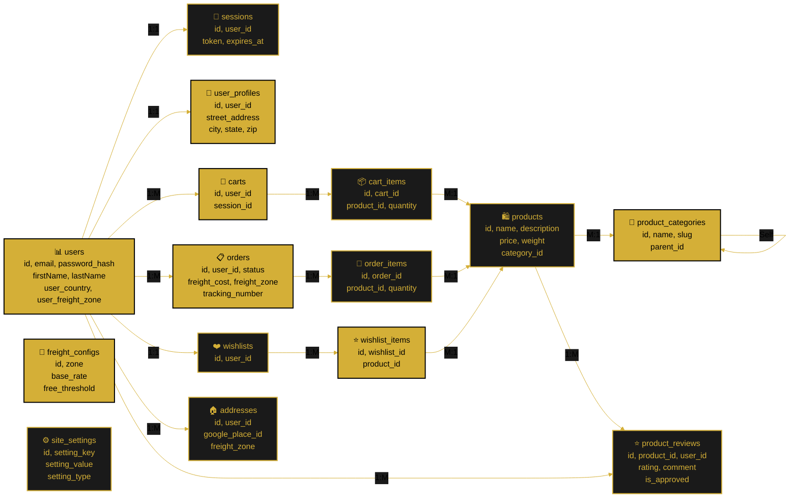

---

<!--
  ORBIS Database Schema Architecture
  
  Document Type: Database Design & Specifications
  Purpose: Complete database schema with Sequelize ORM models, relationships, and migrations
  Last Updated: January 4, 2026
  Version: 2.0 (Sequelize ORM Edition)
-->

# 💾 Database Schema & Architecture (Sequelize ORM)

Comprehensive documentation of the PostgreSQL database schema for the Orbis application, now powered by Sequelize ORM with model definitions, associations, and migration support.

---

## 📋 Overview

### Database System
- **Type:** PostgreSQL (Relational)
- **ORM:** Sequelize v6+ ✨
- **Version:** 12+
- **Port:** 5432
- **Connection:** Node.js with Sequelize
- **Config:** `/backend/src/config/sequelizeConfig.js`
- **Backup Strategy:** Daily snapshots

### Design Principles
1. **Normalization** - Reduce data redundancy
2. **Referential Integrity** - Sequelize associations
3. **Indexing** - Model-defined indexes
4. **Scalability** - Design for growth
5. **Data Consistency** - ACID compliance
6. **Code-First Models** - Sequelize model definitions ✨

---

## 📊 Database Diagram (Updated)



---

## 🏗️ Table Definitions

### users Table
**Purpose:** Store user account information

```sql
CREATE TABLE users (
  id UUID PRIMARY KEY DEFAULT gen_random_uuid(),
  email VARCHAR(255) UNIQUE NOT NULL,
  password_hash VARCHAR(255) NOT NULL,
  firstName VARCHAR(100) NOT NULL,
  lastName VARCHAR(100) NOT NULL,
  nickname VARCHAR(100),
  avatar_url TEXT,
  role VARCHAR(20) DEFAULT 'user', -- 'user' or 'admin'
  status VARCHAR(20) DEFAULT 'active', -- 'active' or 'inactive'
  created_at TIMESTAMP DEFAULT CURRENT_TIMESTAMP,
  updated_at TIMESTAMP DEFAULT CURRENT_TIMESTAMP,
  
  CONSTRAINT email_format CHECK (email ~* '^[A-Za-z0-9._%+-]+@[A-Za-z0-9.-]+\.[A-Z|a-z]{2,}$'),
  INDEX idx_email (email),
  INDEX idx_status (status)
);

-- Update timestamp trigger
CREATE OR REPLACE FUNCTION update_users_timestamp()
RETURNS TRIGGER AS $$
BEGIN
  NEW.updated_at = CURRENT_TIMESTAMP;
  RETURN NEW;
END;
$$ LANGUAGE plpgsql;

CREATE TRIGGER trigger_users_updated_at
BEFORE UPDATE ON users
FOR EACH ROW
EXECUTE FUNCTION update_users_timestamp();
```

**Columns:**
| Column | Type | Constraint | Purpose |
|--------|------|-----------|---------|
| id | UUID | PK | Unique user identifier |
| email | VARCHAR(255) | UNIQUE | User login email |
| password_hash | VARCHAR(255) | NOT NULL | bcrypt hashed password |
| firstName | VARCHAR(100) | NOT NULL | User first name |
| lastName | VARCHAR(100) | NOT NULL | User last name |
| nickname | VARCHAR(100) | | Display name |
| avatar_url | TEXT | | Profile picture URL |
| role | VARCHAR(20) | DEFAULT 'user' | user or admin |
| status | VARCHAR(20) | DEFAULT 'active' | Account status |
| created_at | TIMESTAMP | DEFAULT NOW | Account creation time |
| updated_at | TIMESTAMP | DEFAULT NOW | Last update time |

---

### sessions Table
**Purpose:** Store user login sessions

```sql
CREATE TABLE sessions (
  id UUID PRIMARY KEY DEFAULT gen_random_uuid(),
  user_id UUID NOT NULL REFERENCES users(id) ON DELETE CASCADE,
  token VARCHAR(255) UNIQUE NOT NULL,
  expires_at TIMESTAMP NOT NULL,
  created_at TIMESTAMP DEFAULT CURRENT_TIMESTAMP,
  
  INDEX idx_user_id (user_id),
  INDEX idx_token (token),
  INDEX idx_expires_at (expires_at)
);

-- Auto-delete expired sessions
CREATE OR REPLACE FUNCTION delete_expired_sessions()
RETURNS void AS $$
BEGIN
  DELETE FROM sessions WHERE expires_at < CURRENT_TIMESTAMP;
END;
$$ LANGUAGE plpgsql;

-- Run via cron job every hour
```

**Columns:**
| Column | Type | Constraint | Purpose |
|--------|------|-----------|---------|
| id | UUID | PK | Session identifier |
| user_id | UUID | FK | Reference to user |
| token | VARCHAR(255) | UNIQUE | Session token |
| expires_at | TIMESTAMP | | Session expiration time |
| created_at | TIMESTAMP | DEFAULT NOW | Session start time |

---

### user_profiles Table
**Purpose:** Store extended user profile information

```sql
CREATE TABLE user_profiles (
  id UUID PRIMARY KEY DEFAULT gen_random_uuid(),
  user_id UUID NOT NULL UNIQUE REFERENCES users(id) ON DELETE CASCADE,
  street_address VARCHAR(255),
  apartment VARCHAR(50),
  city VARCHAR(100),
  state VARCHAR(50),
  zip_code VARCHAR(10),
  country VARCHAR(100) DEFAULT 'USA',
  updated_at TIMESTAMP DEFAULT CURRENT_TIMESTAMP,
  
  INDEX idx_user_id (user_id)
);

CREATE TRIGGER trigger_user_profiles_updated_at
BEFORE UPDATE ON user_profiles
FOR EACH ROW
EXECUTE FUNCTION update_users_timestamp();
```

**Columns:**
| Column | Type | Constraint | Purpose |
|--------|------|-----------|---------|
| id | UUID | PK | Profile identifier |
| user_id | UUID | FK, UNIQUE | Reference to user |
| street_address | VARCHAR(255) | | Street address |
| apartment | VARCHAR(50) | | Apartment number |
| city | VARCHAR(100) | | City name |
| state | VARCHAR(50) | | State/Province |
| zip_code | VARCHAR(10) | | Postal code |
| country | VARCHAR(100) | DEFAULT 'USA' | Country |
| updated_at | TIMESTAMP | | Last update |

---

### products Table
**Purpose:** Store product catalog

```sql
CREATE TABLE products (
  id UUID PRIMARY KEY DEFAULT gen_random_uuid(),
  name VARCHAR(255) NOT NULL,
  description TEXT,
  price DECIMAL(10, 2) NOT NULL CHECK (price >= 0),
  inventory INT NOT NULL DEFAULT 0 CHECK (inventory >= 0),
  category VARCHAR(100),
  image_url TEXT,
  sku VARCHAR(50) UNIQUE,
  created_at TIMESTAMP DEFAULT CURRENT_TIMESTAMP,
  updated_at TIMESTAMP DEFAULT CURRENT_TIMESTAMP,
  
  INDEX idx_name (name),
  INDEX idx_category (category),
  INDEX idx_sku (sku)
);

CREATE TRIGGER trigger_products_updated_at
BEFORE UPDATE ON products
FOR EACH ROW
EXECUTE FUNCTION update_users_timestamp();
```

**Columns:**
| Column | Type | Constraint | Purpose |
|--------|------|-----------|---------|
| id | UUID | PK | Product identifier |
| name | VARCHAR(255) | NOT NULL | Product name |
| description | TEXT | | Product description |
| price | DECIMAL(10, 2) | NOT NULL | Product price |
| inventory | INT | DEFAULT 0 | Stock quantity |
| category | VARCHAR(100) | | Product category |
| image_url | TEXT | | Product image |
| sku | VARCHAR(50) | UNIQUE | Stock keeping unit |
| created_at | TIMESTAMP | DEFAULT NOW | Creation time |
| updated_at | TIMESTAMP | DEFAULT NOW | Update time |

---

### carts Table
**Purpose:** Store shopping cart information

```sql
CREATE TABLE carts (
  id UUID PRIMARY KEY DEFAULT gen_random_uuid(),
  user_id UUID REFERENCES users(id) ON DELETE CASCADE,
  session_id UUID, -- For guest carts
  created_at TIMESTAMP DEFAULT CURRENT_TIMESTAMP,
  updated_at TIMESTAMP DEFAULT CURRENT_TIMESTAMP,
  
  INDEX idx_user_id (user_id),
  INDEX idx_session_id (session_id),
  CONSTRAINT one_cart_per_user UNIQUE (user_id)
);

CREATE TRIGGER trigger_carts_updated_at
BEFORE UPDATE ON carts
FOR EACH ROW
EXECUTE FUNCTION update_users_timestamp();
```

**Columns:**
| Column | Type | Constraint | Purpose |
|--------|------|-----------|---------|
| id | UUID | PK | Cart identifier |
| user_id | UUID | FK | Reference to user |
| session_id | UUID | | Guest session ID |
| created_at | TIMESTAMP | DEFAULT NOW | Creation time |
| updated_at | TIMESTAMP | DEFAULT NOW | Update time |

---

### cart_items Table
**Purpose:** Store individual items in shopping carts

```sql
CREATE TABLE cart_items (
  id UUID PRIMARY KEY DEFAULT gen_random_uuid(),
  cart_id UUID NOT NULL REFERENCES carts(id) ON DELETE CASCADE,
  product_id UUID NOT NULL REFERENCES products(id) ON DELETE CASCADE,
  quantity INT NOT NULL CHECK (quantity > 0),
  created_at TIMESTAMP DEFAULT CURRENT_TIMESTAMP,
  
  INDEX idx_cart_id (cart_id),
  INDEX idx_product_id (product_id),
  UNIQUE (cart_id, product_id)
);
```

**Columns:**
| Column | Type | Constraint | Purpose |
|--------|------|-----------|---------|
| id | UUID | PK | Item identifier |
| cart_id | UUID | FK | Reference to cart |
| product_id | UUID | FK | Reference to product |
| quantity | INT | NOT NULL | Item quantity |
| created_at | TIMESTAMP | DEFAULT NOW | Creation time |

---

### orders Table
**Purpose:** Store customer orders

```sql
CREATE TABLE orders (
  id UUID PRIMARY KEY DEFAULT gen_random_uuid(),
  user_id UUID NOT NULL REFERENCES users(id) ON DELETE RESTRICT,
  status VARCHAR(50) DEFAULT 'pending', -- pending, shipped, delivered, cancelled
  subtotal DECIMAL(10, 2) NOT NULL,
  tax DECIMAL(10, 2) NOT NULL DEFAULT 0,
  shipping DECIMAL(10, 2) NOT NULL DEFAULT 0,
  total_amount DECIMAL(10, 2) NOT NULL,
  shipping_address JSONB, -- Complete address as JSON
  payment_method VARCHAR(50),
  notes TEXT,
  created_at TIMESTAMP DEFAULT CURRENT_TIMESTAMP,
  updated_at TIMESTAMP DEFAULT CURRENT_TIMESTAMP,
  
  INDEX idx_user_id (user_id),
  INDEX idx_status (status),
  INDEX idx_created_at (created_at)
);

CREATE TRIGGER trigger_orders_updated_at
BEFORE UPDATE ON orders
FOR EACH ROW
EXECUTE FUNCTION update_users_timestamp();
```

**Columns:**
| Column | Type | Constraint | Purpose |
|--------|------|-----------|---------|
| id | UUID | PK | Order identifier |
| user_id | UUID | FK | Reference to user |
| status | VARCHAR(50) | DEFAULT 'pending' | Order status |
| subtotal | DECIMAL(10, 2) | NOT NULL | Items subtotal |
| tax | DECIMAL(10, 2) | DEFAULT 0 | Tax amount |
| shipping | DECIMAL(10, 2) | DEFAULT 0 | Shipping cost |
| total_amount | DECIMAL(10, 2) | NOT NULL | Total price |
| shipping_address | JSONB | | Address as JSON |
| payment_method | VARCHAR(50) | | Payment method |
| notes | TEXT | | Order notes |
| created_at | TIMESTAMP | DEFAULT NOW | Creation time |
| updated_at | TIMESTAMP | DEFAULT NOW | Update time |

---

### order_items Table
**Purpose:** Store items in orders

```sql
CREATE TABLE order_items (
  id UUID PRIMARY KEY DEFAULT gen_random_uuid(),
  order_id UUID NOT NULL REFERENCES orders(id) ON DELETE CASCADE,
  product_id UUID NOT NULL REFERENCES products(id),
  product_name VARCHAR(255) NOT NULL, -- Denormalized for historical accuracy
  product_price DECIMAL(10, 2) NOT NULL,
  quantity INT NOT NULL CHECK (quantity > 0),
  created_at TIMESTAMP DEFAULT CURRENT_TIMESTAMP,
  
  INDEX idx_order_id (order_id),
  INDEX idx_product_id (product_id)
);
```

**Columns:**
| Column | Type | Constraint | Purpose |
|--------|------|-----------|---------|
| id | UUID | PK | Item identifier |
| order_id | UUID | FK | Reference to order |
| product_id | UUID | FK | Reference to product |
| product_name | VARCHAR(255) | NOT NULL | Product name (snapshot) |
| product_price | DECIMAL(10, 2) | NOT NULL | Product price (snapshot) |
| quantity | INT | NOT NULL | Item quantity |
| created_at | TIMESTAMP | DEFAULT NOW | Creation time |

---

### wishlists Table
**Purpose:** Store user wishlist collections

```sql
CREATE TABLE wishlists (
  id UUID PRIMARY KEY DEFAULT gen_random_uuid(),
  user_id UUID NOT NULL UNIQUE REFERENCES users(id) ON DELETE CASCADE,
  created_at TIMESTAMP DEFAULT CURRENT_TIMESTAMP,
  
  INDEX idx_user_id (user_id)
);
```

**Columns:**
| Column | Type | Constraint | Purpose |
|--------|------|-----------|---------|
| id | UUID | PK | Wishlist identifier |
| user_id | UUID | FK, UNIQUE | Reference to user |
| created_at | TIMESTAMP | DEFAULT NOW | Creation time |

---

### wishlist_items Table
**Purpose:** Store individual wishlist items

```sql
CREATE TABLE wishlist_items (
  id UUID PRIMARY KEY DEFAULT gen_random_uuid(),
  wishlist_id UUID NOT NULL REFERENCES wishlists(id) ON DELETE CASCADE,
  product_id UUID NOT NULL REFERENCES products(id) ON DELETE CASCADE,
  created_at TIMESTAMP DEFAULT CURRENT_TIMESTAMP,
  
  INDEX idx_wishlist_id (wishlist_id),
  INDEX idx_product_id (product_id),
  UNIQUE (wishlist_id, product_id)
);
```

**Columns:**
| Column | Type | Constraint | Purpose |
|--------|------|-----------|---------|
| id | UUID | PK | Item identifier |
| wishlist_id | UUID | FK | Reference to wishlist |
| product_id | UUID | FK | Reference to product |
| created_at | TIMESTAMP | DEFAULT NOW | Creation time |

---

### product_categories Table ✨
**Purpose:** Store product category hierarchy

```sql
CREATE TABLE product_categories (
  id UUID PRIMARY KEY DEFAULT gen_random_uuid(),
  name VARCHAR(100) NOT NULL UNIQUE,
  description TEXT,
  slug VARCHAR(100) NOT NULL UNIQUE,
  parent_id UUID REFERENCES product_categories(id) ON DELETE SET NULL,
  is_active BOOLEAN DEFAULT true,
  created_at TIMESTAMP DEFAULT CURRENT_TIMESTAMP,
  updated_at TIMESTAMP DEFAULT CURRENT_TIMESTAMP,
  
  INDEX idx_slug (slug),
  INDEX idx_parent_id (parent_id)
);
```

**Sequelize Model:**
```javascript
// /backend/src/models/ProductCategory.js
const ProductCategory = sequelize.define('ProductCategory', {
  id: { type: DataTypes.UUID, defaultValue: DataTypes.UUIDV4, primaryKey: true },
  name: { type: DataTypes.STRING(100), allowNull: false, unique: true },
  description: { type: DataTypes.TEXT },
  slug: { type: DataTypes.STRING(100), allowNull: false, unique: true },
  parent_id: { type: DataTypes.UUID, references: { model: 'product_categories', key: 'id' } },
  is_active: { type: DataTypes.BOOLEAN, defaultValue: true }
}, { tableName: 'product_categories', timestamps: true, underscored: true });

// Self-referencing association
ProductCategory.belongsTo(ProductCategory, { as: 'parent', foreignKey: 'parent_id' });
ProductCategory.hasMany(ProductCategory, { as: 'children', foreignKey: 'parent_id' });
```

---

### product_reviews Table ✨
**Purpose:** Store customer product reviews

```sql
CREATE TABLE product_reviews (
  id UUID PRIMARY KEY DEFAULT gen_random_uuid(),
  product_id UUID NOT NULL REFERENCES products(id) ON DELETE CASCADE,
  user_id UUID NOT NULL REFERENCES users(id) ON DELETE CASCADE,
  rating INT NOT NULL CHECK (rating >= 1 AND rating <= 5),
  title VARCHAR(200),
  comment TEXT,
  is_approved BOOLEAN DEFAULT false,
  admin_response TEXT,
  created_at TIMESTAMP DEFAULT CURRENT_TIMESTAMP,
  updated_at TIMESTAMP DEFAULT CURRENT_TIMESTAMP,
  
  INDEX idx_product_id (product_id),
  INDEX idx_user_id (user_id),
  INDEX idx_is_approved (is_approved),
  UNIQUE (product_id, user_id)
);
```

**Sequelize Model:**
```javascript
// /backend/src/models/ProductReview.js
const ProductReview = sequelize.define('ProductReview', {
  id: { type: DataTypes.UUID, defaultValue: DataTypes.UUIDV4, primaryKey: true },
  product_id: { type: DataTypes.UUID, allowNull: false },
  user_id: { type: DataTypes.UUID, allowNull: false },
  rating: { type: DataTypes.INTEGER, allowNull: false, validate: { min: 1, max: 5 } },
  title: { type: DataTypes.STRING(200) },
  comment: { type: DataTypes.TEXT },
  is_approved: { type: DataTypes.BOOLEAN, defaultValue: false },
  admin_response: { type: DataTypes.TEXT }
}, { tableName: 'product_reviews', timestamps: true, underscored: true });

ProductReview.belongsTo(Product, { foreignKey: 'product_id' });
ProductReview.belongsTo(User, { foreignKey: 'user_id' });
```

---

### addresses Table ✨
**Purpose:** Store user addresses with Google Places integration

```sql
CREATE TABLE addresses (
  id UUID PRIMARY KEY DEFAULT gen_random_uuid(),
  user_id UUID NOT NULL REFERENCES users(id) ON DELETE CASCADE,
  address_line_1 VARCHAR(255) NOT NULL,
  address_line_2 VARCHAR(255),
  city VARCHAR(100) NOT NULL,
  state VARCHAR(100),
  postal_code VARCHAR(20),
  country VARCHAR(100) NOT NULL DEFAULT 'New Zealand',
  google_place_id VARCHAR(255),
  formatted_address TEXT,
  latitude DECIMAL(10, 8),
  longitude DECIMAL(11, 8),
  freight_zone VARCHAR(50),
  is_default BOOLEAN DEFAULT false,
  created_at TIMESTAMP DEFAULT CURRENT_TIMESTAMP,
  updated_at TIMESTAMP DEFAULT CURRENT_TIMESTAMP,
  
  INDEX idx_user_id (user_id),
  INDEX idx_google_place_id (google_place_id),
  INDEX idx_freight_zone (freight_zone)
);
```

**Sequelize Model:**
```javascript
// /backend/src/models/Address.js
const Address = sequelize.define('Address', {
  id: { type: DataTypes.UUID, defaultValue: DataTypes.UUIDV4, primaryKey: true },
  user_id: { type: DataTypes.UUID, allowNull: false },
  address_line_1: { type: DataTypes.STRING(255), allowNull: false },
  address_line_2: { type: DataTypes.STRING(255) },
  city: { type: DataTypes.STRING(100), allowNull: false },
  state: { type: DataTypes.STRING(100) },
  postal_code: { type: DataTypes.STRING(20) },
  country: { type: DataTypes.STRING(100), allowNull: false, defaultValue: 'New Zealand' },
  google_place_id: { type: DataTypes.STRING(255) },
  formatted_address: { type: DataTypes.TEXT },
  latitude: { type: DataTypes.DECIMAL(10, 8) },
  longitude: { type: DataTypes.DECIMAL(11, 8) },
  freight_zone: { type: DataTypes.STRING(50) },
  is_default: { type: DataTypes.BOOLEAN, defaultValue: false }
}, { tableName: 'addresses', timestamps: true, underscored: true });

Address.belongsTo(User, { foreignKey: 'user_id' });
```

---

### freight_configs Table ✨
**Purpose:** Store zone-based freight configuration

```sql
CREATE TABLE freight_configs (
  id UUID PRIMARY KEY DEFAULT gen_random_uuid(),
  zone VARCHAR(50) NOT NULL UNIQUE,
  zone_name VARCHAR(100) NOT NULL,
  base_rate DECIMAL(10, 2) NOT NULL DEFAULT 0,
  per_kg_rate DECIMAL(10, 2) NOT NULL DEFAULT 0,
  free_threshold DECIMAL(10, 2) NOT NULL DEFAULT 0,
  weight_threshold DECIMAL(10, 2) DEFAULT 10,
  is_active BOOLEAN DEFAULT true,
  created_at TIMESTAMP DEFAULT CURRENT_TIMESTAMP,
  updated_at TIMESTAMP DEFAULT CURRENT_TIMESTAMP,
  
  INDEX idx_zone (zone),
  INDEX idx_is_active (is_active)
);

-- Default zone configurations
INSERT INTO freight_configs (zone, zone_name, base_rate, free_threshold) VALUES
  ('local', 'Tauranga/Mount Maunganui', 5.00, 50.00),
  ('north_island', 'North Island NZ', 12.00, 150.00),
  ('south_island', 'South Island NZ', 15.00, 150.00),
  ('intl_north_america', 'USA & Canada', 40.00, 350.00),
  ('intl_asia', 'Asia Pacific', 35.00, 300.00),
  ('intl_europe', 'Europe', 45.00, 350.00),
  ('intl_latin_america', 'Latin America', 50.00, 400.00),
  ('intl_africa', 'Africa', 55.00, 400.00);
```

**Sequelize Model:**
```javascript
// /backend/src/models/FreightConfig.js
const FreightConfig = sequelize.define('FreightConfig', {
  id: { type: DataTypes.UUID, defaultValue: DataTypes.UUIDV4, primaryKey: true },
  zone: { type: DataTypes.STRING(50), allowNull: false, unique: true },
  zone_name: { type: DataTypes.STRING(100), allowNull: false },
  base_rate: { type: DataTypes.DECIMAL(10, 2), allowNull: false, defaultValue: 0 },
  per_kg_rate: { type: DataTypes.DECIMAL(10, 2), allowNull: false, defaultValue: 0 },
  free_threshold: { type: DataTypes.DECIMAL(10, 2), allowNull: false, defaultValue: 0 },
  weight_threshold: { type: DataTypes.DECIMAL(10, 2), defaultValue: 10 },
  is_active: { type: DataTypes.BOOLEAN, defaultValue: true }
}, { tableName: 'freight_configs', timestamps: true, underscored: true });
```

**Zone Types:**
| Zone | Description | Base Rate | Free Threshold |
|------|-------------|-----------|----------------|
| `local` | Tauranga/Mount Maunganui | $5.00 | $50 |
| `north_island` | North Island NZ | $12.00 | $150 |
| `south_island` | South Island NZ | $15.00 | $150 |
| `intl_north_america` | USA & Canada | $40.00 | $350 |
| `intl_asia` | Asia Pacific | $35.00 | $300 |
| `intl_europe` | Europe | $45.00 | $350 |
| `intl_latin_america` | Latin America | $50.00 | $400 |
| `intl_africa` | Africa | $55.00 | $400 |

---

### site_settings Table ✨
**Purpose:** Store application-wide settings

```sql
CREATE TABLE site_settings (
  id UUID PRIMARY KEY DEFAULT gen_random_uuid(),
  setting_key VARCHAR(100) NOT NULL UNIQUE,
  setting_value JSONB,
  setting_type VARCHAR(20) NOT NULL DEFAULT 'string',
  description TEXT,
  is_editable BOOLEAN DEFAULT true,
  created_at TIMESTAMP DEFAULT CURRENT_TIMESTAMP,
  updated_at TIMESTAMP DEFAULT CURRENT_TIMESTAMP,
  
  INDEX idx_setting_key (setting_key)
);

-- Default settings
INSERT INTO site_settings (setting_key, setting_value, setting_type, description) VALUES
  ('maintenance_mode', 'false', 'boolean', 'Enable site-wide maintenance mode'),
  ('site_name', '"Orbis"', 'string', 'Website name'),
  ('contact_email', '"contact@orbis.com"', 'string', 'Contact email address'),
  ('feature_reviews_enabled', 'true', 'boolean', 'Enable product reviews'),
  ('feature_wishlists_enabled', 'true', 'boolean', 'Enable wishlists'),
  ('max_cart_items', '50', 'number', 'Maximum items per cart');
```

**Sequelize Model:**
```javascript
// /backend/src/models/SiteSettings.js
const SiteSettings = sequelize.define('SiteSettings', {
  id: { type: DataTypes.UUID, defaultValue: DataTypes.UUIDV4, primaryKey: true },
  setting_key: { type: DataTypes.STRING(100), allowNull: false, unique: true },
  setting_value: { type: DataTypes.JSONB },
  setting_type: { 
    type: DataTypes.ENUM('string', 'number', 'boolean', 'json'), 
    allowNull: false, 
    defaultValue: 'string' 
  },
  description: { type: DataTypes.TEXT },
  is_editable: { type: DataTypes.BOOLEAN, defaultValue: true }
}, { tableName: 'site_settings', timestamps: true, underscored: true });
```

---

## 🔍 Common Queries

### User Authentication
```sql
-- Get user by email with profile
SELECT u.*, up.* FROM users u
LEFT JOIN user_profiles up ON u.id = up.user_id
WHERE u.email = $1 AND u.status = 'active';

-- Validate session
SELECT u.* FROM users u
JOIN sessions s ON u.id = s.user_id
WHERE s.token = $1 AND s.expires_at > CURRENT_TIMESTAMP;
```

### Cart Operations
```sql
-- Get user's cart with items
SELECT c.id, ci.id as item_id, p.id, p.name, p.price, ci.quantity,
       (p.price * ci.quantity) as subtotal
FROM carts c
JOIN cart_items ci ON c.id = ci.cart_id
JOIN products p ON ci.product_id = p.id
WHERE c.user_id = $1
ORDER BY ci.created_at DESC;

-- Add to cart (upsert)
INSERT INTO cart_items (cart_id, product_id, quantity)
VALUES ($1, $2, $3)
ON CONFLICT (cart_id, product_id)
DO UPDATE SET quantity = cart_items.quantity + $3;
```

### Orders
```sql
-- Get user's orders
SELECT o.id, o.status, o.total_amount, o.created_at,
       COUNT(oi.id) as item_count
FROM orders o
LEFT JOIN order_items oi ON o.id = oi.order_id
WHERE o.user_id = $1
GROUP BY o.id
ORDER BY o.created_at DESC
LIMIT $2 OFFSET $3;

-- Get order with items
SELECT o.*, oi.product_name, oi.product_price, oi.quantity
FROM orders o
JOIN order_items oi ON o.id = oi.order_id
WHERE o.id = $1 AND o.user_id = $2;
```

### Freight Calculation ✨
```javascript
// Sequelize query for freight calculation
const freightConfig = await FreightConfig.findOne({
  where: { zone, is_active: true }
});

// Calculate freight cost
const calculateFreight = (config, cartTotal, totalWeight) => {
  if (cartTotal >= config.free_threshold) {
    return { cost: 0, isFreeShipping: true };
  }
  
  let cost = parseFloat(config.base_rate);
  if (totalWeight > config.weight_threshold) {
    cost += (totalWeight - config.weight_threshold) * parseFloat(config.per_kg_rate);
  }
  
  return { cost, isFreeShipping: false };
};
```

### Product Reviews ✨
```javascript
// Get approved reviews with user info
const reviews = await ProductReview.findAll({
  where: { product_id, is_approved: true },
  include: [{ model: User, attributes: ['id', 'firstName', 'avatar_url'] }],
  order: [['created_at', 'DESC']]
});

// Calculate average rating
const avgRating = await ProductReview.findOne({
  where: { product_id, is_approved: true },
  attributes: [[sequelize.fn('AVG', sequelize.col('rating')), 'average']]
});
```

### Analytics ✨
```sql
-- Total sales by month
SELECT DATE_TRUNC('month', created_at) as month,
       COUNT(*) as order_count,
       SUM(total_amount) as total_revenue,
       AVG(total_amount) as average_order_value
FROM orders
WHERE status != 'cancelled'
GROUP BY DATE_TRUNC('month', created_at)
ORDER BY month DESC;

-- Top products
SELECT p.id, p.name, COUNT(oi.id) as times_ordered,
       SUM(oi.quantity) as total_quantity,
       SUM(oi.product_price * oi.quantity) as revenue
FROM products p
JOIN order_items oi ON p.id = oi.product_id
GROUP BY p.id
ORDER BY times_ordered DESC
LIMIT 10;

-- Review statistics by product
SELECT p.id, p.name,
       COUNT(pr.id) as review_count,
       AVG(pr.rating)::numeric(3,2) as avg_rating
FROM products p
LEFT JOIN product_reviews pr ON p.id = pr.product_id AND pr.is_approved = true
GROUP BY p.id
ORDER BY avg_rating DESC NULLS LAST;
```

---

## ⚙️ Sequelize Configuration ✨

### Connection Setup
```javascript
// /backend/src/config/sequelizeConfig.js
const { Sequelize } = require('sequelize');

const sequelize = new Sequelize(
  process.env.DB_NAME,
  process.env.DB_USER,
  process.env.DB_PASSWORD,
  {
    host: process.env.DB_HOST,
    port: process.env.DB_PORT,
    dialect: 'postgres',
    logging: process.env.NODE_ENV === 'development' ? console.log : false,
    pool: {
      max: 5,
      min: 0,
      acquire: 30000,
      idle: 10000
    },
    define: {
      timestamps: true,
      underscored: true,
      freezeTableName: true
    }
  }
);

module.exports = sequelize;
```

### Model Index & Associations
```javascript
// /backend/src/models/index.js
const sequelize = require('../config/sequelizeConfig');
const User = require('./User');
const Product = require('./Product');
const ProductCategory = require('./ProductCategory');
const ProductReview = require('./ProductReview');
const Cart = require('./Cart');
const CartItem = require('./CartItem');
const Order = require('./Order');
const OrderItem = require('./OrderItem');
const Wishlist = require('./Wishlist');
const Address = require('./Address');
const FreightConfig = require('./FreightConfig');
const SiteSettings = require('./SiteSettings');

// Define associations
User.hasOne(Cart);
User.hasMany(Order);
User.hasOne(Wishlist);
User.hasMany(Address);
User.hasMany(ProductReview);

Product.belongsTo(ProductCategory, { foreignKey: 'category_id' });
Product.hasMany(ProductReview);
Product.hasMany(CartItem);
Product.hasMany(OrderItem);

ProductCategory.hasMany(Product, { foreignKey: 'category_id' });
ProductCategory.belongsTo(ProductCategory, { as: 'parent', foreignKey: 'parent_id' });
ProductCategory.hasMany(ProductCategory, { as: 'children', foreignKey: 'parent_id' });

Cart.belongsTo(User);
Cart.hasMany(CartItem);
CartItem.belongsTo(Cart);
CartItem.belongsTo(Product);

Order.belongsTo(User);
Order.hasMany(OrderItem);
OrderItem.belongsTo(Order);
OrderItem.belongsTo(Product);

Wishlist.belongsTo(User);
Wishlist.belongsToMany(Product, { through: 'wishlist_items' });

Address.belongsTo(User);
ProductReview.belongsTo(Product);
ProductReview.belongsTo(User);

module.exports = {
  sequelize,
  User, Product, ProductCategory, ProductReview,
  Cart, CartItem, Order, OrderItem, Wishlist,
  Address, FreightConfig, SiteSettings
};
```

---

## ⚙️ Database Optimization

### Indexing Strategy
```sql
-- Primary queries to index
- Users lookup by email (frequently accessed)
- Sessions lookup by token (every request)
- Cart items by cart_id (cart operations)
- Orders by user_id (user's order history)
- Products by category (shop filtering)

-- Composite indexes for complex queries
CREATE INDEX idx_order_user_status ON orders(user_id, status);
CREATE INDEX idx_cart_items_cart ON cart_items(cart_id, product_id);
```

### Query Performance
```sql
-- Use EXPLAIN ANALYZE to check performance
EXPLAIN ANALYZE
SELECT * FROM products WHERE category = 'electronics'
ORDER BY name LIMIT 20;

-- Monitor slow queries
log_min_duration_statement = 1000 -- Log queries > 1 second
```

### Backup Strategy
```
- Daily full backups
- Hourly incremental backups
- 30-day retention
- Test restoration monthly
- Document recovery procedures
```

---

## 🔐 Database Security

### Connection Security
```javascript
// Use connection pooling
const pool = new Pool({
  user: process.env.DB_USER,
  password: process.env.DB_PASSWORD,
  host: process.env.DB_HOST,
  port: process.env.DB_PORT,
  database: process.env.DB_NAME,
  ssl: { rejectUnauthorized: false } // Production: use certificates
});
```

### Query Safety
```javascript
// Use parameterized queries to prevent SQL injection
const result = await pool.query(
  'SELECT * FROM users WHERE email = $1',
  [email]
);

// Never concatenate user input into queries
// Bad:  `SELECT * FROM users WHERE email = '${email}'`
// Good: `SELECT * FROM users WHERE email = $1`, [email]
```

### Data Protection
- Never store passwords in plain text (use bcrypt)
- Use HTTPS for all connections
- Implement role-based access control
- Audit sensitive operations
- Encrypt PII in sensitive fields

---

## 🔗 Related Documentation

- **[System Architecture](./system-architecture.md)** - Overall design
- **[API Architecture](./api-architecture.md)** - API endpoints
- **[User Roles & Permissions](./user-roles.md)** - Access control

---

**Document Version:** 2.0 (Sequelize ORM Edition)  
**Last Updated:** January 4, 2026  
**Status:** ✅ Complete