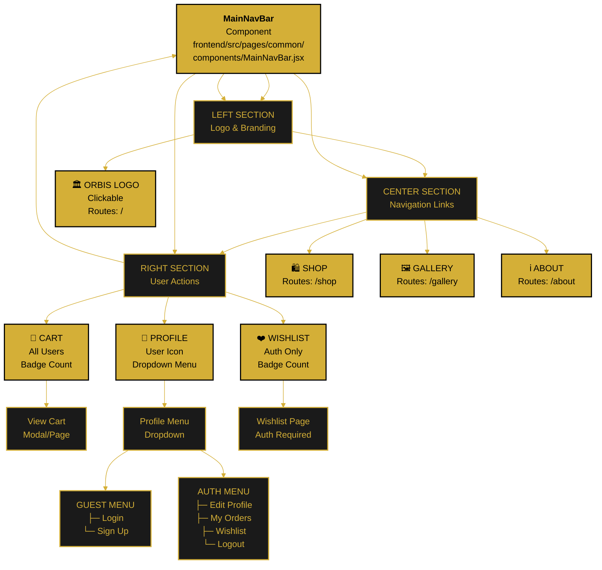

---

<!--
  ORBIS Navigation Structure Architecture
  
  Document Type: System Architecture & UI Components
  Purpose: Navigation bar structure, components, and user interactions
  Last Updated: December 29, 2025
  
  For page hierarchy: see page-hierarchy.md
  For user roles: see user-roles.md
-->

# 🧭 Navigation Structure Architecture

This comprehensive document describes the main navigation components, structure, user interactions, and responsive behavior of the Orbis application.

---

## 📋 Overview

### Navigation Layers
1. **Primary Navigation:** MainNavBar (horizontal)
2. **Secondary Navigation:** Page breadcrumbs & local navigation
3. **User Menu:** Profile dropdown & login modal
4. **Mobile Navigation:** Hamburger menu & drawer

### Navigation Components
- Logo/Home link
- Main navigation links
- Search functionality
- Cart badge
- Wishlist badge
- User profile button/icon

---

## 🏗️ Navigation Architecture



---

## 📱 MainNavBar Component

### Location
- **File:** `frontend/src/pages/common/components/MainNavBar.jsx`
- **Imports:** React, React Router, AuthContext, styling
- **Provider:** Wrapped by AuthContext in App.jsx

### Component Structure

```jsx
<MainNavBar>
  <Left>
    <Logo /> {/* Clickable, routes to / */}
  </Left>
  <Center>
    <NavLink to="/shop">Shop</NavLink>
    <NavLink to="/gallery">Gallery</NavLink>
    <NavLink to="/about">About</NavLink>
  </Center>
  <Right>
    <WishlistIcon /> {/* Auth-only, shows badge */}
    <CartIcon /> {/* All users, shows badge */}
    <ProfileButton /> {/* Shows different menu based on auth */}
  </Right>
</MainNavBar>
```

---

## 🎨 Left Section - Logo & Branding

### Logo Component
- **Element:** `` or SVG of Orbis logo
- **Style:** Gold (#D4AF37) with black background
- **Size:** 40-50px height
- **Click Action:** `navigate('/')`
- **Hover Effect:** Scale up, change opacity
- **Mobile:** Smaller logo (30-35px)

### Text Branding (Optional)
- **Text:** "ORBIS"
- **Font:** Gold color, bold
- **Display:** Desktop only (hidden on mobile)
- **Click Action:** Same as logo

---

## 🔗 Center Section - Navigation Links

### Navigation Structure

#### Desktop (> 768px)
```
Visible Links:
├─ Shop (/shop)
├─ Gallery (/gallery)
└─ About (/about)

Display: Horizontal, inline
Spacing: 30-40px between items
```

#### Mobile (≤ 768px)
```
Hidden by default
Accessible via hamburger menu
Opens as vertical drawer
```

### Shop Link
- **Text:** "Shop"
- **Route:** `/shop`
- **State:** Product listing page
- **Visible:** All users
- **Active State:** Underline/highlight when on shop pages

### Gallery Link
- **Text:** "Gallery"
- **Route:** `/gallery`
- **State:** Interactive product gallery
- **Visible:** All users
- **Active State:** Underline/highlight when on gallery page

### About Link
- **Text:** "About"
- **Route:** `/about`
- **State:** Company info & contact
- **Visible:** All users
- **Active State:** Underline/highlight when on about page

### Search (Optional Future)
- **Position:** Center section
- **Placeholder:** "Search products..."
- **Functionality:** Filter products by keyword
- **Mobile:** Icon only (expands on click)

---

## 👥 Right Section - User Actions

### Wishlist Icon (Auth-Only)

#### Desktop View
- **Icon:** Heart icon (❤️)
- **Badge:** Number of wishlist items
- **Position:** Before cart icon
- **Click Action:** 
  - If authenticated → Navigate to `/wishlist`
  - If guest → Show login modal
- **Hover:** Tooltip "My Wishlist"
- **Mobile:** Hidden on small screens

#### Mobile View
- **Display:** Hidden (accessible via menu)

#### Badge
- **Background:** Gold (#D4AF37)
- **Text:** White
- **Position:** Top-right of icon
- **Updates:** Real-time when items added/removed
- **Shows:** 0-999+ items

---

### Cart Icon

#### Desktop View
- **Icon:** Shopping cart (🛒)
- **Badge:** Number of items
- **Position:** Before profile icon
- **Click Action:** Open cart page or modal
- **Hover:** Tooltip "Shopping Cart"
- **Mobile:** Visible (important action)

#### Mobile View
- **Icon:** Same cart icon
- **Badge:** Same positioning
- **Click Action:** Same navigation

#### Badge
- **Background:** Gold (#D4AF37)
- **Text:** White
- **Position:** Top-right corner of icon
- **Size:** 18-20px diameter
- **Updates:** Real-time
- **Shows:** 0-999+ items
- **Display:** Hidden when count = 0 (optional)

#### Cart Interactions
```
Desktop:
- Hover over cart icon → Show mini-cart preview
- Click icon → Navigate to /cart

Mobile:
- Click icon → Navigate to /cart
```

---

### Profile Button / User Menu

#### Guest User Display
- **Icon:** Generic user silhouette (👤)
- **Avatar:** Not shown
- **Text:** "Login" or "Account"
- **Click Action:** Open dropdown menu

#### Authenticated User Display
- **Icon:** User's avatar image
- **Size:** 36-40px circular
- **Name:** User's first name or nickname
- **Click Action:** Open dropdown menu
- **Hover:** Tooltip "Profile Menu"

#### Profile Dropdown Menu

##### Guest Dropdown
```
┌─────────────────┐
│   Login         │ → LoginModal appears
│   Sign Up       │ → Navigate to /register
└─────────────────┘
```

##### Authenticated Dropdown
```
┌──────────────────────┐
│ 👤 Name             │ (Display only)
├──────────────────────┤
│ Edit Profile         │ → /profile
│ My Orders            │ → /orders
│ My Wishlist          │ → /wishlist (if exists)
│ Account Settings     │ → /profile/settings
├──────────────────────┤
│ Logout               │ → Clear session
└──────────────────────┘
```

---

## 📱 Responsive Behavior

### Desktop (> 1024px)
```
┌─────────────────────────────────────────────────────┐
│ 🏛️  ORBIS        Shop  Gallery  About        ❤️ 🛒 👤 │
└─────────────────────────────────────────────────────┘

- All items visible
- Horizontal layout
- Full spacing
- Dropdown menus expand right
```

### Tablet (768px - 1024px)
```
┌──────────────────────────────────────────────┐
│ 🏛️  ORBIS      Shop  Gallery      ❤️ 🛒 👤 │
└──────────────────────────────────────────────┘

- Navigation links may condense
- Icons spaced slightly tighter
- Dropdowns adapt to space
```

### Mobile (< 768px)
```
┌─────────────────────────────┐
│ ☰    ORBIS          🛒 👤   │
└─────────────────────────────┘

- Hamburger menu (☰) replaces nav links
- Cart and profile always visible
- Wishlist in dropdown menu
- Navigation opens vertical drawer
```

### Mobile Drawer Menu
```
┌──────────────────┐
│ ✕ (Close)       │
├──────────────────┤
│ Shop             │
│ Gallery          │
│ About            │
├──────────────────┤
│ My Wishlist      │ (Auth only)
│ My Orders        │ (Auth only)
│ Settings         │ (Auth only)
├──────────────────┤
│ Login / Logout   │
└──────────────────┘
```

---

## 🎯 Interaction Patterns

### Navigation Flow
```
User clicks link
  ↓
Component checks authentication status
  ↓
If protected route + not authenticated
  → Show login modal
  ↓
If authenticated or public route
  → Navigate to route
  ↓
Route component loads
```

### Dropdown Interactions
```
User clicks profile button
  ↓
Dropdown appears (animated fade-in)
  ↓
User hovers or clicks menu item
  ↓
If navigation action
  → Close dropdown
  → Navigate to route
  ↓
If logout action
  → Clear session
  → Close dropdown
  → Redirect to home
```

---

## 🎨 Styling & Theme

### Colors
- **Primary (Gold):** #D4AF37
- **Secondary (Black):** #1a1a1a
- **Text:** #ffffff on dark, #1a1a1a on gold
- **Hover:** Gold background with black text
- **Active:** Gold underline on links

### Spacing
- **Horizontal Padding:** 20-30px per side
- **Vertical Padding:** 15-20px
- **Link Spacing:** 30-40px between items
- **Icon Spacing:** 20-30px between buttons

### Typography
- **Logo:** 18-20px bold
- **Nav Links:** 16px regular
- **Mobile:** 14-16px

### Icons
- **Size:** 20-24px for links, 30-40px for user actions
- **Color:** Gold on dark background
- **Hover:** Scale 1.1x, shadow effect

---

## 🔐 Authentication States

### Logged-Out State
- Profile icon: Generic silhouette
- Profile menu: Login & Sign Up options
- Wishlist: Hidden (or shows login prompt)
- Cart: Full access, session-based

### Logging-In State
- Loading spinner shown
- All interactions disabled
- Temporary overlay/modal

### Logged-In State
- Profile icon: User avatar
- Profile menu: Edit Profile, Orders, Logout
- Wishlist: Full access with badge
- Cart: Enhanced with saved items

### Logout State
- Session cleared
- Context reset
- Redirect to home
- Profile icon returns to guest state

---

## 🔧 Component Props & State

### MainNavBar Props
```javascript
{
  // Optional props
  showLogo: boolean = true,
  showSearch: boolean = false,
  onSearchChange: (query) => {},
  customLinks: Array<{text, path}>
}
```

### Internal State
```javascript
{
  isMenuOpen: boolean,      // Mobile drawer
  isProfileDropdown: boolean,
  user: AuthContext.user,
  cartCount: number,
  wishlistCount: number,
  loading: boolean
}
```

---

## 🗂️ Related Components

### AuthContext
- **Provides:** user, loading, login(), logout()
- **Used By:** ProfileButton to determine display
- **Updates:** When login/logout occurs

### LoginModal
- **Triggered By:** Profile button in guest state
- **Portal:** Rendered at document root
- **Triggers:** AuthContext update on success

### Cart Context/State
- **Provides:** cartItems, cartCount
- **Updates:** Badge on item add/remove
- **Persists:** LocalStorage or server

---

## 📊 Navigation Hierarchy

```
Primary Navigation (NavBar)
├── Logo/Home (always visible)
├── Main Links (Shop, Gallery, About)
│   └── Hidden on mobile (drawer only)
├── Wishlist (auth-only)
├── Cart (all users)
└── Profile Menu
    ├── Guest
    │   ├── Login
    │   └── Sign Up
    └── Authenticated
        ├── Edit Profile
        ├── My Orders
        ├── My Wishlist
        ├── Settings
        └── Logout

Secondary Navigation (Page-Specific)
├── Breadcrumbs
├── Page-local navigation
└── Back buttons
```

---

## ✅ Navigation Checklist

- [x] Logo clickable & returns home
- [x] Main links route correctly
- [x] Cart badge updates in real-time
- [x] Wishlist badge shows when authenticated
- [x] Profile dropdown shows correct menu
- [x] Login modal appears for guests
- [x] Logout clears session
- [x] Mobile drawer functional
- [x] Responsive on all breakpoints
- [x] Keyboard accessible
- [x] ARIA labels present
- [x] Icons have tooltips
- [x] Active states clear
- [x] Smooth animations
- [x] Fast load times

---

## 🔗 Related Documentation

- **[Page Hierarchy](./page-hierarchy.md)** - Complete page structure
- **[User Roles & Permissions](./user-roles.md)** - Access control
- **[Main Application Flow](../flows/main-application-flow.md)** - Navigation flows
- **[Authentication Quickstart](../quickstart/authentication.md)** - Auth details

---

**Document Version:** 2.0  
**Last Updated:** December 29, 2025  
**Status:** ✅ Comprehensive