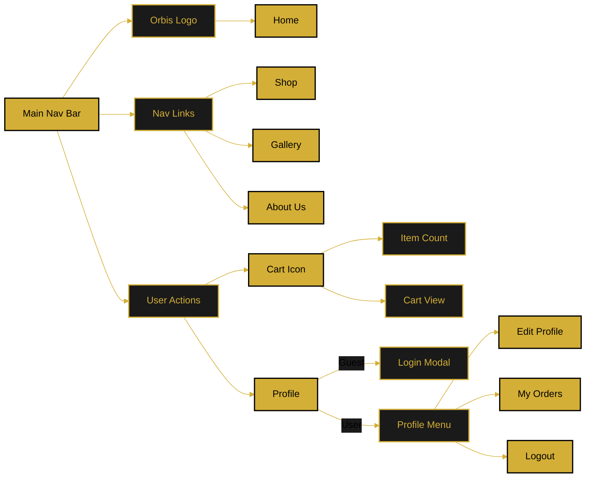

# Navigation Structure

This document describes the main navigation bar structure and user action menus.

---

## Navigation Diagram

---

## Navigation Components

### Left Section - Logo
- **Orbis Logo** - Clickable, returns to home page
- Always visible on all pages

### Center Section - Main Links
- **Shop** - Product catalog (planned)
- **Gallery** - Interactive gallery (planned)
- **About Us** - Company information (planned)

### Right Section - User Actions
- **Cart Icon** - Shows item count badge
- **Profile Button** - User-specific menu

---

## Profile Menu States

### Guest Users (Not Logged In)
- Profile icon shows generic user symbol
- Clicking opens dropdown with:
  - **Login** - Opens login modal
  - **Sign Up** - Navigates to registration page

### Logged In Users
- Profile icon shows user avatar
- Username/nickname displayed
- Clicking opens dropdown with:
  - **Edit Profile** - Navigate to profile page
  - **My Orders** - View order history (planned)
  - **Log Out** - End session and redirect home

---

## Cart Badge
- Displays number of items in cart
- Updates in real-time when items added/removed
- Clicking opens cart view (sidebar or page)

---

## Responsive Behavior

### Desktop (> 768px)
- Full navigation visible
- Horizontal layout

### Mobile (≤ 768px)
- Hamburger menu for main links
- Cart and profile always visible
- Collapsible dropdown menus

---

**Related Documents:**
- [Page Hierarchy](./page-hierarchy.md)
- [User Roles & Permissions](./user-roles.md)
