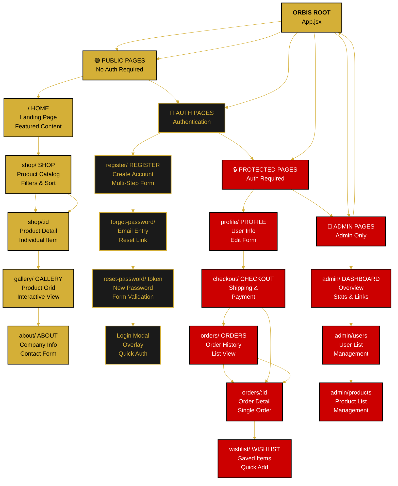

---

<!--
  ORBIS Page Hierarchy Architecture
  
  Document Type: System Architecture & Page Structure
  Purpose: Complete page hierarchy, route structure, and page categories
  Last Updated: December 29, 2025
  
  For flow details: see /docs/flows/
  For navigation details: see navigation-structure.md
-->

# 📄 Page Hierarchy Architecture

This comprehensive document defines the complete hierarchical structure of all pages in the Orbis application, including route definitions, access control, and page metadata.

---

## 📋 Overview

### Application Structure
- **Total Pages:** 15+ pages
- **Public Pages:** 5 (no authentication)
- **Auth Pages:** 4 (authentication flows)
- **Protected Pages:** 6+ (authentication required)
- **Admin Pages:** 2+ (admin role required)

### Route Organization
- **Root:** `/` (Home)
- **Public:** `/shop`, `/gallery`, `/about`
- **Auth:** `/register`, `/forgot-password`
- **Protected:** `/profile`, `/checkout`, `/orders`, `/wishlist`
- **Admin:** `/admin`, `/admin/users`, `/admin/products`

---

## 🌳 Page Hierarchy Tree



---

## 📑 Complete Page Reference

### 🟢 Public Pages (No Authentication Required)

#### **Home Page**
- **Route:** `/`
- **Component:** `HomePage.jsx`
- **Location:** `frontend/src/pages/common/`
- **Features:**
  - Featured products carousel
  - Category sections
  - Call-to-action buttons
  - User testimonials
  - Newsletter signup
- **Accessible By:** All users (guests & authenticated)
- **Protected:** No
- **Permissions:** View-only

#### **Shop Page**
- **Route:** `/shop`
- **Component:** `ShopPage.jsx`
- **Location:** `frontend/src/pages/shop/`
- **Features:**
  - Product grid/list view
  - Filters (category, price, rating)
  - Sort options (newest, price, popularity)
  - Search functionality
  - Product cards with quick actions
- **Accessible By:** All users
- **Protected:** No
- **Permissions:** Browse, add to cart, view details

#### **Product Detail Page**
- **Route:** `/shop/:id`
- **Component:** `ProductDetail.jsx`
- **Location:** `frontend/src/pages/shop/`
- **Features:**
  - Full product images
  - Product description & specifications
  - Price & availability
  - Add to cart button
  - Add to wishlist button (auth-required)
  - Related products
  - Customer reviews
- **Accessible By:** All users
- **Protected:** No (wishlist restricted)
- **Permissions:** View, add to cart, view wishlist (auth-only)

#### **Gallery Page**
- **Route:** `/gallery`
- **Component:** `GalleryPage.jsx`
- **Location:** `frontend/src/pages/gallery/`
- **Features:**
  - Product image gallery grid
  - Lightbox/modal view
  - Filter by category
  - View history/favorites
  - Location map integration
  - Product history timeline
- **Accessible By:** All users
- **Protected:** No
- **Permissions:** View, expand details

#### **About Page**
- **Route:** `/about`
- **Component:** `AboutPage.jsx`
- **Location:** `frontend/src/pages/common/`
- **Features:**
  - Company information
  - Team member profiles
  - Company mission/vision
  - Contact form
  - Location map
  - Social media links
- **Accessible By:** All users
- **Protected:** No
- **Permissions:** View, submit contact form

---

### 🔑 Authentication Pages

#### **Registration Page**
- **Route:** `/register`
- **Component:** `RegisterPage.jsx`
- **Location:** `frontend/src/pages/auth/`
- **Features:**
  - Multi-step form (4 sections)
  - Email validation & uniqueness check
  - Password strength requirements
  - Optional avatar upload
  - Address information
  - Auto-login after signup
- **Accessible By:** Guests (logged-in users redirected)
- **Protected:** No (redirects if already authenticated)
- **Form Sections:**
  1. Personal Details (First/Last Name)
  2. Account Setup (Email/Password)
  3. Profile Info (Nickname/Avatar)
  4. Address (Shipping Address)

#### **Forgot Password Page**
- **Route:** `/forgot-password`
- **Component:** `ForgotPasswordPage.jsx`
- **Location:** `frontend/src/pages/auth/`
- **Features:**
  - Email entry field
  - Validation
  - Reset link sent notification
  - Resend option
- **Accessible By:** Guests (logged-in users redirected)
- **Protected:** No
- **Actions:** Send password reset email

#### **Reset Password Page**
- **Route:** `/reset-password/:token`
- **Component:** `ResetPasswordPage.jsx`
- **Location:** `frontend/src/pages/auth/`
- **Features:**
  - Token validation
  - New password entry (2 fields)
  - Password strength validation
  - Confirmation message
  - Auto-redirect to login
- **Accessible By:** Users with valid reset token
- **Protected:** No (token-protected)
- **Actions:** Update password in database

#### **Login Modal**
- **Route:** Overlay (no direct route)
- **Component:** `LoginModal.jsx`
- **Location:** `frontend/src/pages/common/components/`
- **Features:**
  - Email & password inputs
  - Remember me option
  - Forgot password link
  - Sign up link
  - Real-time validation
  - Error messages
- **Accessible By:** All users (overlay)
- **Protected:** No
- **Actions:** Create session, update auth context

---

### 🔒 Protected Pages (Authentication Required)

#### **Profile Page**
- **Route:** `/profile`
- **Component:** `ProfilePage.jsx`
- **Location:** `frontend/src/pages/auth/`
- **Features:**
  - Personal information editor
  - Email management
  - Avatar upload/delete
  - Address management
  - Password change form
  - Account settings
  - Member since date
- **Accessible By:** Authenticated users only
- **Protected:** Yes (ProtectedRoute wrapper)
- **Permissions:** Edit own profile only

#### **Cart Page**
- **Route:** `/cart`
- **Component:** `CartPage.jsx`
- **Location:** `frontend/src/pages/shop/`
- **Features:**
  - Cart items list with images
  - Quantity selector
  - Remove item option
  - Clear cart button
  - Order summary
  - Subtotal & taxes calculation
  - Proceed to checkout button
  - Continue shopping button
- **Accessible By:** All users (guests & authenticated)
- **Protected:** No (guests allowed)
- **Permissions:** View own cart, modify items

#### **Checkout Page**
- **Route:** `/checkout`
- **Component:** `CheckoutPage.jsx`
- **Location:** `frontend/src/pages/shop/`
- **Features:**
  - Shipping address form
  - Address validation
  - Payment method selection
  - Order review summary
  - Place order button
  - Order confirmation
  - Email receipt
- **Accessible By:** Authenticated users only
- **Protected:** Yes (ProtectedRoute wrapper)
- **Permissions:** Checkout own cart

#### **Order History Page**
- **Route:** `/orders`
- **Component:** `OrderHistoryPage.jsx`
- **Location:** `frontend/src/pages/shop/`
- **Features:**
  - List of user's orders
  - Order status (pending, shipped, delivered)
  - Order dates
  - Order totals
  - Click to view details
  - Filter & sort options
  - Re-order functionality
- **Accessible By:** Authenticated users only
- **Protected:** Yes
- **Permissions:** View own orders only

#### **Order Detail Page**
- **Route:** `/orders/:id`
- **Component:** `OrderDetailPage.jsx`
- **Location:** `frontend/src/pages/shop/`
- **Features:**
  - Full order information
  - Order items with quantities
  - Shipping address
  - Payment method (masked)
  - Order status timeline
  - Tracking number (if available)
  - Customer support contact
  - Invoice download option
- **Accessible By:** Authenticated users (own orders only)
- **Protected:** Yes
- **Permissions:** View own orders only

#### **Wishlist Page**
- **Route:** `/wishlist`
- **Component:** `WishlistPage.jsx`
- **Location:** `frontend/src/pages/shop/`
- **Features:**
  - Saved products grid
  - Remove from wishlist
  - Add to cart button
  - Product availability status
  - Price updates
  - Move to cart functionality
- **Accessible By:** Authenticated users only
- **Protected:** Yes
- **Permissions:** View & manage own wishlist

---

### 🔴 Admin Pages (Admin Role Required)

#### **Admin Dashboard**
- **Route:** `/admin`
- **Component:** `AdminDashboard.jsx`
- **Location:** `frontend/src/pages/admin/`
- **Features:**
  - Overview statistics
  - Recent orders
  - User count
  - Product inventory stats
  - Quick action buttons
  - Analytics charts
- **Accessible By:** Admin users only
- **Protected:** Yes (role-based)
- **Permissions:** View-only

#### **User Management**
- **Route:** `/admin/users`
- **Component:** `AdminUsersPage.jsx`
- **Location:** `frontend/src/pages/admin/`
- **Features:**
  - User list table
  - Search & filter
  - Edit user details
  - Change user role
  - Disable/enable accounts
  - View user orders
  - Send messages to users
- **Accessible By:** Admin users only
- **Protected:** Yes (role-based)
- **Permissions:** CRUD on users

#### **Product Management**
- **Route:** `/admin/products`
- **Component:** `AdminProductsPage.jsx`
- **Location:** `frontend/src/pages/admin/`
- **Features:**
  - Product list table
  - Add new product
  - Edit product details
  - Upload product images
  - Manage inventory
  - Set prices & discounts
  - Publish/unpublish products
- **Accessible By:** Admin users only
- **Protected:** Yes (role-based)
- **Permissions:** CRUD on products

---

## 🔐 Access Control Matrix

| Page | Route | Public | Guest Auth | User | Admin | Guest Cart | Notes |
|---|---|---|---|---|---|---|---|
| **Home** | `/` | ✅ | ✅ | ✅ | ✅ | - | Always visible |
| **Shop** | `/shop` | ✅ | ✅ | ✅ | ✅ | ✅ | Browse products |
| **Product Detail** | `/shop/:id` | ✅ | ✅ | ✅ | ✅ | ✅ | View & add cart |
| **Gallery** | `/gallery` | ✅ | ✅ | ✅ | ✅ | - | Public gallery |
| **About** | `/about` | ✅ | ✅ | ✅ | ✅ | - | Public info |
| **Register** | `/register` | ✅ | ✅ | ❌ Redirect | ❌ Redirect | - | Not logged in |
| **Login Modal** | Modal | ✅ | ✅ | ✅ | ✅ | - | Overlay |
| **Forgot Password** | `/forgot-password` | ✅ | ✅ | ❌ Redirect | ❌ Redirect | - | Password reset |
| **Reset Password** | `/reset-password/:token` | ✅ | ✅ | ✅ | ✅ | - | Token required |
| **Profile** | `/profile` | ❌ | ❌ | ✅ Own | ✅ All | - | Requires auth |
| **Cart** | `/cart` | ✅ | ✅ | ✅ | ✅ | ✅ | Session-based |
| **Checkout** | `/checkout` | ❌ Login | ❌ Login | ✅ | ✅ | - | Auth required |
| **Orders** | `/orders` | ❌ Login | ❌ Login | ✅ Own | ✅ All | - | Auth required |
| **Order Detail** | `/orders/:id` | ❌ Login | ❌ Login | ✅ Own | ✅ All | - | Auth required |
| **Wishlist** | `/wishlist` | ❌ Login | ❌ Login | ✅ | ✅ | - | Auth required |
| **Admin Panel** | `/admin` | ❌ | ❌ | ❌ | ✅ | - | Admin only |
| **User Mgmt** | `/admin/users` | ❌ | ❌ | ❌ | ✅ | - | Admin only |
| **Product Mgmt** | `/admin/products` | ❌ | ❌ | ❌ | ✅ | - | Admin only |

---

## 🗂️ File Organization

```
frontend/src/pages/
├── common/
│   ├── HomePage.jsx
│   ├── AboutPage.jsx
│   ├── components/
│   │   ├── MainNavBar.jsx
│   │   ├── LoginModal.jsx
│   │   ├── ProtectedRoute.jsx
│   │   └── FadeNotification.jsx
│   └── context/
│       └── AuthContext.jsx
├── auth/
│   ├── RegisterPage.jsx
│   ├── ProfilePage.jsx
│   ├── ForgotPasswordPage.jsx
│   ├── ResetPasswordPage.jsx
│   └── components/
│       ├── RegisterForm.jsx
│       └── ProfileForm.jsx
├── shop/
│   ├── ShopPage.jsx
│   ├── ProductDetail.jsx
│   ├── CartPage.jsx
│   ├── CheckoutPage.jsx
│   ├── OrderHistoryPage.jsx
│   ├── OrderDetailPage.jsx
│   ├── WishlistPage.jsx
│   └── components/
│       ├── ProductCard.jsx
│       ├── CartItem.jsx
│       └── CheckoutForm.jsx
├── gallery/
│   ├── GalleryPage.jsx
│   └── components/
│       └── GalleryGrid.jsx
└── admin/
    ├── AdminDashboard.jsx
    ├── AdminUsersPage.jsx
    ├── AdminProductsPage.jsx
    └── components/
        ├── UserTable.jsx
        ├── ProductTable.jsx
        └── AdminStats.jsx
```

---

## 🔄 Route Definition (React Router)

```javascript
// Routes configuration in App.jsx
const routes = [
  // Public routes
  { path: '/', element: <HomePage /> },
  { path: '/shop', element: <ShopPage /> },
  { path: '/shop/:id', element: <ProductDetail /> },
  { path: '/gallery', element: <GalleryPage /> },
  { path: '/about', element: <AboutPage /> },
  
  // Auth routes
  { path: '/register', element: <RegisterPage /> },
  { path: '/forgot-password', element: <ForgotPasswordPage /> },
  { path: '/reset-password/:token', element: <ResetPasswordPage /> },
  
  // Cart (guest-allowed)
  { path: '/cart', element: <CartPage /> },
  
  // Protected routes
  { 
    path: '/profile', 
    element: <ProtectedRoute><ProfilePage /></ProtectedRoute> 
  },
  { 
    path: '/checkout', 
    element: <ProtectedRoute><CheckoutPage /></ProtectedRoute> 
  },
  { 
    path: '/orders', 
    element: <ProtectedRoute><OrderHistoryPage /></ProtectedRoute> 
  },
  { 
    path: '/orders/:id', 
    element: <ProtectedRoute><OrderDetailPage /></ProtectedRoute> 
  },
  { 
    path: '/wishlist', 
    element: <ProtectedRoute><WishlistPage /></ProtectedRoute> 
  },
  
  // Admin routes
  { 
    path: '/admin', 
    element: <ProtectedRoute adminOnly><AdminDashboard /></ProtectedRoute> 
  },
  { 
    path: '/admin/users', 
    element: <ProtectedRoute adminOnly><AdminUsersPage /></ProtectedRoute> 
  },
  { 
    path: '/admin/products', 
    element: <ProtectedRoute adminOnly><AdminProductsPage /></ProtectedRoute> 
  },
  
  // Fallback
  { path: '*', element: <NotFoundPage /> }
];
```

---

## 📊 Page Statistics

| Category | Count | Public | Protected | Admin |
|---|---|---|---|---|
| **Public Pages** | 5 | 5 | - | - |
| **Auth Pages** | 4 | 4 | - | - |
| **Shop Pages** | 7 | 2 | 5 | - |
| **Admin Pages** | 3 | - | - | 3 |
| **Total** | 19 | 11 | 5 | 3 |

---

## 🔗 Related Documentation

- **[Navigation Structure](./navigation-structure.md)** - NavBar and navigation components
- **[User Roles & Permissions](./user-roles.md)** - Access control details
- **[Main Application Flow](../flows/main-application-flow.md)** - Navigation flows
- **[Authentication Flow](../flows/authentication-flow.md)** - Auth processes

---

**Document Version:** 2.0  
**Last Updated:** December 29, 2025  
**Status:** ✅ Comprehensive