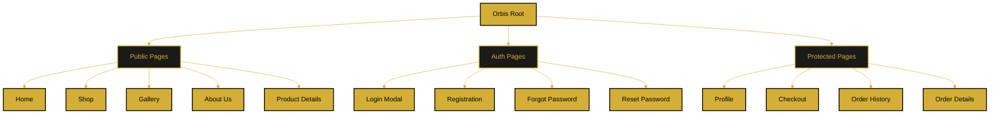

# Page Hierarchy

This document shows the complete hierarchical structure of all pages in the Orbis application.

---

## Structure Diagram

---

## Page Categories

### Public Pages (No Auth Required)
- **Home** - `/` - Landing page
- **Shop** - `/shop` - Product catalog (planned)
- **Gallery** - `/gallery` - Interactive gallery (planned)
- **About Us** - `/about` - Company info (planned)
- **Product Details** - `/product/:id` - Individual product (planned)

### Authentication Pages
- **Login Modal** - Overlay modal
- **Registration** - `/register` - Full registration form
- **Forgot Password** - `/forgot-password` - Email entry (planned)
- **Reset Password** - `/reset-password/:token` - New password form (planned)

### Protected Pages (Auth Required)
- **Profile** - `/profile/:userId` - User profile
- **Checkout** - `/checkout` - Order completion (planned)
- **Order History** - `/orders` - Past orders (planned)
- **Order Details** - `/order/:id` - Specific order (planned)

---

## Access Control

| Page Category | Guest Access | User Access | Admin Access |
|--------------|--------------|-------------|--------------|
| Public Pages | ✅ View | ✅ View | ✅ View |
| Auth Pages | ✅ Access | ✅ Access | ✅ Access |
| Protected Pages | ❌ Redirect to Login | ✅ View Own | ✅ View All |

---

**Related Documents:**
- [Navigation Structure](./navigation-structure.md)
- [User Roles & Permissions](./user-roles.md)
