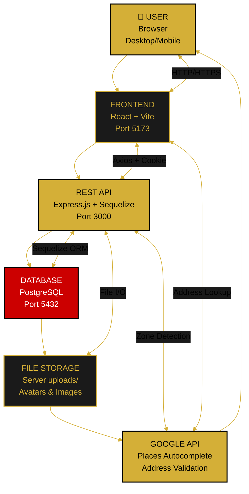
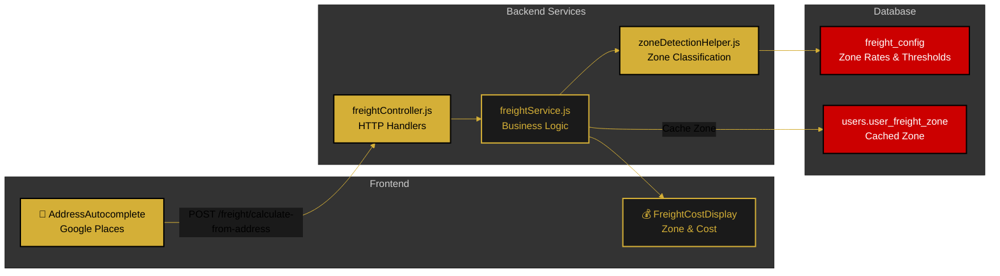

---

<!--
  ORBIS System Architecture Overview
  
  Document Type: System Architecture & Technical Design
  Purpose: Complete system architecture, technology stack, and design patterns
  Last Updated: January 4, 2026
  Version: 2.0 (Sequelize ORM)
  
  For page structure: see page-hierarchy.md
  For navigation: see navigation-structure.md
  For roles: see user-roles.md
-->

# 🏗️ System Architecture Overview

This comprehensive document describes the complete system architecture of the Orbis application, including technology stack, design patterns, component organization, and data flow.

---

## 📋 Overview

### Architecture Type
- **Frontend:** SPA (Single Page Application) with React
- **Backend:** Node.js/Express REST API with **Sequelize ORM** ✨
- **Database:** PostgreSQL (relational)
- **Deployment:** Docker containers
- **State Management:** Context API (frontend), Sessions (backend)
- **External APIs:** Google Places API (address autocomplete) ✨

### Key Principles
1. **Separation of Concerns** - Frontend/backend clearly separated
2. **Component-Based** - Reusable React components
3. **Session-Based Auth** - Server sessions with httpOnly cookies
4. **Responsive Design** - Mobile, tablet, desktop support
5. **Security First** - Validation, sanitization, CORS
6. **Service-Oriented** - Dedicated services for complex operations ✨
7. **Localization Ready** - NZD currency, multi-country support ✨

---

## 🏛️ System Architecture Diagram



---

## 🚚 Freight Management System ✨

### Overview
The Freight Management System provides zone-based shipping calculation with automatic detection based on user address. Integrates with Google Places API for address validation.

### Architecture Diagram



### Freight Zone Classification

| Zone | Coverage | Detection Logic |
|------|----------|-----------------|
| `local` | Configurable city (default: Tauranga) | City name match + postal prefix |
| `north_island` | NZ North Island (excl. local) | Country=NZ + NI region list |
| `south_island` | NZ South Island | Country=NZ + SI region list |
| `intl_north_america` | USA, Canada | Country match |
| `intl_europe` | UK, Portugal, EU | Country match |
| `intl_asia` | China | Country match |
| `intl_latin_america` | Brazil | Country match |
| `intl_africa` | African countries | Country match |

### Service Layer Pattern

```
freightController.js (HTTP Layer)
    ↓
freightService.js (Business Logic)
    ↓
zoneDetectionHelper.js (Zone Classification)
    ↓
FreightConfig Model (Database Access)
```

---

## 🖥️ Frontend Architecture

### Technology Stack
- **Framework:** React 18+
- **Build Tool:** Vite
- **Routing:** React Router v6
- **HTTP Client:** Axios (with interceptors)
- **State Management:** Context API + Local Storage
- **CSS:** CSS Modules + inline styles
- **Icons:** Material Icons
- **Notifications:** Custom FadeNotification component

### Frontend Directory Structure
```
frontend/
├── src/
│   ├── pages/
│   │   ├── common/
│   │   │   ├── HomePage.jsx
│   │   │   ├── AboutPage.jsx
│   │   │   ├── components/
│   │   │   │   ├── MainNavBar.jsx
│   │   │   │   ├── LoginModal.jsx
│   │   │   │   ├── ProtectedRoute.jsx
│   │   │   │   ├── FadeNotification.jsx
│   │   │   │   ├── PriceDisplay.jsx          # ✨ NZD formatting
│   │   │   │   ├── CountrySelect.jsx         # ✨ Country dropdown
│   │   │   │   └── AddressAutocomplete.jsx   # ✨ Google Places
│   │   │   └── context/
│   │   │       └── AuthContext.jsx
│   │   ├── auth/
│   │   │   ├── RegisterPage.jsx
│   │   │   ├── ProfilePage.jsx
│   │   │   ├── ForgotPasswordPage.jsx
│   │   │   └── ResetPasswordPage.jsx
│   │   ├── shop/
│   │   │   ├── ShopPage.jsx
│   │   │   ├── ProductDetail.jsx
│   │   │   ├── CartPage.jsx
│   │   │   ├── CheckoutPage.jsx              # ✨ Freight calculation
│   │   │   ├── OrderHistoryPage.jsx
│   │   │   ├── WishlistPage.jsx
│   │   │   └── components/
│   │   │       ├── ProductCard.jsx
│   │   │       ├── CartItem.jsx
│   │   │       ├── CheckoutForm.jsx
│   │   │       ├── FreightCostDisplay.jsx    # ✨ Zone-based costs
│   │   │       └── ProductReviewSection.jsx  # ✨ Reviews
│   │   ├── gallery/
│   │   │   ├── GalleryPage.jsx
│   │   │   └── components/
│   │   │       └── GalleryGrid.jsx
│   │   └── admin/
│   │       ├── AdminDashboard.jsx
│   │       ├── adminpages/
│   │       │   ├── AdminUsers/               # User management
│   │       │   ├── AdminProducts/            # Product management
│   │       │   ├── AdminOrders/              # ✨ Order management
│   │       │   ├── AdminReviews/             # ✨ Review moderation
│   │       │   ├── AdminWishlists/           # ✨ Wishlist analytics
│   │       │   └── AdminSettings/            # ✨ Site & freight settings
│   │       └── components/
│   │           ├── AdminManagementView.jsx   # ✨ Reusable template
│   │           ├── AdminNavBar.jsx
│   │           ├── StatCard.jsx
│   │           └── ViewUserDetailsModal.jsx  # ✨ User preview
│   ├── App.jsx
│   ├── main.jsx
│   └── styles/
│       ├── global.css
│       ├── variables.css
│       └── responsive.css
├── package.json
├── vite.config.js
└── index.html
```

### Frontend Components

#### Core Components
- **App.jsx** - Root component, routes, context provider
- **MainNavBar.jsx** - Primary navigation, user menu
- **LoginModal.jsx** - Login form overlay
- **ProtectedRoute.jsx** - Route wrapper for auth
- **FadeNotification.jsx** - Toast notifications

#### Page Components
- **HomePage.jsx** - Landing page
- **ShopPage.jsx** - Product listing
- **ProductDetail.jsx** - Product view
- **CartPage.jsx** - Shopping cart
- **CheckoutPage.jsx** - Order creation
- **ProfilePage.jsx** - User profile
- **OrderHistoryPage.jsx** - Orders list
- **WishlistPage.jsx** - Saved products
- **GalleryPage.jsx** - Image gallery
- **AboutPage.jsx** - Company info
- **RegisterPage.jsx** - New user signup

#### Feature Components
- **ProductCard.jsx** - Product preview card
- **CartItem.jsx** - Cart item row
- **CheckoutForm.jsx** - Checkout form
- **GalleryGrid.jsx** - Gallery layout
- **UserTable.jsx** - Admin user list
- **ProductTable.jsx** - Admin product list

---

## 🔌 API Layer

### Base Configuration
```javascript
// Axios instance with interceptors
const axiosInstance = axios.create({
  baseURL: 'http://localhost:3000/api',
  withCredentials: true, // Send cookies
  timeout: 10000
});

// Request interceptor: Add auth headers
// Response interceptor: Handle 401, refresh token
```

### API Endpoints

#### Authentication
- `POST /api/auth/register` - Create account
- `POST /api/auth/login` - Authenticate user
- `DELETE /api/auth/logout` - End session
- `GET /api/session` - Verify session

#### Profile
- `GET /api/profile` - Get user profile
- `PATCH /api/profile/personal` - Update name/email
- `PATCH /api/profile/address` - Update address
- `POST /api/profile/avatar` - Upload avatar
- `DELETE /api/profile/avatar` - Delete avatar
- `POST /api/profile/password` - Change password

#### Shop
- `GET /api/products` - List products (with filters)
- `GET /api/products/:id` - Get single product
- `GET /api/categories` - Get product categories
- `GET /api/products/search` - Search products

#### Cart
- `GET /api/cart` - Get user's cart
- `POST /api/cart` - Add item to cart
- `PATCH /api/cart/:itemId` - Update quantity
- `DELETE /api/cart/:itemId` - Remove item
- `DELETE /api/cart` - Clear cart

#### Orders
- `POST /api/orders` - Create order
- `GET /api/orders` - List user's orders
- `GET /api/orders/:id` - Get order details
- `GET /api/orders/:id/invoice` - Download invoice

#### Wishlist
- `GET /api/wishlist` - Get wishlist
- `POST /api/wishlist` - Add item
- `DELETE /api/wishlist/:productId` - Remove item

---

## ⚙️ Backend Architecture

### Technology Stack
- **Runtime:** Node.js
- **Framework:** Express.js
- **Database:** PostgreSQL
- **Authentication:** bcrypt, jsonwebtoken (sessions instead)
- **File Upload:** Multer
- **Validation:** express-validator
- **CORS:** cors middleware
- **Environment:** dotenv

### Backend Directory Structure (Sequelize ORM) ✨
```
backend/
├── src/
│   ├── config/
│   │   ├── config.js              # Legacy DB pool
│   │   └── sequelizeConfig.js     # ✨ Sequelize instance
│   ├── models/                    # ✨ Sequelize models
│   │   ├── index.js               # Associations & exports
│   │   ├── User.js
│   │   ├── Product.js
│   │   ├── ProductCategory.js
│   │   ├── ProductImage.js
│   │   ├── ProductReview.js       # ✨ Review system
│   │   ├── Cart.js
│   │   ├── CartItem.js
│   │   ├── Order.js
│   │   ├── OrderItem.js
│   │   ├── Wishlist.js
│   │   ├── Address.js             # ✨ Google Places fields
│   │   ├── SiteSettings.js        # ✨ Maintenance modes
│   │   └── FreightConfig.js       # ✨ Zone-based rates
│   ├── controllers/
│   │   ├── authController.js
│   │   ├── productController.js
│   │   ├── cartController.js
│   │   ├── orderController.js
│   │   ├── profileController.js
│   │   ├── wishlistController.js
│   │   ├── reviewController.js    # ✨ User reviews
│   │   ├── freightController.js   # ✨ Freight calculation
│   │   ├── adminUserController.js
│   │   ├── adminProductController.js
│   │   ├── adminOrderController.js     # ✨
│   │   ├── adminReviewController.js    # ✨
│   │   ├── adminWishlistController.js  # ✨
│   │   └── adminSettingsController.js  # ✨
│   ├── routes/
│   │   ├── authRoutes.js
│   │   ├── productRoutes.js
│   │   ├── cartRoutes.js
│   │   ├── orderRoutes.js
│   │   ├── profileRoutes.js
│   │   ├── wishlistRoutes.js
│   │   ├── reviewRoutes.js        # ✨
│   │   ├── freightRoutes.js       # ✨
│   │   ├── adminUserRoutes.js
│   │   ├── adminProductRoutes.js
│   │   ├── adminOrderRoutes.js    # ✨
│   │   ├── adminReviewRoutes.js   # ✨
│   │   ├── adminWishlistRoutes.js # ✨
│   │   └── adminSettingsRoutes.js # ✨
│   ├── services/
│   │   ├── authService.js
│   │   ├── productService.js
│   │   ├── orderService.js
│   │   ├── emailService.js
│   │   ├── fileService.js
│   │   ├── reviewService.js       # ✨
│   │   ├── freightService.js      # ✨ Zone calculation
│   │   ├── adminOrderService.js   # ✨
│   │   ├── adminReviewService.js  # ✨
│   │   ├── adminWishlistService.js # ✨
│   │   └── adminSettingsService.js # ✨
│   ├── middleware/
│   │   ├── authMiddleware.js
│   │   ├── adminMiddleware.js
│   │   ├── validationMiddleware.js
│   │   └── errorHandler.js
│   ├── helpers/
│   │   ├── handleServerError.js
│   │   └── zoneDetectionHelper.js # ✨ NZ zone detection
│   ├── uploads/
│   │   ├── avatars/
│   │   └── products/
│   └── server.js
├── package.json
├── .env
└── .env.example
```

### MVC Pattern Extension ✨

The backend follows an extended MVC pattern with dedicated service layers:

```
┌─────────────────────────────────────────────────────────────┐
│                     REQUEST FLOW                            │
├─────────────────────────────────────────────────────────────┤
│                                                             │
│  HTTP Request                                               │
│       ↓                                                     │
│  ┌─────────────┐                                           │
│  │   Routes    │  Define endpoints, apply middleware        │
│  └─────────────┘                                           │
│       ↓                                                     │
│  ┌─────────────┐                                           │
│  │ Controllers │  Parse request, validate, call service     │
│  └─────────────┘                                           │
│       ↓                                                     │
│  ┌─────────────┐                                           │
│  │  Services   │  Business logic, complex operations        │
│  └─────────────┘                                           │
│       ↓                                                     │
│  ┌─────────────┐                                           │
│  │  Helpers    │  Utility functions (zone detection, etc.)  │
│  └─────────────┘                                           │
│       ↓                                                     │
│  ┌─────────────┐                                           │
│  │   Models    │  Sequelize ORM, database access            │
│  └─────────────┘                                           │
│       ↓                                                     │
│  HTTP Response                                              │
│                                                             │
└─────────────────────────────────────────────────────────────┘
```

**Key Service Additions:**
- `freightService.js` - Zone-based freight calculation with threshold logic
- `adminOrderService.js` - Order management with status workflows
- `adminReviewService.js` - Review moderation with rating recalculation
- `adminSettingsService.js` - Site configuration with maintenance modes

### Backend Components

#### Controllers
- **authController.js** - Register, login, logout
- **profileController.js** - Profile CRUD
- **productController.js** - Product management
- **cartController.js** - Cart operations
- **orderController.js** - Order creation, history
- **wishlistController.js** - Wishlist operations
- **adminController.js** - Admin operations

#### Middleware
- **authMiddleware.js** - Session validation
- **roleMiddleware.js** - Role-based access
- **validationMiddleware.js** - Input validation
- **errorHandler.js** - Global error handling
- **corsMiddleware.js** - CORS configuration

#### Models
- Database schema definitions
- Validation rules
- Relationships

#### Services
- Business logic
- Database queries
- External integrations
- Email sending

---

## 💾 Database Schema (Sequelize ORM) ✨

### Core Tables

#### Users Table
```sql
users {
  id PK
  email UK
  password_hash
  firstName
  lastName
  nickname
  avatar_url
  role DEFAULT 'user'
  status DEFAULT 'active'
  user_country                    # ✨ For freight zone
  user_freight_zone               # ✨ Detected zone
  user_is_tauranga BOOLEAN        # ✨ Local delivery flag
  created_at
  updated_at
}
```

#### Sessions Table
```sql
sessions {
  id PK
  user_id FK→users
  token UK
  expires_at
  created_at
}
```

#### User Profiles Table
```sql
user_profiles {
  id PK
  user_id FK UK→users
  street_address
  apartment
  city
  state
  zip_code
  country DEFAULT 'New Zealand'   # ✨ Updated default
  updated_at
}
```

#### Products Table
```sql
products {
  id PK
  name
  description
  price
  inventory
  category_id FK→product_categories  # ✨
  weight                             # ✨ For freight calc
  image_url
  created_at
  updated_at
}
```

#### Product Categories Table ✨
```sql
product_categories {
  id PK
  name UK
  description
  slug UK
  parent_id FK→product_categories (self-ref)
  is_active DEFAULT true
  created_at
  updated_at
}
```

#### Product Reviews Table ✨
```sql
product_reviews {
  id PK
  product_id FK→products
  user_id FK→users
  rating (1-5)
  title
  comment TEXT
  is_approved DEFAULT false
  admin_response TEXT
  created_at
  updated_at
}
```

#### Carts Table
```sql
carts {
  id PK
  user_id FK→users
  session_id (for guests)
  created_at
  updated_at
}
```

#### Cart Items Table
```sql
cart_items {
  id PK
  cart_id FK→carts
  product_id FK→products
  quantity
  created_at
}
```

#### Orders Table
```sql
orders {
  id PK
  user_id FK→users
  status ENUM('pending','processing','shipped','delivered','cancelled')  # ✨
  total_amount
  freight_cost                    # ✨
  freight_zone                    # ✨
  shipping_address JSONB          # ✨ Google Places format
  payment_method
  tracking_number                 # ✨
  notes TEXT                      # ✨
  created_at
  updated_at
}
```

#### Addresses Table ✨
```sql
addresses {
  id PK
  user_id FK→users
  address_line_1
  address_line_2
  city
  state
  postal_code
  country
  google_place_id                 # ✨ Google Places integration
  formatted_address               # ✨ Full formatted address
  latitude
  longitude
  freight_zone                    # ✨ Calculated zone
  is_default DEFAULT false
  created_at
  updated_at
}
```

#### Freight Config Table ✨
```sql
freight_configs {
  id PK
  zone UK ENUM('local','north_island','south_island',
               'intl_north_america','intl_asia','intl_europe',
               'intl_latin_america','intl_africa')
  base_rate DECIMAL
  per_kg_rate DECIMAL
  free_threshold DECIMAL
  weight_threshold DECIMAL
  is_active DEFAULT true
  created_at
  updated_at
}
```

#### Site Settings Table ✨
```sql
site_settings {
  id PK
  setting_key UK
  setting_value JSONB
  setting_type ENUM('string','number','boolean','json')
  description
  is_editable DEFAULT true
  created_at
  updated_at
}

-- Example settings:
-- maintenance_mode: boolean
-- site_name: string
-- contact_email: string
-- feature_reviews_enabled: boolean
-- feature_wishlists_enabled: boolean
```

#### Wishlists Table
```sql
wishlists {
  id PK
  user_id FK UK→users
  created_at
}
```

#### Wishlist Items Table
```sql
wishlist_items {
  id PK
  wishlist_id FK→wishlists
  product_id FK→products
  created_at
}
```

---

## 🔄 Data Flow

### Authentication Flow
```
User enters credentials
  ↓
Frontend: POST /api/auth/login
  ↓
Backend: Validate email & password
  ↓
Backend: Create session in DB
  ↓
Backend: Set httpOnly cookie
  ↓
Backend: Return user object
  ↓
Frontend: Update AuthContext
  ↓
Frontend: Store user in localStorage
  ↓
Frontend: Navigate to home or previous page
```

### Shopping Flow
```
User adds product to cart
  ↓
Frontend: POST /api/cart (product_id, quantity)
  ↓
Backend: Find or create cart
  ↓
Backend: Add cart item to DB
  ↓
Backend: Return updated cart
  ↓
Frontend: Update local cart state
  ↓
Frontend: Update badge count
  ↓
User sees notification
```

### Checkout Flow (with Freight Calculation) ✨
```
User clicks "Proceed to Checkout"
  ↓
Frontend: Check if authenticated
  ↓
If guest: Show login modal
If authenticated: Navigate to checkout
  ↓
User enters shipping address (AddressAutocomplete component)
  ↓
Frontend: Google Places API autocomplete suggestions
  ↓
User selects address from Google Places
  ↓
Frontend: POST /api/freight/calculate-from-address
  ├── Body: { address, country, city }
  │
  ↓
Backend: zoneDetectionHelper determines freight zone
  ├── local (Tauranga/Mount Maunganui)
  ├── north_island (NZ North Island cities)
  ├── south_island (NZ South Island cities)
  └── intl_* (International zones)
  │
  ↓
Backend: freightService calculates cost
  ├── Base rate per zone
  ├── Weight threshold rules
  └── Free freight threshold check
  │
  ↓
Backend: Return freight calculation
  {
    zone: "north_island",
    baseCost: 12.00,
    freeThreshold: 150.00,
    isFreeShipping: false
  }
  ↓
Frontend: Display FreightCostDisplay component
  ↓
User selects payment method
  ↓
User clicks "Place Order"
  ↓
Frontend: POST /api/orders (cart, address, freight_zone, payment)
  ↓
Backend: Validate cart, address, freight
  ↓
Backend: Create order in DB with freight cost
  ↓
Backend: Clear cart
  ↓
Backend: Send confirmation email
  ↓
Backend: Return order confirmation
  ↓
Frontend: Show confirmation page
  ↓
Frontend: Clear local cart
```

---

## 🔐 Security Architecture

### Authentication Layer
- **Method:** Session-based with httpOnly cookies
- **Validation:** Backend validates on every request
- **Hashing:** bcrypt for password storage
- **Expiration:** 30-day session TTL
- **Refresh:** Automatic session extension

### Authorization Layer
- **Check Points:** 
  - Frontend: ProtectedRoute components
  - Backend: authMiddleware on routes
- **Role Validation:** roleMiddleware for admin features
- **Data Access:** Users can only access own data
- **Audit:** Admin actions logged

### Input Validation
- **Frontend:** Real-time validation feedback
- **Backend:** express-validator on all inputs
- **Sanitization:** Clean all user inputs
- **Type Checking:** TypeScript (future) or runtime checks

### Data Protection
- **Passwords:** Never sent in plain text, hashed with salt
- **Sensitive Fields:** Masked in responses (passwords, tokens)
- **HTTPS:** Enforced in production
- **CORS:** Restricted to frontend origin

---

## 🚀 Deployment Architecture

### Development Environment
```
docker-compose.dev.yml
├── Frontend service (port 5173)
├── Backend service (port 3000)
├── PostgreSQL service (port 5432)
└── pgAdmin (port 5050) - DB management
```

### Production Environment
```
docker-compose.prod.yml
├── Frontend (nginx reverse proxy)
├── Backend (Express, multiple instances)
├── PostgreSQL (managed database)
└── File storage (cloud or server)
```

### Docker Configuration
- **Frontend:** Node container, Vite dev server
- **Backend:** Node container, Express server
- **Database:** PostgreSQL official image
- **Volumes:** Persistent data, uploads

---

## 📊 Architecture Diagram by Layer

```
PRESENTATION LAYER (Frontend)
├── Pages (Home, Shop, Profile, etc.)
├── Components (Nav, Cards, Forms)
├── Context (AuthContext, CartContext)
└── Utilities (Axios, formatters)

APPLICATION LAYER
├── Routes (React Router)
├── State Management (Context API)
├── HTTP Clients (Axios)
└── Form Handling

API LAYER (Backend)
├── Controllers (Business logic)
├── Middleware (Auth, validation)
├── Services (Database operations)
└── Routes (Endpoint definitions)

DATA LAYER
├── Database (PostgreSQL)
├── File Storage (Uploads)
└── Sessions (Server-side)
```

---

## 🔗 Related Documentation

- **[Page Hierarchy](./page-hierarchy.md)** - Application pages
- **[Navigation Structure](./navigation-structure.md)** - User interface navigation
- **[User Roles & Permissions](./user-roles.md)** - Access control
- **[Main Application Flow](../flows/main-application-flow.md)** - User flows
- **[Authentication Quickstart](../quickstart/authentication.md)** - Implementation

---

**Document Version:** 2.0  
**Last Updated:** January 4, 2026  
**Status:** ✅ Complete (Sequelize ORM Edition)