---

<!--
  ORBIS System Architecture Overview
  
  Document Type: System Architecture & Technical Design
  Purpose: Complete system architecture, technology stack, and design patterns
  Last Updated: December 29, 2025
  
  For page structure: see page-hierarchy.md
  For navigation: see navigation-structure.md
  For roles: see user-roles.md
-->

# 🏗️ System Architecture Overview

This comprehensive document describes the complete system architecture of the Orbis application, including technology stack, design patterns, component organization, and data flow.

---

## 📋 Overview

### Architecture Type
- **Frontend:** SPA (Single Page Application) with React
- **Backend:** Node.js/Express REST API
- **Database:** PostgreSQL (relational)
- **Deployment:** Docker containers
- **State Management:** Context API (frontend), Sessions (backend)

### Key Principles
1. **Separation of Concerns** - Frontend/backend clearly separated
2. **Component-Based** - Reusable React components
3. **Session-Based Auth** - Server sessions with httpOnly cookies
4. **Responsive Design** - Mobile, tablet, desktop support
5. **Security First** - Validation, sanitization, CORS

---

## 🏛️ System Architecture Diagram

```mermaid
%%{init: {'theme':'base', 'themeVariables': { 'primaryColor':'#D4AF37','primaryTextColor':'#000','primaryBorderColor':'#000','lineColor':'#D4AF37','secondaryColor':'#1a1a1a','tertiaryColor':'#333'}}}%%
graph TB
    User["👤 USER<br/>Browser<br/>Desktop/Mobile"]:::gold -->
    
    Frontend["FRONTEND<br/>React + Vite<br/>Port 5173"]:::black -->
    
    API["REST API<br/>Express.js<br/>Port 3000"]:::gold -->
    
    Database["DATABASE<br/>PostgreSQL<br/>Port 5432"]:::error -->
    
    Storage["FILE STORAGE<br/>Server uploads/<br/>Avatars & Images"]:::black -->
    
    User <-->|HTTP/HTTPS| Frontend
    Frontend <-->|Axios + Cookie| API
    API <-->|SQL Queries| Database
    API <-->|File I/O| Storage
    
    classDef gold fill:#D4AF37,stroke:#000,stroke-width:2px,color:#000
    classDef black fill:#1a1a1a,stroke:#D4AF37,stroke-width:2px,color:#D4AF37
    classDef error fill:#cc0000,stroke:#000,stroke-width:2px,color:#fff
```



---

## 🖥️ Frontend Architecture

### Technology Stack
- **Framework:** React 18+
- **Build Tool:** Vite
- **Routing:** React Router v6
- **HTTP Client:** Axios (with interceptors)
- **State Management:** Context API + Local Storage
- **CSS:** CSS Modules + inline styles
- **Icons:** Material Icons
- **Notifications:** Custom FadeNotification component

### Frontend Directory Structure
```
frontend/
├── src/
│   ├── pages/
│   │   ├── common/
│   │   │   ├── HomePage.jsx
│   │   │   ├── AboutPage.jsx
│   │   │   ├── components/
│   │   │   │   ├── MainNavBar.jsx
│   │   │   │   ├── LoginModal.jsx
│   │   │   │   ├── ProtectedRoute.jsx
│   │   │   │   └── FadeNotification.jsx
│   │   │   └── context/
│   │   │       └── AuthContext.jsx
│   │   ├── auth/
│   │   │   ├── RegisterPage.jsx
│   │   │   ├── ProfilePage.jsx
│   │   │   ├── ForgotPasswordPage.jsx
│   │   │   └── ResetPasswordPage.jsx
│   │   ├── shop/
│   │   │   ├── ShopPage.jsx
│   │   │   ├── ProductDetail.jsx
│   │   │   ├── CartPage.jsx
│   │   │   ├── CheckoutPage.jsx
│   │   │   ├── OrderHistoryPage.jsx
│   │   │   ├── WishlistPage.jsx
│   │   │   └── components/
│   │   │       ├── ProductCard.jsx
│   │   │       ├── CartItem.jsx
│   │   │       └── CheckoutForm.jsx
│   │   ├── gallery/
│   │   │   ├── GalleryPage.jsx
│   │   │   └── components/
│   │   │       └── GalleryGrid.jsx
│   │   └── admin/
│   │       ├── AdminDashboard.jsx
│   │       ├── AdminUsersPage.jsx
│   │       ├── AdminProductsPage.jsx
│   │       └── components/
│   │           ├── UserTable.jsx
│   │           └── ProductTable.jsx
│   ├── App.jsx
│   ├── main.jsx
│   └── styles/
│       ├── global.css
│       ├── variables.css
│       └── responsive.css
├── package.json
├── vite.config.js
└── index.html
```

### Frontend Components

#### Core Components
- **App.jsx** - Root component, routes, context provider
- **MainNavBar.jsx** - Primary navigation, user menu
- **LoginModal.jsx** - Login form overlay
- **ProtectedRoute.jsx** - Route wrapper for auth
- **FadeNotification.jsx** - Toast notifications

#### Page Components
- **HomePage.jsx** - Landing page
- **ShopPage.jsx** - Product listing
- **ProductDetail.jsx** - Product view
- **CartPage.jsx** - Shopping cart
- **CheckoutPage.jsx** - Order creation
- **ProfilePage.jsx** - User profile
- **OrderHistoryPage.jsx** - Orders list
- **WishlistPage.jsx** - Saved products
- **GalleryPage.jsx** - Image gallery
- **AboutPage.jsx** - Company info
- **RegisterPage.jsx** - New user signup

#### Feature Components
- **ProductCard.jsx** - Product preview card
- **CartItem.jsx** - Cart item row
- **CheckoutForm.jsx** - Checkout form
- **GalleryGrid.jsx** - Gallery layout
- **UserTable.jsx** - Admin user list
- **ProductTable.jsx** - Admin product list

---

## 🔌 API Layer

### Base Configuration
```javascript
// Axios instance with interceptors
const axiosInstance = axios.create({
  baseURL: 'http://localhost:3000/api',
  withCredentials: true, // Send cookies
  timeout: 10000
});

// Request interceptor: Add auth headers
// Response interceptor: Handle 401, refresh token
```

### API Endpoints

#### Authentication
- `POST /api/auth/register` - Create account
- `POST /api/auth/login` - Authenticate user
- `DELETE /api/auth/logout` - End session
- `GET /api/session` - Verify session

#### Profile
- `GET /api/profile` - Get user profile
- `PATCH /api/profile/personal` - Update name/email
- `PATCH /api/profile/address` - Update address
- `POST /api/profile/avatar` - Upload avatar
- `DELETE /api/profile/avatar` - Delete avatar
- `POST /api/profile/password` - Change password

#### Shop
- `GET /api/products` - List products (with filters)
- `GET /api/products/:id` - Get single product
- `GET /api/categories` - Get product categories
- `GET /api/products/search` - Search products

#### Cart
- `GET /api/cart` - Get user's cart
- `POST /api/cart` - Add item to cart
- `PATCH /api/cart/:itemId` - Update quantity
- `DELETE /api/cart/:itemId` - Remove item
- `DELETE /api/cart` - Clear cart

#### Orders
- `POST /api/orders` - Create order
- `GET /api/orders` - List user's orders
- `GET /api/orders/:id` - Get order details
- `GET /api/orders/:id/invoice` - Download invoice

#### Wishlist
- `GET /api/wishlist` - Get wishlist
- `POST /api/wishlist` - Add item
- `DELETE /api/wishlist/:productId` - Remove item

---

## ⚙️ Backend Architecture

### Technology Stack
- **Runtime:** Node.js
- **Framework:** Express.js
- **Database:** PostgreSQL
- **Authentication:** bcrypt, jsonwebtoken (sessions instead)
- **File Upload:** Multer
- **Validation:** express-validator
- **CORS:** cors middleware
- **Environment:** dotenv

### Backend Directory Structure
```
backend/
├── src/
│   ├── controllers/
│   │   ├── authController.js
│   │   ├── productController.js
│   │   ├── cartController.js
│   │   ├── orderController.js
│   │   ├── profileController.js
│   │   ├── wishlistController.js
│   │   └── adminController.js
│   ├── routes/
│   │   ├── authRoutes.js
│   │   ├── productRoutes.js
│   │   ├── cartRoutes.js
│   │   ├── orderRoutes.js
│   │   ├── profileRoutes.js
│   │   ├── wishlistRoutes.js
│   │   └── adminRoutes.js
│   ├── middleware/
│   │   ├── authMiddleware.js
│   │   ├── roleMiddleware.js
│   │   ├── validationMiddleware.js
│   │   ├── errorHandler.js
│   │   └── corsMiddleware.js
│   ├── models/
│   │   ├── User.js
│   │   ├── Product.js
│   │   ├── Cart.js
│   │   ├── Order.js
│   │   ├── Session.js
│   │   └── Wishlist.js
│   ├── services/
│   │   ├── authService.js
│   │   ├── productService.js
│   │   ├── orderService.js
│   │   ├── emailService.js
│   │   └── fileService.js
│   ├── config/
│   │   ├── database.js
│   │   ├── environment.js
│   │   └── constants.js
│   ├── uploads/
│   │   ├── avatars/
│   │   └── products/
│   ├── app.js
│   └── server.js
├── package.json
├── .env
└── .env.example
```

### Backend Components

#### Controllers
- **authController.js** - Register, login, logout
- **profileController.js** - Profile CRUD
- **productController.js** - Product management
- **cartController.js** - Cart operations
- **orderController.js** - Order creation, history
- **wishlistController.js** - Wishlist operations
- **adminController.js** - Admin operations

#### Middleware
- **authMiddleware.js** - Session validation
- **roleMiddleware.js** - Role-based access
- **validationMiddleware.js** - Input validation
- **errorHandler.js** - Global error handling
- **corsMiddleware.js** - CORS configuration

#### Models
- Database schema definitions
- Validation rules
- Relationships

#### Services
- Business logic
- Database queries
- External integrations
- Email sending

---

## 💾 Database Schema

### Core Tables

#### Users Table
```sql
users {
  id PK
  email UK
  password_hash
  firstName
  lastName
  nickname
  avatar_url
  role DEFAULT 'user'
  status DEFAULT 'active'
  created_at
  updated_at
}
```

#### Sessions Table
```sql
sessions {
  id PK
  user_id FK→users
  token UK
  expires_at
  created_at
}
```

#### User Profiles Table
```sql
user_profiles {
  id PK
  user_id FK UK→users
  street_address
  apartment
  city
  state
  zip_code
  country DEFAULT 'USA'
  updated_at
}
```

#### Products Table
```sql
products {
  id PK
  name
  description
  price
  inventory
  category
  image_url
  created_at
  updated_at
}
```

#### Carts Table
```sql
carts {
  id PK
  user_id FK→users
  session_id (for guests)
  created_at
  updated_at
}
```

#### Cart Items Table
```sql
cart_items {
  id PK
  cart_id FK→carts
  product_id FK→products
  quantity
  created_at
}
```

#### Orders Table
```sql
orders {
  id PK
  user_id FK→users
  status (pending, shipped, delivered)
  total_amount
  shipping_address
  payment_method
  created_at
  updated_at
}
```

#### Wishlists Table
```sql
wishlists {
  id PK
  user_id FK UK→users
  created_at
}
```

#### Wishlist Items Table
```sql
wishlist_items {
  id PK
  wishlist_id FK→wishlists
  product_id FK→products
  created_at
}
```

---

## 🔄 Data Flow

### Authentication Flow
```
User enters credentials
  ↓
Frontend: POST /api/auth/login
  ↓
Backend: Validate email & password
  ↓
Backend: Create session in DB
  ↓
Backend: Set httpOnly cookie
  ↓
Backend: Return user object
  ↓
Frontend: Update AuthContext
  ↓
Frontend: Store user in localStorage
  ↓
Frontend: Navigate to home or previous page
```

### Shopping Flow
```
User adds product to cart
  ↓
Frontend: POST /api/cart (product_id, quantity)
  ↓
Backend: Find or create cart
  ↓
Backend: Add cart item to DB
  ↓
Backend: Return updated cart
  ↓
Frontend: Update local cart state
  ↓
Frontend: Update badge count
  ↓
User sees notification
```

### Checkout Flow
```
User clicks "Proceed to Checkout"
  ↓
Frontend: Check if authenticated
  ↓
If guest: Show login modal
If authenticated: Navigate to checkout
  ↓
User fills shipping address
  ↓
User selects payment method
  ↓
User clicks "Place Order"
  ↓
Frontend: POST /api/orders (cart, address, payment)
  ↓
Backend: Validate cart & address
  ↓
Backend: Create order in DB
  ↓
Backend: Clear cart
  ↓
Backend: Send confirmation email
  ↓
Backend: Return order confirmation
  ↓
Frontend: Show confirmation page
  ↓
Frontend: Clear local cart
```

---

## 🔐 Security Architecture

### Authentication Layer
- **Method:** Session-based with httpOnly cookies
- **Validation:** Backend validates on every request
- **Hashing:** bcrypt for password storage
- **Expiration:** 30-day session TTL
- **Refresh:** Automatic session extension

### Authorization Layer
- **Check Points:** 
  - Frontend: ProtectedRoute components
  - Backend: authMiddleware on routes
- **Role Validation:** roleMiddleware for admin features
- **Data Access:** Users can only access own data
- **Audit:** Admin actions logged

### Input Validation
- **Frontend:** Real-time validation feedback
- **Backend:** express-validator on all inputs
- **Sanitization:** Clean all user inputs
- **Type Checking:** TypeScript (future) or runtime checks

### Data Protection
- **Passwords:** Never sent in plain text, hashed with salt
- **Sensitive Fields:** Masked in responses (passwords, tokens)
- **HTTPS:** Enforced in production
- **CORS:** Restricted to frontend origin

---

## 🚀 Deployment Architecture

### Development Environment
```
docker-compose.dev.yml
├── Frontend service (port 5173)
├── Backend service (port 3000)
├── PostgreSQL service (port 5432)
└── pgAdmin (port 5050) - DB management
```

### Production Environment
```
docker-compose.prod.yml
├── Frontend (nginx reverse proxy)
├── Backend (Express, multiple instances)
├── PostgreSQL (managed database)
└── File storage (cloud or server)
```

### Docker Configuration
- **Frontend:** Node container, Vite dev server
- **Backend:** Node container, Express server
- **Database:** PostgreSQL official image
- **Volumes:** Persistent data, uploads

---

## 📊 Architecture Diagram by Layer

```
PRESENTATION LAYER (Frontend)
├── Pages (Home, Shop, Profile, etc.)
├── Components (Nav, Cards, Forms)
├── Context (AuthContext, CartContext)
└── Utilities (Axios, formatters)

APPLICATION LAYER
├── Routes (React Router)
├── State Management (Context API)
├── HTTP Clients (Axios)
└── Form Handling

API LAYER (Backend)
├── Controllers (Business logic)
├── Middleware (Auth, validation)
├── Services (Database operations)
└── Routes (Endpoint definitions)

DATA LAYER
├── Database (PostgreSQL)
├── File Storage (Uploads)
└── Sessions (Server-side)
```

---

## 🔗 Related Documentation

- **[Page Hierarchy](./page-hierarchy.md)** - Application pages
- **[Navigation Structure](./navigation-structure.md)** - User interface navigation
- **[User Roles & Permissions](./user-roles.md)** - Access control
- **[Main Application Flow](../flows/main-application-flow.md)** - User flows
- **[Authentication Quickstart](../quickstart/authentication.md)** - Implementation

---

**Document Version:** 1.0  
**Last Updated:** December 29, 2025  
**Status:** ✅ Complete