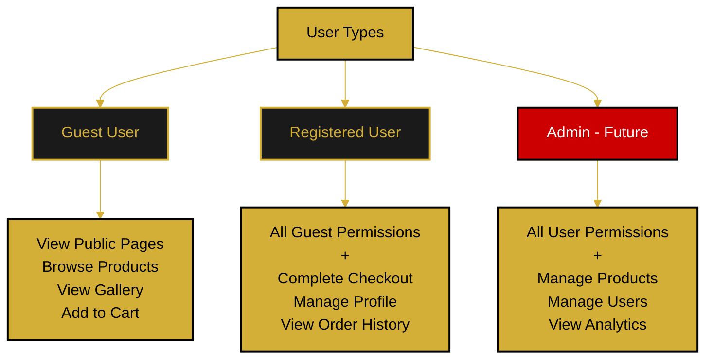

# User Roles & Permissions

This document defines the different user types and their access permissions in the Orbis application.

---

## Roles Diagram

---

## User Types

### Guest User (Unauthenticated)
**Permissions:**
- ✅ View public pages (Home, Shop, Gallery, About)
- ✅ Browse products
- ✅ View product details
- ✅ Add items to cart (local storage)
- ❌ Cannot complete checkout
- ❌ Cannot save profile data
- ❌ Cannot view order history

### Registered User (Authenticated)
**Permissions:**
- ✅ All guest permissions
- ✅ Complete checkout process
- ✅ Create and manage profile
- ✅ Upload and manage avatar
- ✅ View order history
- ✅ Save multiple addresses
- ✅ View own profile
- ❌ Cannot access admin features
- ❌ Cannot view other users' data

### Admin (Future Implementation)
**Permissions:**
- ✅ All registered user permissions
- ✅ Manage products (CRUD operations)
- ✅ Manage users (view, edit, disable)
- ✅ View all orders
- ✅ Access analytics dashboard
- ✅ Manage site content
- ✅ Configure system settings

---

## Permission Matrix

| Feature | Guest | Registered | Admin |
|---------|-------|------------|-------|
| View Public Pages | ✅ | ✅ | ✅ |
| Browse Products | ✅ | ✅ | ✅ |
| Add to Cart | ✅ | ✅ | ✅ |
| Complete Checkout | ❌ | ✅ | ✅ |
| Manage Profile | ❌ | ✅ Own | ✅ All |
| View Orders | ❌ | ✅ Own | ✅ All |
| Product Management | ❌ | ❌ | ✅ |
| User Management | ❌ | ❌ | ✅ |
| Analytics | ❌ | ❌ | ✅ |

---

## Profile Access Rules

### Viewing Profiles
- Users can view their own profile
- Users cannot view other users' profiles (current implementation)
- Future: Public profile pages with privacy settings

### Editing Profiles
- Users can only edit their own profile
- Admins can edit any profile
- Certain fields may be locked (email verification status, etc.)

---

## Implementation Notes

- Role stored in user database table
- Middleware checks role before allowing access
- Frontend hides unavailable features based on role
- Backend enforces permissions on all API endpoints

---

**Related Documents:**
- [Authentication Flow](../flows/authentication-flow.md)
- [Page Hierarchy](./page-hierarchy.md)
- [Navigation Structure](./navigation-structure.md)
