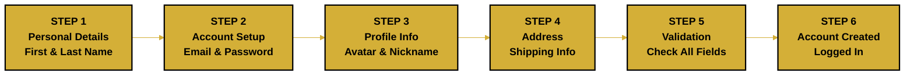
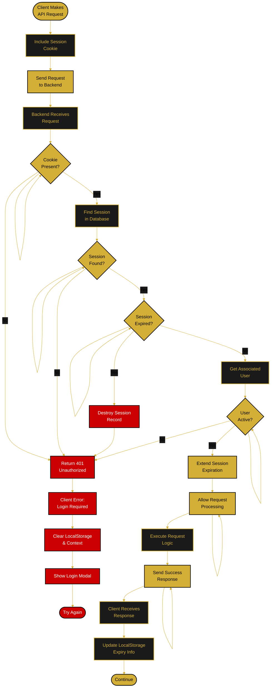
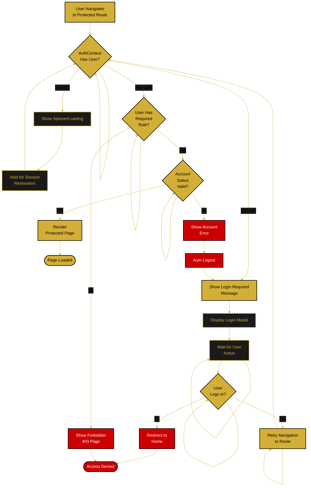
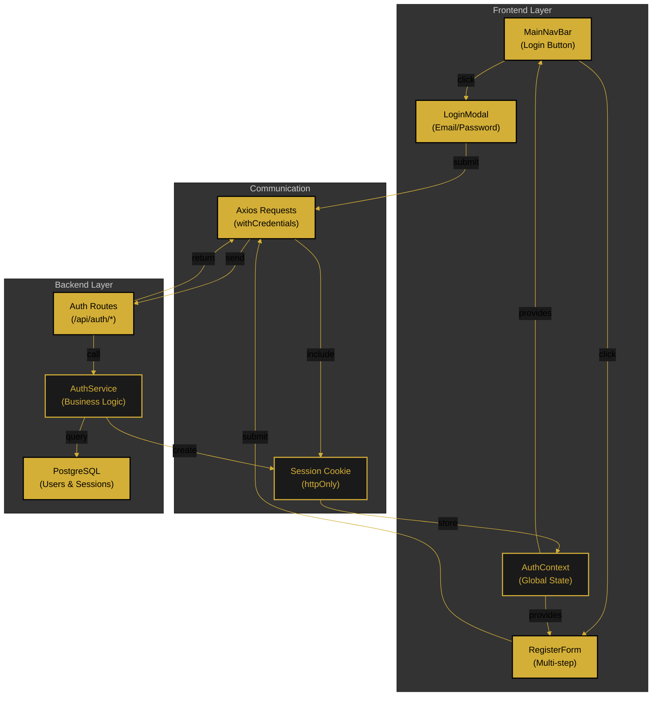

<!--
  ORBIS Authentication Flow Chart
  
  Document Type: Visual Flowchart & Decision Tree
  Purpose: Visual representation of authentication processes
  
  For detailed implementation: see /docs/quickstart/authentication.md
  For sequential flow: see /docs/flows/authentication-flow.md
  
  Updated: December 29, 2025
-->

# 🔐 Authentication Flow Chart

## 📊 Main Authentication Decision Tree

```mermaid
%%{init: {'theme':'base', 'themeVariables': { 'primaryColor':'#D4AF37','primaryTextColor':'#000','primaryBorderColor':'#000','lineColor':'#D4AF37','secondaryColor':'#1a1a1a','tertiaryColor':'#333'}}}%%
graph TD
    Start([User Visits App]):::gold --> CheckSession{Session<br/>in Cookie?}:::gold
    
    CheckSession -->|Yes| ValidateSession[Validate Session<br/>Token]:::black
    CheckSession -->|No| CheckLocal{User in<br/>LocalStorage?}:::gold
    
    ValidateSession --> SessionValid{Session<br/>Valid?}:::gold
    SessionValid -->|Yes| RestoreDB[Get User from<br/>Database]:::black
    SessionValid -->|No| ClearBad[Clear Session<br/>Cookie]:::error
    
    CheckLocal -->|Yes| LoadFromStorage[Load User from<br/>LocalStorage]:::black
    CheckLocal -->|No| NoAuth[No Authentication]:::black
    
    RestoreDB --> SetAuth[Set AuthContext<br/>Loading: false]:::gold
    LoadFromStorage --> SetAuth
    ClearBad --> NoAuth
    NoAuth --> SetAuth
    
    SetAuth --> LoadApp[Render App]:::black
    LoadApp --> UserAction{User<br/>Action?}:::gold
    
    UserAction -->|Clicks Login| ShowModal[Show Login Modal]:::gold
    UserAction -->|Clicks Register| ShowRegister[Redirect to<br/>/register]:::gold
    UserAction -->|Continues| ContinueAs[Continue as<br/>Guest]:::black
    
    ShowModal --> EnterCreds[Enter Email &<br/>Password]:::black
    EnterCreds --> ValidateCreds{Email &<br/>Password<br/>Valid?}:::gold
    
    ValidateCreds -->|No| ErrorCreds[Show Validation<br/>Error]:::error
    ErrorCreds --> EnterCreds
    
    ValidateCreds -->|Yes| SendLogin[Send to<br/>/api/auth/login]:::gold
    SendLogin --> CheckUser{User<br/>Exists?}:::gold
    
    CheckUser -->|No| UserNotFound[Return<br/>User Not Found]:::error
    UserNotFound --> ErrorLogin[Show Error<br/>Message]:::error
    ErrorLogin --> EnterCreds
    
    CheckUser -->|Yes| CheckPassword{Password<br/>Correct?}:::gold
    CheckPassword -->|No| BadPassword[Return<br/>Invalid Password]:::error
    BadPassword --> ErrorLogin
    
    CheckPassword -->|Yes| CheckStatus{Account<br/>Active?}:::gold
    CheckStatus -->|Banned| AccountBanned[Return Account<br/>Banned]:::error
    AccountBanned --> ErrorLogin
    
    CheckStatus -->|Verified| CreateSession[Create Session<br/>in Database]:::gold
    CreateSession --> SetCookie[Set Session<br/>Cookie httpOnly]:::black
    SetCookie --> ReturnUser[Return User<br/>Object]:::gold
    
    ReturnUser --> ClientReceive[Client Receives<br/>User & Session]:::black
    ClientReceive --> UpdateContext[Update AuthContext]:::gold
    UpdateContext --> UpdateStorage[Store User in<br/>LocalStorage]:::black
    UpdateStorage --> CloseModal[Close Modal]:::gold
    CloseModal --> RefreshUI[Refresh UI]:::black
    RefreshUI --> LoggedIn([User Logged In]):::gold
    
    ShowRegister --> RegisterFlow([See Registration<br/>Flow]):::gold
    ContinueAs --> GuestMode([App in Guest Mode]):::black
    
    classDef gold fill:#D4AF37,stroke:#000,stroke-width:2px,color:#000
    classDef black fill:#1a1a1a,stroke:#D4AF37,stroke-width:2px,color:#D4AF37
    classDef error fill:#cc0000,stroke:#000,stroke-width:2px,color:#fff
```



---

## 📋 Registration Process Steps



---

## 🔐 Session Validation Flow (Per Request)



---

## 🗝️ Logout & Session Cleanup Flow

```mermaid
%%{init: {'theme':'base', 'themeVariables': { 'primaryColor':'#D4AF37','primaryTextColor':'#000','primaryBorderColor':'#000','lineColor':'#D4AF37','secondaryColor':'#1a1a1a','tertiaryColor':'#333'}}}%%
graph TD
    UserClick([User Clicks<br/>Logout]):::gold -->
    OnClick[onClick Handler<br/>Triggered]:::black -->
    
    CallLogout[Call logout()<br/>from AuthContext]:::gold -->
    
    MakeRequest[Send DELETE<br/>/api/auth/logout]:::black -->
    
    ServerReceive[Backend Receives<br/>Logout Request]:::gold -->
    FindSession[Find Session<br/>Record]:::black -->
    
    DeleteSession[Delete Session<br/>from Database]:::gold -->
    ClearCookie[Return Clear-Cookie<br/>Header]:::black -->
    
    ClientReceive[Client Receives<br/>Response]:::gold -->
    
    RemoveLocal[Remove User from<br/>LocalStorage]:::black -->
    ClearContext[Clear AuthContext<br/>user = null]:::gold -->
    
    ResetState[Set loading: false]:::black -->
    
    ClearBrowser[Browser Clears<br/>Session Cookie]:::gold -->
    
    RefreshUI[Update UI<br/>Hide Protected Elements]:::black -->
    
    Redirect[Redirect to<br/>Home Page]:::gold -->
    
    GuestMode([App in Guest Mode]):::black
    
    classDef gold fill:#D4AF37,stroke:#000,stroke-width:2px,color:#000
    classDef black fill:#1a1a1a,stroke:#D4AF37,stroke-width:2px,color:#D4AF37
    classDef error fill:#cc0000,stroke:#000,stroke-width:2px,color:#fff
```

---

## 🔄 Protected Route Access



---

## 📱 Component Interaction Diagram



---

## 🔑 Key Decision Points

| Decision Point | Yes Path | No Path |
|---|---|---|
| **Session Valid?** | Restore user session | Treat as guest |
| **User Exists?** | Check password | Return "not found" error |
| **Password Correct?** | Create session | Return "invalid password" |
| **Account Active?** | Proceed to login | Return "account inactive" |
| **Email Unique?** | Create account | Return "email taken" error |
| **Password Strong?** | Continue | Show requirements |
| **User Has Role?** | Show page | Show "forbidden" error |

---

## 🎯 API Endpoints Summary

| Endpoint | Method | Payload | Response | Purpose |
|---|---|---|---|---|
| `/api/auth/login` | POST | `{email, password}` | `{user, sessionId}` | User login |
| `/api/auth/register` | POST | `{firstName, lastName, email, password, ...}` | `{user, sessionId}` | New account |
| `/api/auth/logout` | DELETE | - | `{message}` | Destroy session |
| `/api/session` | GET | - | `{user} or {error}` | Verify session |
| `/api/auth/password-reset` | POST | `{email}` | `{message}` | Reset request |

---

## 🛡️ Security Validation Points

- ✅ HTTPS enforcement (production)
- ✅ Password hashing (bcrypt 10 rounds)
- ✅ Session token generation (secure random)
- ✅ httpOnly cookie flag
- ✅ SameSite=Lax CSRF protection
- ✅ Email uniqueness validation
- ✅ Password strength requirements
- ✅ Account status checking
- ✅ Session expiration (30 days)
- ✅ Secure logout clearing

---

## 🔗 Related Documentation

- **[Authentication Quickstart](../quickstart/authentication.md)** - Implementation details
- **[Authentication Flow](./authentication-flow.md)** - Sequential processes
- **[Shop & Cart Flow](./shop-cart-flow.md)** - Login integration
- **[Profile Management](./profile-management-flow.md)** - User profile

---

**Chart Version:** 1.0  
**Last Updated:** December 29, 2025  
**Status:** ✅ Complete