<!--
  ORBIS Main Application Flow Chart
  
  Document Type: Visual Flowchart & Decision Tree
  Purpose: Visual representation of overall application navigation and user journeys
  
  For detailed implementation: see /docs/flows/main-application-flow.md
  For page hierarchy: see /docs/architecture/page-hierarchy.md
  
  Updated: December 29, 2025
-->

# 🏠 Main Application Flow Chart

## 📊 Overall Application Navigation Flow

```mermaid
%%{init: {'theme':'base', 'themeVariables': { 'primaryColor':'#D4AF37','primaryTextColor':'#000','primaryBorderColor':'#000','lineColor':'#D4AF37','secondaryColor':'#1a1a1a','tertiaryColor':'#333'}}}%%
graph TD
    Start([User Loads App]):::gold --> Init[App Initializes<br/>AuthContext Provider<br/>Checks Session]:::black -->
    
    RestoreAuth{Session<br/>Stored?}:::gold -->
    |No| GuestMode[Guest Mode<br/>No Auth]:::black -->
    |Yes| ValidateServer[Validate with<br/>Backend]:::gold -->
    
    ValidateServer --> IsValid{Valid<br/>Session?}:::gold -->
    |No| ClearAuth[Clear LocalStorage]:::error --> GuestMode
    |Yes| RestoreUser[Restore User<br/>to AuthContext]:::gold -->
    
    GuestMode --> SetReady[Set Loading: False<br/>Render App]:::gold -->
    RestoreUser --> SetReady -->
    
    RenderNav[Display MainNavBar<br/>with Navigation]:::black -->
    
    UserChooses{User<br/>Clicks?}:::gold -->
    
    UserChooses -->|Home| HomePage["🏠 HOME<br/>Route: /"]:::gold
    UserChooses -->|Shop| ShopPage["🛍️ SHOP<br/>Route: /shop"]:::gold
    UserChooses -->|Gallery| GalleryPage["🖼️ GALLERY<br/>Route: /gallery"]:::gold
    UserChooses -->|About| AboutPage["ℹ️ ABOUT<br/>Route: /about"]:::gold
    UserChooses -->|Profile| ProfileGate{User<br/>Logged<br/>In?}:::gold
    UserChooses -->|Cart| CartPage["🛒 CART<br/>Route: /cart"]:::gold
    UserChooses -->|Login| LoginModal[Show Login<br/>Modal]:::gold
    
    ProfileGate -->|No| ShowLogin[Show Login<br/>Required]:::error --> LoginModal
    ProfileGate -->|Yes| ProfilePage["👤 PROFILE<br/>Route: /profile"]:::gold
    
    LoginModal --> EnterCreds[Enter Email &<br/>Password]:::black -->
    LoginSuccess{Credentials<br/>Valid?}:::gold -->
    |No| LoginErr[Show Error]:::error --> EnterCreds
    |Yes| CreateSession[Session Created<br/>httpOnly Cookie]:::gold -->
    UpdateContext[Update AuthContext<br/>& LocalStorage]:::black -->
    MergeCart[Merge Guest Cart<br/>with User Cart]:::gold -->
    CloseModal[Close Modal]:::black -->
    RenderNav
    
    HomePage --> ShowHome[Display Featured<br/>Content & CTAs]:::black -->
    HomeAction{Next<br/>Action?}:::gold -->
    HomeAction -->|Browse Shop| ShopPage
    HomeAction -->|View Gallery| GalleryPage
    HomeAction -->|Learn More| AboutPage
    
    ShopPage --> ShowShop[Display Products<br/>Filters & Sort]:::black -->
    ShopAction{Product<br/>Action?}:::gold -->
    
    ShopAction -->|View Details| ProductDetail[Product Detail<br/>Page: /shop/:id]:::gold -->
    PDPAction{Action?}:::gold -->
    PDPAction -->|Add to Cart| AddCart[Update Cart<br/>Badge Updates]:::gold -->
    PDPAction -->|Wishlist| AddWish{User<br/>Logged<br/>In?}:::gold -->
    PDPAction -->|Back| BackShop[Return to<br/>Shop]:::black
    
    AddWish -->|No| WishLoginReq[Show Login<br/>Required]:::error --> LoginModal
    AddWish -->|Yes| AddWishItem[Add to Wishlist<br/>Update Badge]:::gold --> BackShop
    
    AddCart --> BackShop
    BackShop --> ShopPage
    
    ShopAction -->|Add to Cart| AddCart2[Add Item<br/>to Cart]:::gold --> ShopPage
    ShopAction -->|Wishlist| AddWish2[Add Wishlist<br/>Check Auth]:::gold --> ShopPage
    ShopAction -->|View Details| ProductDetail
    
    GalleryPage --> ShowGallery[Display Gallery<br/>Grid View]:::black -->
    GalleryAction{User<br/>Action?}:::gold -->
    GalleryAction -->|Expand Details| GalleryDetail[Show Item<br/>Details & History]:::gold -->
    GalleryAction -->|Add to Cart| AddCart3[Add to Cart]:::gold --> GalleryPage
    GalleryAction -->|Map/Location| MapView[Show Location<br/>Map]:::black --> GalleryPage
    
    GalleryDetail --> DetailAction{Action?}:::gold -->
    DetailAction -->|Add Cart| AddCart3
    DetailAction -->|Back| GalleryPage
    
    AboutPage --> ShowAbout[Display Team<br/>Contact Form<br/>Location]:::black -->
    AboutAction{User<br/>Action?}:::gold -->
    AboutAction -->|Contact Submit| ContactForm[Submit Contact<br/>Message]:::gold -->
    ContactSent[Show Success<br/>Confirmation]:::gold --> RenderNav
    AboutAction -->|View Map| MapView
    
    CartPage --> ShowCart[Display Cart<br/>Items & Total]:::black -->
    CartAction{User<br/>Action?}:::gold -->
    
    CartAction -->|Update Qty| UpdateQty[Update Quantity<br/>Recalculate Total]:::gold --> CartPage
    CartAction -->|Remove Item| RemoveItem[Remove Item<br/>Update Total]:::gold --> CartPage
    CartAction -->|Continue Shop| ShopPage
    CartAction -->|Proceed| CheckAuth{User<br/>Logged<br/>In?}:::gold -->
    
    CheckAuth -->|No| CheckoutLogin[Show Login<br/>Required]:::error --> LoginModal
    CheckAuth -->|Yes| CheckoutFlow[→ CHECKOUT FLOW]:::gold -->
    
    CheckoutFlow --> ShippingForm[Enter Shipping<br/>Address]:::black -->
    ShippingVal{Address<br/>Valid?}:::gold -->
    ShippingVal -->|No| ShippingErr[Show Errors]:::error --> ShippingForm
    ShippingVal -->|Yes| PaymentSelect[Select Payment<br/>Method]:::black -->
    
    PaymentSelect --> ReviewOrder[Review Order<br/>Summary]:::gold -->
    ConfirmOrder{Confirm<br/>Order?}:::gold -->
    ConfirmOrder -->|No| EditOrder[Edit Order]:::error --> ShippingForm
    ConfirmOrder -->|Yes| CreateOrder[Create Order<br/>in Database]:::gold -->
    
    CreateOrder --> OrderConf[Order Confirmation<br/>Page]:::gold -->
    ConfAction{Next<br/>Action?}:::gold -->
    ConfAction -->|Continue Shop| ShopPage
    ConfAction -->|My Orders| OrderHist[Order History<br/>Page: /orders]:::black
    ConfAction -->|Home| HomePage
    
    ProfilePage --> ShowProfile[Display Profile<br/>Form]:::black -->
    ProfileAction{Edit<br/>What?}:::gold -->
    
    ProfileAction -->|Personal| PersonalEdit[Edit First/Last<br/>Name, Email]:::gold -->
    PersonalEdit --> SavePersonal[Save Changes]:::gold -->
    ProfilePage
    
    ProfileAction -->|Avatar| AvatarUpload[Upload/Delete<br/>Avatar Image]:::gold -->
    AvatarUpload --> SaveAvatar[Save Changes]:::gold -->
    ProfilePage
    
    ProfileAction -->|Address| AddressEdit[Edit Street,<br/>City, State, Zip]:::gold -->
    AddressEdit --> SaveAddress[Save Changes]:::gold -->
    ProfilePage
    
    ProfileAction -->|Password| PasswordChange[Enter Current &<br/>New Password]:::gold -->
    PasswordChange --> SavePassword[Save Changes]:::gold -->
    ProfilePage
    
    ProfileAction -->|Logout| DoLogout[Clear Session<br/>& Auth Context]:::error -->
    DoLogout --> LoggedOut[Logged Out<br/>Redirected Home]:::black -->
    RenderNav
    
    classDef gold fill:#D4AF37,stroke:#000,stroke-width:2px,color:#000
    classDef black fill:#1a1a1a,stroke:#D4AF37,stroke-width:2px,color:#D4AF37
    classDef error fill:#cc0000,stroke:#000,stroke-width:2px,color:#fff
```

---

## 🛒 Shopping Journey (Guest → Authenticated)


---

## 👥 Authenticated User Shopping Journey


---

## 📍 Route Decision Tree

```mermaid
%%{init: {'theme':'base', 'themeVariables': { 'primaryColor':'#D4AF37','primaryTextColor':'#000','primaryBorderColor':'#000','lineColor':'#D4AF37','secondaryColor':'#1a1a1a','tertiaryColor':'#333'}}}%%
graph TD
    UserRequest[User Navigates<br/>to Route]:::gold -->
    CheckRoute{Route<br/>Type?}:::gold -->
    
    CheckRoute -->|Public| PublicCheck{Auth<br/>Required?}:::gold -->
    PublicCheck -->|No| LoadPublic[Load Page<br/>No Restrictions]:::black -->
    Render[Render Page]:::gold
    
    CheckRoute -->|Protected| AuthCheck{User<br/>Logged<br/>In?}:::gold -->
    AuthCheck -->|No| Deny[Redirect to Home<br/>Show Login]:::error -->
    AuthCheck -->|Yes| CheckAdmin{Route<br/>Admin?}:::gold -->
    
    CheckAdmin -->|Yes| RoleCheck{User is<br/>Admin?}:::gold -->
    RoleCheck -->|No| AdminDeny[Redirect<br/>Access Denied]:::error -->
    RoleCheck -->|Yes| LoadAdmin[Load Admin<br/>Page]:::black -->
    Render
    
    CheckAdmin -->|No| LoadProtected[Load Protected<br/>Page]:::black -->
    Render
    
    Deny --> LoginFlow[→ Login Flow]:::error
    AdminDeny --> HomePage[→ Home Page]:::error
    
    classDef gold fill:#D4AF37,stroke:#000,stroke-width:2px,color:#000
    classDef black fill:#1a1a1a,stroke:#D4AF37,stroke-width:2px,color:#D4AF37
    classDef error fill:#cc0000,stroke:#000,stroke-width:2px,color:#fff
```



---

## 🔐 Protection & Access Control

```mermaid
%%{init: {'theme':'base', 'themeVariables': { 'primaryColor':'#D4AF37','primaryTextColor':'#000','primaryBorderColor':'#000','lineColor':'#D4AF37','secondaryColor':'#1a1a1a','tertiaryColor':'#333'}}}%%
graph TD
    Routes["<b>All Routes</b>"]:::gold -->
    
    PublicRoutes["🟢 PUBLIC ROUTES<br/>/ /shop /gallery /about<br/>No Auth Required<br/>All Users"]:::gold -->
    
    GuestAllow["🟡 GUEST-ALLOWED<br/>/cart /register<br/>Work for All<br/>Enhanced for Auth"]:::black -->
    
    AuthRoutes["🔒 PROTECTED ROUTES<br/>/profile /checkout /orders<br/>require AuthContext.user<br/>Redirect if Missing"]:::error -->
    
    AdminRoutes["🔴 ADMIN-ONLY<br/>/admin /admin/users<br/>require role = 'admin'<br/>403 if Regular User"]:::error -->
    
    Routes --> PublicRoutes
    Routes --> GuestAllow
    Routes --> AuthRoutes
    Routes --> AdminRoutes
    
    classDef gold fill:#D4AF37,stroke:#000,stroke-width:2px,color:#000
    classDef black fill:#1a1a1a,stroke:#D4AF37,stroke-width:2px,color:#D4AF37
    classDef error fill:#cc0000,stroke:#000,stroke-width:2px,color:#fff
```



---

## 🎯 Page Hierarchy

| Page | Route | Auth Required | Description |
|---|---|---|---|
| **Home** | `/` | No | Landing page, featured content |
| **Shop** | `/shop` | No | Product listing, filters, sort |
| **Product Detail** | `/shop/:id` | No | Single product page |
| **Gallery** | `/gallery` | No | Interactive product gallery |
| **About** | `/about` | No | Company info, contact form |
| **Cart** | `/cart` | No | View & manage cart items |
| **Register** | `/register` | No | Create new account |
| **Profile** | `/profile` | Yes | User profile management |
| **Checkout** | `/checkout` | Yes | Shipping, payment, order |
| **Orders** | `/orders` | Yes | Order history & details |
| **Wishlist** | `/wishlist` | Yes | Saved products |
| **Admin** | `/admin` | Yes* | Admin dashboard |

*Requires `role = 'admin'`

---

## 🗂️ Component Tree

```
App
├── AuthContext
├── Router
│   ├── MainNavBar
│   ├── Route: Home
│   ├── Route: Shop
│   ├── Route: Shop/:id
│   ├── Route: Gallery
│   ├── Route: About
│   ├── Route: Cart
│   ├── Route: Register
│   ├── ProtectedRoute: Profile
│   ├── ProtectedRoute: Checkout
│   ├── ProtectedRoute: Orders
│   ├── ProtectedRoute: Wishlist
│   └── ProtectedRoute: Admin
├── LoginModal (portal)
└── FadeNotification (portal)
```

---

## 📱 Navigation by Device

### Desktop
- Horizontal navbar with all links
- Dropdown menus
- Full feature access
- Multi-column layouts

### Mobile (< 768px)
- Hamburger menu
- Vertical nav drawer
- Stacked layouts
- Touch-friendly buttons
- Bottom mobile navigation (optional)

### Tablet (768px - 1024px)
- Flexible navbar
- Adjusted grid columns
- Balanced spacing

---

## 🔗 Related Documentation

- **[Main Application Flow](./main-application-flow.md)** - Detailed sequential flows
- **[Authentication Flow Chart](./authentication-flow-chart.md)** - Auth processes
- **[Profile Management Chart](./profile-management-flow-chart.md)** - Profile operations
- **[Shop & Cart Flow Chart](./shop-cart-flow-chart.md)** - Shopping processes
- **[Page Hierarchy](../architecture/page-hierarchy.md)** - Complete page listing
- **[Navigation Structure](../architecture/navigation-structure.md)** - NavBar details

---

**Chart Version:** 1.0  
**Last Updated:** December 29, 2025  
**Status:** ✅ Complete