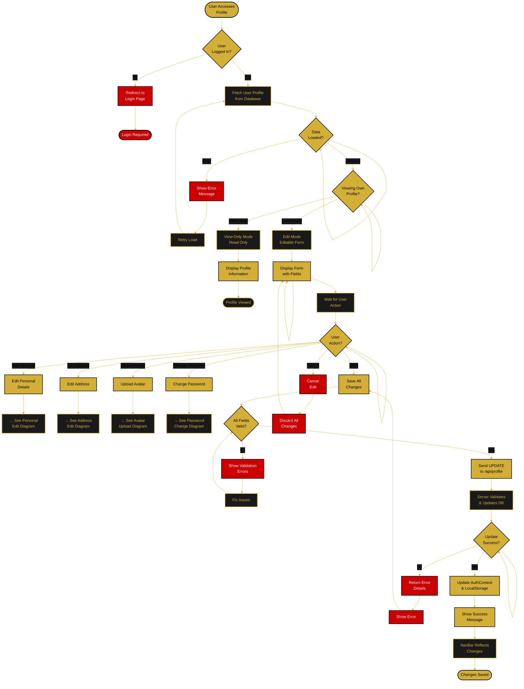
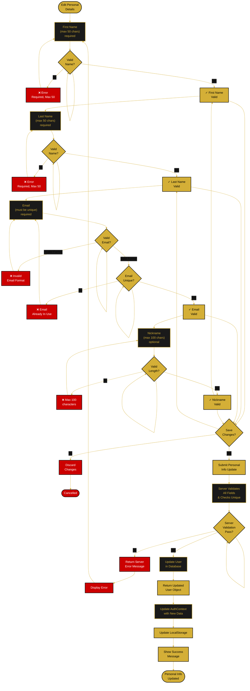
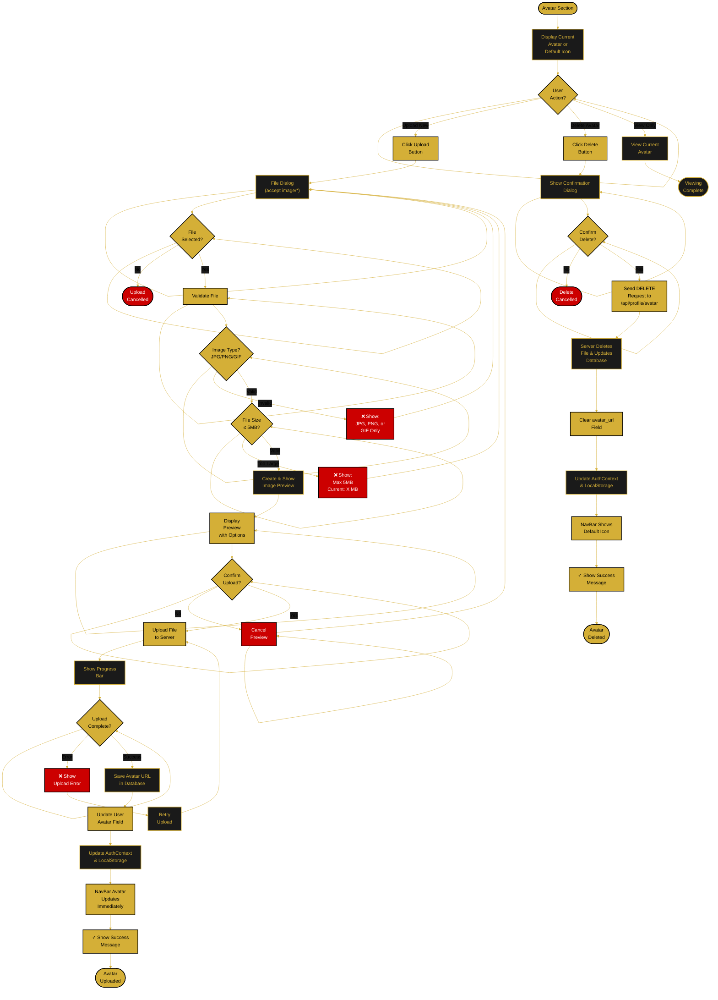
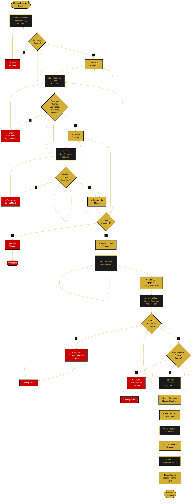
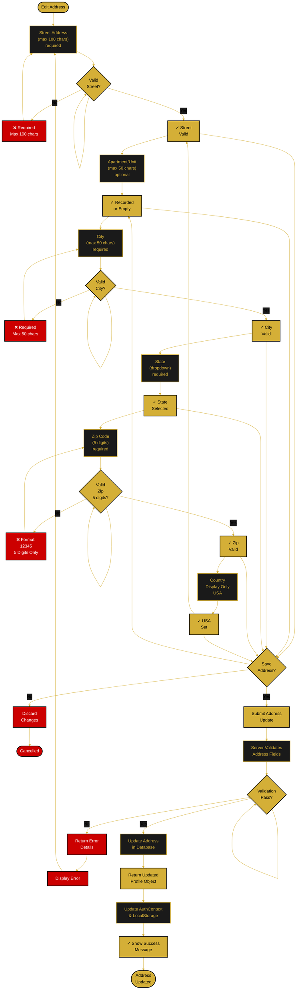
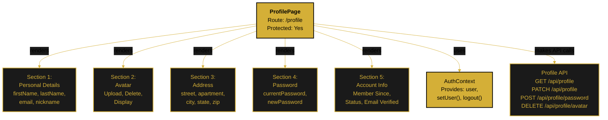

<!--
  ORBIS Profile Management Flow Chart
  
  Document Type: Visual Flowchart & Decision Tree
  Purpose: Visual representation of profile management processes
  
  For detailed implementation: see /docs/quickstart/authentication.md
  For sequential flow: see /docs/flows/profile-management-flow.md
  
  Updated: December 29, 2025
-->

# 👤 Profile Management Flow Chart

## 📊 Profile Access & Editing Decision Tree

---

## ✏️ Personal Details Edit Flow

---

## 🖼️ Avatar Upload Flow

---

## 🔐 Change Password Flow

---

## 🏠 Address Edit Flow

---

## 📱 Profile Form Components

---

## 🔑 Key Decision Points

| Decision Point | Yes Path | No Path |
|---|---|---|
| **User Logged In?** | Fetch profile data | Redirect to login |
| **Viewing Own Profile?** | Edit mode enabled | View-only mode |
| **Valid Email Format?** | Check uniqueness | Show format error |
| **Email Unique?** | Allow save | Show "taken" error |
| **Password Strong?** | Allow next step | Show requirements |
| **Passwords Match?** | Save password | Show mismatch error |
| **Valid Image Type?** | Check file size | Show type error |
| **File Size ≤ 5MB?** | Create preview | Show size error |
| **Current Password Correct?** | Update password | Show invalid error |
| **New Password Different?** | Update | Show same password error |

---

## 🔗 Related Documentation

- **[Profile Management Flow](./profile-management-flow.md)** - Sequential processes
- **[Authentication Flow Chart](./authentication-flow-chart.md)** - Login/auth flows
- **[Authentication Quickstart](../quickstart/authentication.md)** - Implementation details
- **[Main Application Flow](./main-application-flow.md)** - Overall navigation

---

**Chart Version:** 1.0  
**Last Updated:** December 29, 2025  
**Status:** ✅ Complete