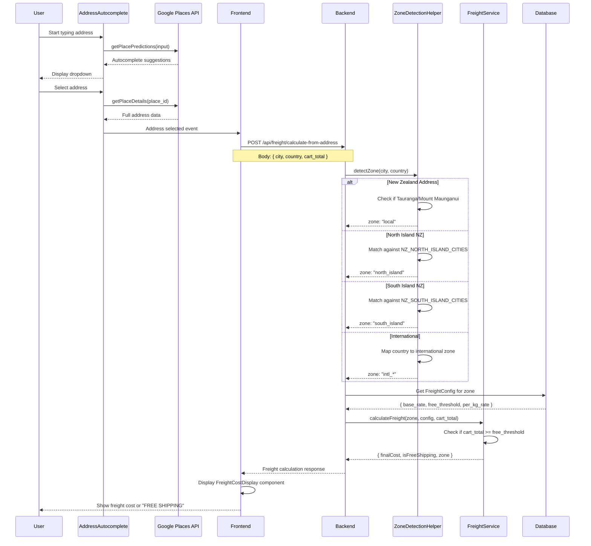

///////////////////////////////////////////////////////////////////////
// ================ SHOP & CART FLOW CHART ========================== //
///////////////////////////////////////////////////////////////////////

/**
 * CHART PURPOSE:
 * Visual representation of the complete shop and cart flow including
 * guest shopping, authenticated shopping, cart merge, checkout with
 * Google Address Autocomplete and freight zone calculation.
 * 
 * RELATED DOCUMENT: /docs/flows/shop-cart-flow.md
 * LAST UPDATED: January 4, 2026
 * VERSION: 2.0 (Freight & Address Integration)
 */

---

## 🛒 Complete Shop & Cart Flow

```mermaid
%%{init: {'theme':'base', 'themeVariables': { 'primaryColor':'#D4AF37','primaryTextColor':'#000','primaryBorderColor':'#000','lineColor':'#D4AF37','secondaryColor':'#1a1a1a','tertiaryColor':'#333'}}}%%
graph TD
    Start[User Enters Site]:::gold --> Browse[Browse Shop Page]:::black
    
    Browse --> ProductCard[View Product Card]:::gold
    ProductCard --> ViewDetails[Click Product Details]:::black
    
    ViewDetails --> ProductPage[Product Detail Page]:::gold
    ProductPage --> Wishlist{Add to Wishlist?}:::gold
    
    Wishlist -->|Yes Auth| AddWishlist[Add to Wishlist]:::black
    Wishlist -->|No Auth| LoginPrompt1[Show Login Prompt]:::error
    Wishlist -->|No| AddCart[Add to Cart]:::black
    
    AddWishlist --> WishlistBadge[Update Wishlist Badge]:::gold
    AddWishlist --> AddCart
    
    AddCart --> GuestCheck{User Logged In?}:::gold
    
    GuestCheck -->|No| GuestCart[Store in Guest Cart]:::black
    GuestCheck -->|Yes| UserCart[Store in User Cart]:::black
    
    GuestCart --> InitSession[Initialize Session]:::gold
    InitSession --> SessionID[Save with session_id]:::black
    UserCart --> UserID[Save with user_id]:::black
    
    SessionID --> ShowNotif[Show FadeNotification]:::gold
    UserID --> ShowNotif
    
    ShowNotif --> ShowCheckoutBtn[Show ProceedToCheckout Btn]:::black
    ShowCheckoutBtn --> UpdateBadge[Update Cart Badge]:::gold
    
    UpdateBadge --> ContinueShopping{Continue Shopping?}:::gold
    ContinueShopping -->|Yes| Browse
    ContinueShopping -->|No| ViewCart[Go to Cart Page]:::black
    
    ViewCart --> CartActions[Cart Management]:::gold
    CartActions --> UpdateQty[Update Quantity]:::black
    CartActions --> RemoveItem[Remove Item]:::black
    CartActions --> ClearCart[Clear Cart]:::black
    
    UpdateQty --> CartActions
    RemoveItem --> CartActions
    ClearCart --> Browse
    
    CartActions --> ProceedCheckout[Proceed to Checkout]:::gold
    
    ProceedCheckout --> AuthCheck{Logged In?}:::gold
    
    AuthCheck -->|No Guest| LoginModal[Open LoginModal]:::error
    AuthCheck -->|Yes| Checkout[Checkout Page]:::black
    
    LoginModal --> LoginOrRegister{Login or Register?}:::gold
    LoginOrRegister -->|Login| DoLogin[Authenticate]:::black
    LoginOrRegister -->|Register| DoRegister[Create Account]:::black
    
    DoLogin --> MergeCart[Merge Guest Cart]:::gold
    DoRegister --> MergeCart
    
    MergeCart --> UpdateCartDB[Update cart.user_id]:::black
    UpdateCartDB --> DispatchEvent[Dispatch cartUpdated]:::gold
    DispatchEvent --> Checkout
    
    Checkout --> AddressAutocomplete[Google Address Autocomplete]:::google
    AddressAutocomplete --> SelectAddress[User Selects Address]:::black
    SelectAddress --> FreightCalc[POST /freight/calculate-from-address]:::gold
    FreightCalc --> ZoneDetect[Detect Freight Zone]:::black
    ZoneDetect --> FreightCost[Calculate Freight Cost]:::gold
    FreightCost --> DisplayFreight[FreightCostDisplay Component]:::black
    DisplayFreight --> ValidateAddr{Valid Address?}:::gold
    ValidateAddr -->|No| AddressAutocomplete
    ValidateAddr -->|Yes| PaymentPage[Payment Method]:::black
    
    PaymentPage --> SelectPayment[Select Payment Type]:::gold
    SelectPayment --> PlaceOrder[Place Order Button]:::black
    
    PlaceOrder --> CreateOrder[Create Order Record]:::gold
    CreateOrder --> ClearUserCart[Clear Cart Items]:::black
    ClearUserCart --> OrderConfirm[Order Confirmation]:::gold
    
    OrderConfirm --> SendEmail[Send Confirmation Email]:::black
    OrderConfirm --> ShowOrderDetails[Display Order Summary]:::gold
    
    classDef gold fill:#D4AF37,stroke:#000,stroke-width:2px,color:#000
    classDef black fill:#1a1a1a,stroke:#D4AF37,stroke-width:2px,color:#D4AF37
    classDef error fill:#cc0000,stroke:#000,stroke-width:2px,color:#fff
    classDef google fill:#4285F4,stroke:#000,stroke-width:2px,color:#fff
```

---

## 🚚 Freight Calculation Sequence Diagram ✨

---

## 🌏 Zone Detection Logic

```mermaid
flowchart TD
    Start[Address Input] --> Country{Country?}
    
    Country -->|New Zealand| NZCheck{City Check}
    NZCheck -->|Tauranga/Mount Maunganui| Local[🏠 Local Zone<br/>Cheapest rates]
    NZCheck -->|Auckland/Wellington/etc| NorthIsland[🏝️ North Island<br/>Standard NZ rates]
    NZCheck -->|Christchurch/Dunedin/etc| SouthIsland[🗻 South Island<br/>Standard NZ rates]
    
    Country -->|Australia| IntlAsia[🌏 International Asia]
    Country -->|USA/Canada| IntlNA[🌎 International North America]
    Country -->|UK/Portugal| IntlEU[🌍 International Europe]
    Country -->|Brazil| IntlLA[🌎 International Latin America]
    Country -->|China| IntlAsia
    Country -->|Other| IntlOther[🌐 Default International]
    
    Local --> Rate1[Base: $5.00<br/>Free threshold: $50]
    NorthIsland --> Rate2[Base: $12.00<br/>Free threshold: $150]
    SouthIsland --> Rate3[Base: $15.00<br/>Free threshold: $150]
    IntlAsia --> Rate4[Base: $35.00<br/>Free threshold: $300]
    IntlNA --> Rate5[Base: $40.00<br/>Free threshold: $350]
    IntlEU --> Rate6[Base: $45.00<br/>Free threshold: $350]
    IntlLA --> Rate7[Base: $50.00<br/>Free threshold: $400]
    IntlOther --> Rate8[Base: $55.00<br/>Free threshold: $400]
    
    style Local fill:#22c55e,color:#000
    style NorthIsland fill:#3b82f6,color:#fff
    style SouthIsland fill:#3b82f6,color:#fff
    style IntlAsia fill:#f59e0b,color:#000
    style IntlNA fill:#ef4444,color:#fff
    style IntlEU fill:#ef4444,color:#fff
    style IntlLA fill:#ef4444,color:#fff
    style IntlOther fill:#6b7280,color:#fff
```

---

## 🎨 Chart Legend

| Color | Meaning |
|-------|---------|
| 🟡 Gold (#D4AF37) | Pages, major decision points, system actions |
| ⬛ Black (#1a1a1a) | User actions, component interactions, database operations |
| 🔴 Red (#cc0000) | Error states, authentication required prompts |
| 🔵 Blue (#4285F4) | Google APIs integration |

---

## 📌 Key Decision Points

### 1. User Authentication Check (GuestCheck)
- **Purpose:** Determine cart storage strategy
- **Guest:** Cart stored with `session_id`
- **User:** Cart stored with `user_id`

### 2. Wishlist Authentication (Wishlist)
- **Purpose:** Enforce authentication for wishlist
- **Guest:** Show login prompt
- **User:** Add to wishlist successfully

### 3. Checkout Authentication (AuthCheck)
- **Purpose:** Require login before checkout
- **Guest:** Show LoginModal
- **User:** Proceed to checkout form

### 4. Address Validation (ValidateAddr)
- **Purpose:** Ensure valid shipping details
- **Invalid:** Return to form with errors
- **Valid:** Proceed to payment

### 4. Freight Zone Detection (ZoneDetect)
- **Purpose:** Calculate shipping cost based on destination
- **Local:** Tauranga/Mount Maunganui (cheapest)
- **Domestic:** North Island / South Island (standard NZ rates)
- **International:** Region-based pricing

---

## 🔄 Cart Merge Process

When a guest logs in or registers with items in cart:

1. **Before Auth:** Cart has `session_id`, `user_id = NULL`
2. **User Authenticates:** Login/register successful
3. **Merge Trigger:** `mergeCart()` called from AuthContext
4. **Database Update:** `UPDATE cart SET user_id = ?, session_id = NULL WHERE session_id = ?`
5. **Event Dispatch:** `window.dispatchEvent(new Event("cartUpdated"))`
6. **UI Update:** Cart badge refreshes, cart page shows merged items

---

## 📱 Component Flow

### FadeNotification Display Points
- After "Add to Cart" action
- After "Add to Wishlist" action
- After "Remove from Wishlist" action
- After cart item updates

### Custom Event Triggers
- `cartUpdated` - After any cart modification
- `wishlistUpdated` - After wishlist add/remove

### Badge Updates
- **Cart Badge:** Listens to `cartUpdated`, polls every 5s
- **Wishlist Badge:** Listens to `wishlistUpdated`, polls every 10s

---

**Related Documentation:**
- [Shop & Cart Flow Details](../flows/shop-cart-flow.md)
- [Authentication Flow Chart](./authentication-flow-chart.md)
- [Wishlist Flow Chart](./wishlist-flow-chart.md)
