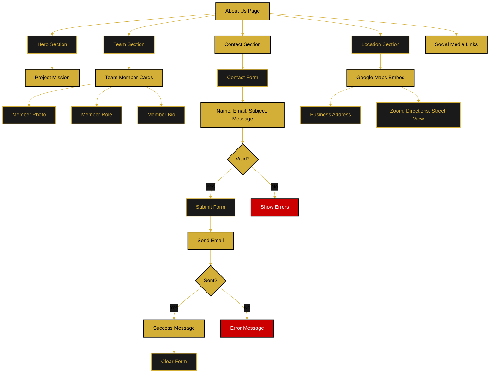

# About Us & Contact Flow

This document describes the planned About Us page featuring company information, team members, contact form, and location map.

**Status:** 🔄 Planned Feature

---

## Flow Diagram

---

## Page Sections

### Hero Section
- Project mission statement
- Brand values
- Hero image/video

### Team Section
- Team member cards
- Photos and bios
- Roles and responsibilities
- Optional social media links

### Contact Form
- **Fields:** Name, Email, Subject, Message
- **Validation:** Required fields, email format
- **Submission:** Sends email to company inbox
- **Feedback:** Success/error messages

### Location Section
- Google Maps embed
- Business address
- Map controls (zoom, directions, street view)
- Optional directions link

### Social Media
- Links to company social profiles
- Icon-based navigation

---

## Contact Form Requirements

- All fields required except additional notes
- Email validation
- Message min/max length
- Anti-spam protection (future: CAPTCHA)
- Confirmation email to sender

---

**Related Documents:**
- [Main Application Flow](./main-application-flow.md)
