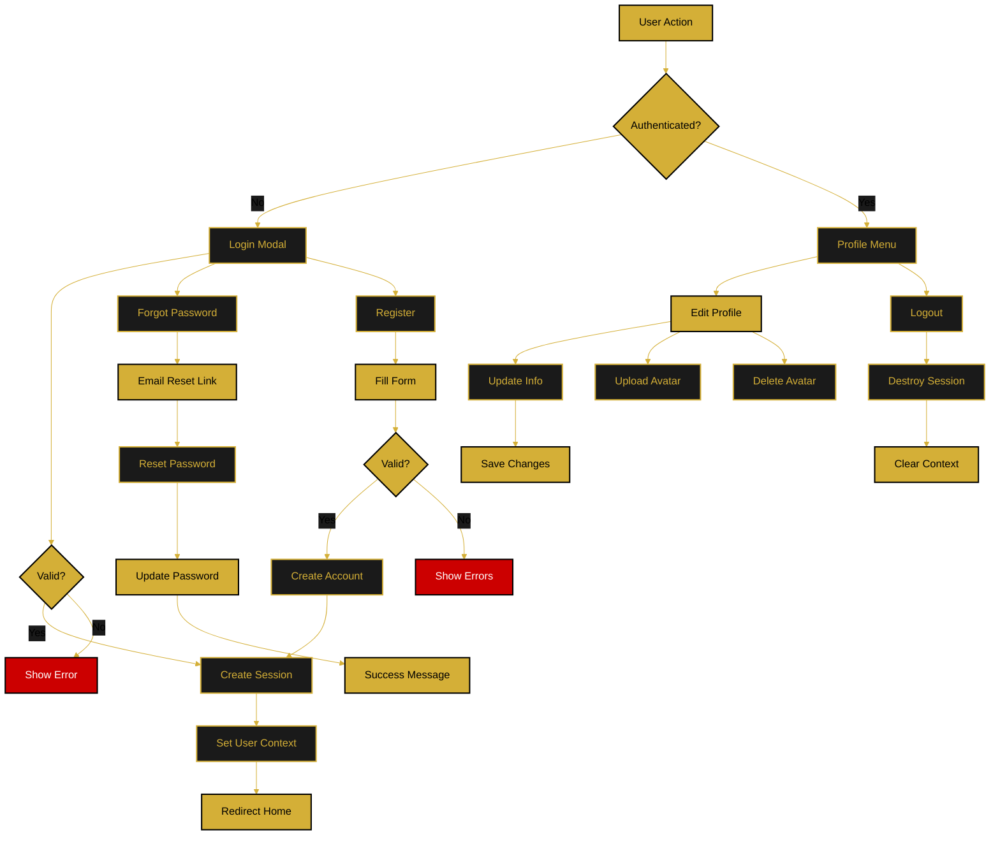

# Authentication Flow

This document details the user authentication process including login, registration, logout, and session management.

---

## Flow Diagram

---

## Authentication Components

### Login
- Email and password validation
- Session creation on success
- Error handling for invalid credentials

### Registration
- Multi-step form (personal details, profile, address)
- Optional avatar upload
- Password strength validation (8+ chars, uppercase, lowercase, number, special char)
- Automatic session creation after registration

### Logout
- Session destruction
- Context clearing
- Redirect to home page

### Session Management
- Persistent sessions using cookies
- Session restoration on page load
- Automatic timeout handling

---

## Password Requirements

- Minimum 8 characters
- At least one uppercase letter
- At least one lowercase letter
- At least one number
- At least one special character (@$!%*?&#)

---

**Related Documents:**
- [Profile Management Flow](./profile-management-flow.md)
- [Password Reset Flow](./password-reset-flow.md)
