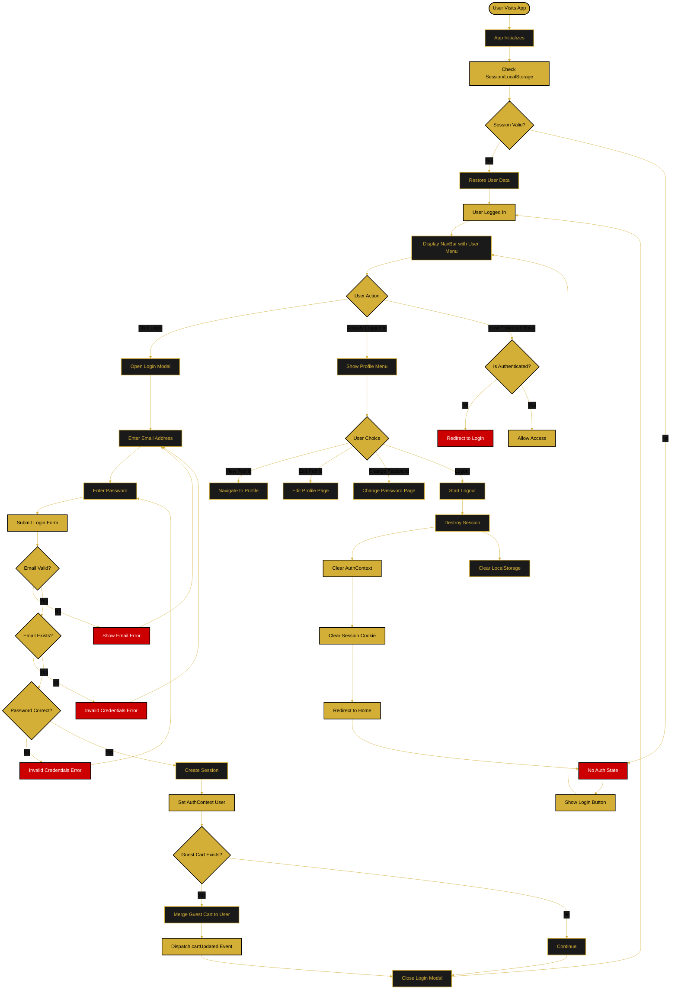
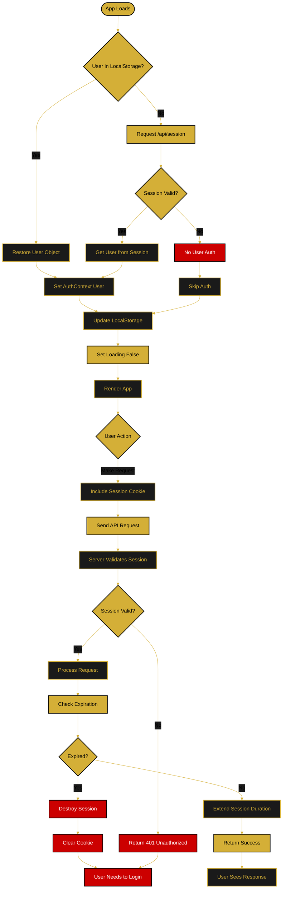
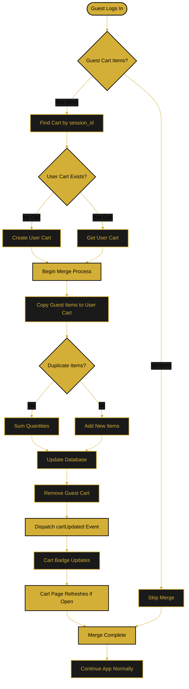

///////////////////////////////////////////////////////////////////////
// =============== AUTHENTICATION FLOW DOCUMENTATION =============== //
///////////////////////////////////////////////////////////////////////

/**
 * FLOW PURPOSE:
 * Complete user authentication flow including registration, login, logout,
 * session management, password reset, and cart merge on authentication.
 * 
 * SYSTEMS INVOLVED: AuthContext, Backend Auth Service, Database, Session Management
 * LAST UPDATED: December 29, 2025
 * VERSION: 2.0
 */

---

## 📋 Overview

The **Authentication Flow** manages user identity verification, session creation, and access control throughout the Orbis platform. It includes:

- **User Registration** with profile creation
- **User Login** with email/password
- **Session Persistence** across page reloads
- **Cart Merge** when guest becomes user
- **Password Reset** for account recovery
- **Logout** with session destruction
- **Context Management** via AuthContext
- **Security** with encrypted passwords and secure cookies

---

## 🔄 Main Authentication Flow



---

## 🔑 Registration Flow

```mermaid
%%{init: {'theme':'base', 'themeVariables': { 'primaryColor':'#D4AF37','primaryTextColor':'#000','primaryBorderColor':'#000','lineColor':'#D4AF37','secondaryColor':'#1a1a1a','tertiaryColor':'#333'}}}%%
graph TD
    Start([User Clicks Register]):::gold --> RegisterPage[Navigate to /register]:::black
    
    RegisterPage --> Section1[Section 1: Personal Details]:::gold
    Section1 --> FirstName[Enter First Name]:::black
    FirstName --> LastName[Enter Last Name]:::black
    
    LastName --> Section2[Section 2: Profile]:::gold
    Section2 --> Email[Enter Email]:::black
    Email --> ValidateEmail{Email Unique?}:::gold
    ValidateEmail -->|No| EmailExists[Show Email Taken Error]:::error
    EmailExists --> Email
    ValidateEmail -->|Yes| Password[Enter Password]:::black
    
    Password --> ValidatePassword{Password Strong?}:::gold
    ValidatePassword -->|No| PasswordWeak[Show Requirements]:::error
    PasswordWeak --> Password
    ValidatePassword -->|Yes| Confirm[Confirm Password]:::black
    
    Confirm --> MatchCheck{Passwords Match?}:::gold
    MatchCheck -->|No| NoMatch[Show Mismatch Error]:::error
    NoMatch --> Confirm
    MatchCheck -->|Yes| Nickname[Enter Nickname Optional]:::black
    
    Nickname --> AvatarSection[Avatar Upload Optional]:::gold
    AvatarSection --> SelectAvatar[Select Image File]:::black
    SelectAvatar --> ValidateImage{Valid Image?}:::gold
    ValidateImage -->|No| ImageError[Show Error]:::error
    ImageError --> SelectAvatar
    ValidateImage -->|Yes| ShowPreview[Show Preview]:::black
    ShowPreview --> ConfirmImage{Keep Image?}:::gold
    ConfirmImage -->|No| SelectAvatar
    ConfirmImage -->|Yes| Section3[Section 3: Address]:::gold
    SelectAvatar -->|Skip Avatar| Section3
    
    Section3 --> Address[Enter Address]:::black
    Address --> City[Enter City]:::black
    City --> State[Enter State]:::black
    State --> ZipCode[Enter Zip Code]:::black
    ZipCode --> Country[Select Country]:::black
    
    Country --> ValidateForm{All Valid?}:::gold
    ValidateForm -->|No| ShowErrors[Display Errors]:::error
    ShowErrors --> FixErrors[Fix Issues]:::black
    FixErrors --> ValidateForm
    
    ValidateForm -->|Yes| SubmitReg[Submit Registration]:::gold
    SubmitReg --> ServerCreate[Create User Account]:::black
    ServerCreate --> CreateProfile[Create Profile Record]:::black
    CreateProfile --> UploadFile[Upload Avatar to Server]:::black
    
    UploadFile --> CreateSession[Create Session]:::gold
    CreateSession --> SetContext[Set AuthContext]:::black
    SetContext --> StoreLocal[Store User in LocalStorage]:::gold
    
    StoreLocal --> Success[Show Success Message]:::gold
    Success --> Redirect[Redirect to Home]:::black
    Redirect --> LoggedIn([User Logged In]):::gold
    
    classDef gold fill:#D4AF37,stroke:#000,stroke-width:2px,color:#000
    classDef black fill:#1a1a1a,stroke:#D4AF37,stroke-width:2px,color:#D4AF37
    classDef error fill:#cc0000,stroke:#000,stroke-width:2px,color:#fff
```



---

## 🔐 Session Management Flow



---

## 🛒 Cart Merge on Login Flow



---

## 🔑 Authentication State Components

### AuthContext
- **Location:** `frontend/src/pages/common/context/AuthContext.jsx`
- **Provides:** `user`, `loading`, `login()`, `logout()`, `setUser()`
- **Manages:** Global authentication state
- **Persists:** User data in localStorage
- **Restores:** Session on app load

### LoginModal Component
- **Trigger:** Click "Login" button in MainNavBar
- **Fields:** Email, Password
- **Validation:** Email format, password required
- **Success:** Creates session, closes modal, updates context
- **Error:** Shows error messages, allows retry

### RegisterForm Component
- **Route:** `/register`
- **Sections:** Personal, Profile, Address
- **Optional:** Avatar upload
- **Validation:** Email unique, password strength, field completion
- **Success:** Creates account, session, redirects home

### Password Requirements
- Minimum 8 characters
- At least one uppercase letter (A-Z)
- At least one lowercase letter (a-z)
- At least one number (0-9)

---

## 🔐 Security Features

### Password Security
- **Hashing:** bcrypt with 10 salt rounds
- **Storage:** Only hash stored, never plain text
- **Comparison:** Safe constant-time comparison
- **Requirements:** Min 8 chars, uppercase, lowercase, number

### Session Security
- **httpOnly:** Prevents JavaScript access (XSS protection)
- **Secure:** Only sent over HTTPS (in production)
- **SameSite:** Lax setting (CSRF protection)
- **Duration:** 30 days default
- **Storage:** Database (not in-memory)

### CORS & Validation
- **withCredentials:** true on all requests
- **Frontend URL:** Validated on backend
- **Session Validation:** Every request checked
- **User Validation:** Account status verified

---

## 🎯 Authentication States

### States
- `loading` - App initializing, checking session
- `authenticated` - User logged in, context has user
- `unauthenticated` - No user, guest mode
- `error` - Authentication failed

### Transitions
```
Loading → Authenticated (session restored)
Loading → Unauthenticated (no session)
Unauthenticated → Authenticated (login/register)
Authenticated → Unauthenticated (logout)
```

---

## 📱 User Experience

### On Login Success
1. Modal closes
2. NavBar shows user name/avatar
3. Profile menu appears
4. Cart merges (if guest items)
5. User can access protected pages

### On Logout
1. Session destroyed
2. Context cleared
3. LocalStorage cleared
4. Redirected to home
5. Login button appears in navbar

### On Session Expire
1. API returns 401
2. Session cleared automatically
3. User redirected to login
4. Message shown: "Please login again"

---

## 🔗 Related Documentation

- **[Authentication System Quickstart](../quickstart/authentication.md)** - Detailed implementation
- **[Password Reset Flow](./password-reset-flow.md)** - Reset process
- **[Profile Management Flow](./profile-management-flow.md)** - Profile editing
- **[Shop & Cart Flow](./shop-cart-flow.md)** - Cart merge details
- **[Main Application Flow](./main-application-flow.md)** - Overall navigation

---

**Document Version:** 2.0  
**Last Updated:** December 29, 2025  
**Status:** ✅ Comprehensive
