# Interactive Gallery Flow

This document describes the planned interactive product gallery featuring historical information and interactive maps.

**Status:** 🔄 Planned Feature

---

## Flow Diagram

```mermaid
%%{init: {'theme':'base', 'themeVariables': { 'primaryColor':'#D4AF37','primaryTextColor':'#000','primaryBorderColor':'#000','lineColor':'#D4AF37','secondaryColor':'#1a1a1a','tertiaryColor':'#333'}}}%%
graph TD
    Gallery[Gallery Page]:::gold --> Grid[Gallery Grid]:::black
    
    Grid --> Item[Gallery Item]:::gold
    Item --> Thumbnail[Thumbnail View]:::black
    Item --> QuickAdd[Quick Add to Cart]:::black
    
    Item --> Expand[Expand Details]:::gold
    
    Expand --> Images[Image Gallery]:::black
    Expand --> Description[Description]:::black
    Expand --> History[Product History]:::gold
    Expand --> Map[Interactive Map]:::gold
    Expand --> AddCart[Add to Cart]:::black
    
    History --> Timeline[Historical Timeline]:::black
    History --> Origin[Origin Story]:::black
    
    Map --> Markers[Location Markers]:::black
    Map --> Controls[Zoom Controls]:::black
    
    Images --> Carousel[Carousel View]:::gold
    Carousel --> Fullscreen[Fullscreen Mode]:::black
    
    QuickAdd --> CartUpdate[Update Cart]:::gold
    AddCart --> CartUpdate
    
    Expand --> Close[Close View]:::black
    Close --> Grid
    
    classDef gold fill:#D4AF37,stroke:#000,stroke-width:2px,color:#000
    classDef black fill:#1a1a1a,stroke:#D4AF37,stroke-width:2px,color:#D4AF37
```

---

## Gallery Features

### Grid View
- Masonry-style layout
- Product thumbnails
- Quick add to cart button
- Click to expand details

### Expanded View
- **Image Gallery:** High-res images with carousel
- **Product Description:** Detailed information
- **Historical Timeline:** Product history and origin
- **Interactive Map:** Geographic location markers
- **Specifications:** Product details
- **Add to Cart:** Purchase option

### Interactive Map
- Location markers showing product origin
- Zoom and pan controls
- Info popups with additional details
- Street view integration (optional)

### Image Carousel
- Next/previous navigation
- Fullscreen viewing
- Thumbnail strip
- Zoom capability

---

## Difference from Shop

The gallery focuses on the **story and history** of products, while the shop page emphasizes **commerce and purchasing**. Gallery items have expanded historical context, maps, and cultural significance.

---

**Related Documents:**
- [Shop & Cart Flow](./shop-cart-flow.md)
- [Main Application Flow](./main-application-flow.md)
