---

<!--
  ORBIS Main Application Flow
  
  Document Type: System Flow Diagram & Documentation
  Purpose: Overall navigation structure, page hierarchy, and user journeys
  Last Updated: December 29, 2025
  
  For implementation details: see /docs/architecture/
  For visual charts: see /docs/charts/main-application-flow-chart.md
-->

# 🏠 Main Application Flow

This comprehensive document describes the overall navigation structure, page hierarchy, and primary user flows through the Orbis e-commerce application. It covers both guest and authenticated user paths, role-based access, and the complete customer journey.

---

## 📋 Overview

### Application Structure
- **Frontend Framework:** React with Vite
- **Routing:** React Router v6
- **Navigation:** MainNavBar + sidebar navigation
- **State Management:** AuthContext + local cart state
- **Protected Routes:** Implemented with ProtectedRoute wrapper
- **Authentication:** Session-based with httpOnly cookies

### Key User Types
- **Guest Users:** Full read-only shop access, cart management, login/register
- **Authenticated Users:** All guest features + profile, wishlist, checkout, orders
- **Admin Users:** Special admin dashboard, user/product management (future)

### Primary User Flows
1. **Guest Shopping Flow** - Browse → Cart → Login → Checkout
2. **Authenticated Shopping Flow** - Browse → Wishlist → Cart → Checkout → Order
3. **Profile Management Flow** - Edit profile → Avatar upload → Address → Password
4. **Authentication Flow** - Login/Register → Session restore → Logout
5. **Guest to Authenticated** - Shop as guest → Add to cart → Login → Merge carts

---

## 🔄 Main Application Navigation Flow

```mermaid
%%{init: {'theme':'base', 'themeVariables': { 'primaryColor':'#D4AF37','primaryTextColor':'#000','primaryBorderColor':'#000','lineColor':'#D4AF37','secondaryColor':'#1a1a1a','tertiaryColor':'#333'}}}%%
graph TD
    Start([User Loads App]):::gold --> AppInit[App Component<br/>Initializes]:::black -->
    
    CheckSession[Check Stored<br/>Session]:::gold -->
    RestoreAuth{Session<br/>Found?}:::gold -->
    
    RestoreAuth -->|Yes| ValidateSession[Validate with<br/>Backend]:::black -->
    IsValid{Valid<br/>Session?}:::gold -->
    IsValid -->|Yes| RestoreUser[Restore User<br/>to AuthContext]:::gold
    IsValid -->|No| GuestMode[Guest Mode]:::error
    
    RestoreAuth -->|No| GuestMode
    
    RestoreUser --> SetAuth[Set auth<br/>Loading: false]:::black -->
    RenderApp[Render Main<br/>Application]:::gold -->
    
    GuestMode --> SetAuth
    
    RenderApp --> DisplayNav[Display MainNavBar<br/>& Navigation]:::black -->
    UserAction{User<br/>Navigation?}:::gold -->
    
    UserAction -->|Click Home| HomePage[Home Page<br/>Route: /]:::gold
    UserAction -->|Click Shop| ShopPage[Shop Page<br/>Route: /shop]:::gold
    UserAction -->|Click Gallery| GalleryPage[Gallery Page<br/>Route: /gallery]:::gold
    UserAction -->|Click About| AboutPage[About Page<br/>Route: /about]:::gold
    UserAction -->|Click Profile| ProfileCheck{User<br/>Logged In?}:::gold
    UserAction -->|Click Cart| CartCheck{Cart<br/>Items?}:::gold
    
    ProfileCheck -->|No| ShowLogin[Show Login<br/>Modal]:::gold -->
    LoginFlow[→ Auth Flow]:::black
    ProfileCheck -->|Yes| ProfilePage[Profile Page<br/>Route: /profile]:::gold
    
    CartCheck -->|Yes| CartPage[Cart Page<br/>Route: /cart]:::gold
    CartCheck -->|No| EmptyCart[Empty Cart<br/>Message]:::black
    
    HomePage --> HomeContent[Display:<br/>Featured Content<br/>CTA Buttons]:::black -->
    HomeNav[Back to Nav]:::gold -->
    UserAction
    
    ShopPage --> ShopContent[Display:<br/>Product List<br/>Filters/Sort]:::black -->
    ProductAction{Product<br/>Action?}:::gold -->
    ProductAction -->|View Details| PDP[Product Detail<br/>Page]:::black
    ProductAction -->|Add to Cart| CartUpdate[Update Cart<br/>State]:::gold
    ProductAction -->|Add Wishlist| WishlistUpd[Update Wishlist<br/>State]:::gold
    
    PDP --> BackShop[Back to Shop]:::gold -->
    ProductAction
    
    CartUpdate --> BackShop
    WishlistUpd --> BackShop
    
    GalleryPage --> GalleryContent[Display:<br/>Product Gallery<br/>Grid View]:::black -->
    GalleryAction{User<br/>Action?}:::gold -->
    GalleryAction -->|View Details| GalleryDetail[Expand Details<br/>with History]:::gold
    GalleryAction -->|Add to Cart| CartUpd2[Update Cart]:::gold
    
    GalleryDetail --> BackGallery[Back to Gallery]:::gold -->
    GalleryAction
    CartUpd2 --> BackGallery
    
    AboutPage --> AboutContent[Display:<br/>Team Info<br/>Contact Form<br/>Location]:::black -->
    AboutAction{User<br/>Action?}:::gold -->
    AboutAction -->|Submit Contact| ContactForm[Submit Contact<br/>Message]:::gold
    AboutAction -->|View Location| MapView[View Map]:::black
    
    ContactForm --> ConfirmSent[Show Confirmation]:::gold -->
    BackAbout[Back to Nav]:::gold -->
    UserAction
    MapView --> BackAbout
    
    CartPage --> CartContent[Display:<br/>Cart Items<br/>Quantity Editor<br/>Total]:::black -->
    CartAction{User<br/>Action?}:::gold -->
    CartAction -->|Remove Item| RemoveItem[Remove Item<br/>Update Cart]:::gold
    CartAction -->|Update Qty| UpdateQty[Update Quantity<br/>Update Total]:::gold
    CartAction -->|Proceed| CheckAuth{User<br/>Logged In?}:::gold
    
    RemoveItem --> CartPage
    UpdateQty --> CartPage
    
    CheckAuth -->|No| RequireAuth[Show Login<br/>Required Message]:::error -->
    ShowLogin
    CheckAuth -->|Yes| CheckoutFlow[→ Checkout Flow]:::black -->
    CheckoutStart[Shipping Address<br/>Form]:::gold
    
    CheckoutStart --> ShippingForm[Enter Address<br/>or Use Profile]:::black -->
    ShippingValid{Address<br/>Valid?}:::gold -->
    ShippingValid -->|No| ShippingErr[Show Errors]:::error -->
    ShippingForm
    ShippingValid -->|Yes| PaymentForm[Payment Method<br/>Selection]:::black -->
    
    PaymentForm --> PaymentReview[Review Order]:::gold -->
    ReviewAction{Confirm<br/>Order?}:::gold -->
    ReviewAction -->|No| EditOrder[Edit Order<br/>Details]:::gold -->
    EditOrder --> ShippingForm
    ReviewAction -->|Yes| CreateOrder[Create Order<br/>in Database]:::gold -->
    
    CreateOrder --> OrderConf[Order Confirmation<br/>Page]:::black -->
    OrderAction{Next<br/>Action?}:::gold -->
    OrderAction -->|Continue Shop| ShopPage
    OrderAction -->|View Profile| ProfilePage
    OrderAction -->|Go Home| HomePage
    
    ProfilePage --> ProfileContent[Display Profile<br/>Form with<br/>Edit Options]:::black -->
    EditChoice{User<br/>Action?}:::gold -->
    EditChoice -->|Edit Info| EditFlow[→ Profile<br/>Edit Flow]:::black
    EditChoice -->|Upload Avatar| AvatarFlow[→ Avatar<br/>Upload Flow]:::black
    EditChoice -->|Change Password| PasswordFlow[→ Password<br/>Change Flow]:::black
    EditChoice -->|Logout| Logout[Clear Session<br/>& Auth]:::error -->
    
    Logout --> LoggedOut[User Logged Out<br/>Redirected Home]:::black -->
    HomePage
    
    classDef gold fill:#D4AF37,stroke:#000,stroke-width:2px,color:#000
    classDef black fill:#1a1a1a,stroke:#D4AF37,stroke-width:2px,color:#D4AF37
    classDef error fill:#cc0000,stroke:#000,stroke-width:2px,color:#fff
```



---

## 📄 Page Hierarchy & Routes

### Root Routes
- **`/`** - Home page (public, all users)
- **`/shop`** - Shop page with product listing (public)
- **`/shop/:id`** - Product detail page (public)
- **`/gallery`** - Interactive gallery (public)
- **`/about`** - About & contact page (public)

### Authentication Routes
- **`/login`** - Login modal (appears in navbar)
- **`/register`** - Registration page (public)
- **`/forgot-password`** - Password reset (public)

### Protected Routes
- **`/profile`** - User profile management (authenticated)
- **`/cart`** - Shopping cart (public, guest-allowed)
- **`/checkout`** - Order checkout (authenticated required)
- **`/orders`** - Order history (authenticated)
- **`/order/:id`** - Order detail page (authenticated)
- **`/wishlist`** - Wishlist page (authenticated)

### Admin Routes
- **`/admin`** - Admin dashboard (admin-only)
- **`/admin/users`** - User management (admin-only)
- **`/admin/products`** - Product management (admin-only)
- **`/admin/orders`** - Order management (admin-only)

---

## 👥 User Journey Maps

### Guest User Journey (Shopping)

```
Home
  ↓
Browse Shop → View Product Details → Add to Cart
  ↓
Repeat or proceed to Cart
  ↓
Click "Checkout"
  ↓
→ Login Modal Appears
  ↓
Login or Register
  ↓
Session Restored (Cart Merged)
  ↓
Shipping Address Form
  ↓
Payment Method
  ↓
Order Confirmation
  ↓
Order Created (User Now Authenticated)
```

### Authenticated User Journey (Shopping with Wishlist)

```
Home
  ↓
Browse Shop → View Product Details
  ↓
Add to Wishlist (heart icon) OR Add to Cart
  ↓
Continue Shopping or View Wishlist
  ↓
Transfer Wishlist Items to Cart
  ↓
Proceed to Checkout
  ↓
Auto-fill Shipping Address from Profile
  ↓
Payment Method
  ↓
Order Created
  ↓
Order Confirmation + Email
  ↓
View Order in Profile → Order History
```

### Profile Management Journey

```
Click Profile Name/Icon in Navbar
  ↓
Profile Page Loads
  ↓
Choose Action:
  ├─ Edit Personal Details → Save
  ├─ Upload/Delete Avatar → Save
  ├─ Edit Address → Save
  ├─ Change Password → Save
  └─ Logout → Redirected to Home
```

### Authentication Journey (New User)

```
Click "Sign Up" Button
  ↓
Registration Page
  ↓
Fill Multi-Step Form:
  ├─ Personal Details
  ├─ Account Setup
  ├─ Profile Info
  └─ Address
  ↓
Create Account
  ↓
Auto-login & Session Created
  ↓
Redirected to Home (Authenticated)
```

---

## 🔐 Protected Routes Implementation

### ProtectedRoute Component
- **Location:** `frontend/src/pages/common/components/ProtectedRoute.jsx`
- **Function:** Wraps routes requiring authentication
- **Logic:**
  - Checks if `AuthContext.user` exists
  - If not logged in → redirects to home
  - If loading session → shows spinner
  - If authenticated → renders page

### Routes Requiring Authentication
- Profile Page
- Checkout Page
- Wishlist Page
- Order History
- Admin Dashboard

### Routes Allowing Guests
- Home
- Shop
- Gallery
- About
- Cart (guests can add items)
- Login/Register

---

## 🗺️ Navigation Components

### MainNavBar
- **Location:** `frontend/src/pages/common/components/MainNavBar.jsx`
- **Features:**
  - Home link (logo)
  - Shop link
  - Gallery link
  - About link
  - Cart badge with item count
  - Wishlist badge (auth-only)
  - Profile dropdown (auth users)
  - Login button (guest users)

### Sidebar Navigation (Admin)
- Products link
- Users link
- Orders link
- Settings link

### Breadcrumb Navigation
- Shown on detail pages
- Allows back navigation
- Shows current location

---

## 🛒 Cart Management Across User Types

### Guest Cart
- **Storage:** Server session
- **Persistence:** Across page refreshes
- **Merge on Login:** Auto-merge with user's saved cart
- **Cleanup:** Session expires after 30 days

### Authenticated Cart
- **Storage:** Database (user cart record)
- **Persistence:** Indefinite (saved in account)
- **Sync:** Real-time updates
- **Display:** Cart badge shows item count

### Cart Merge Logic
1. Guest adds items while browsing
2. Guest clicks checkout → required to login
3. Guest logs in or registers
4. Backend finds guest cart by session ID
5. Backend finds/creates user cart
6. Backend copies guest items to user cart
7. If duplicate products → sums quantities
8. Guest cart deleted
9. User sees merged cart

---

## 📊 Navigation Flow by User Type

### Guest User Navigation
- Home → Shop → (Product Details) → Cart → (Login Required) → Login → Checkout
- Home → Gallery → (Details) → Add to Cart → Cart
- Home → About → Contact Form
- Home → Profile → (Login Modal)

### Authenticated User Navigation
- Home → Shop → (Product Details) → Wishlist / Cart → Checkout
- Home → Profile → Edit Info / Upload Avatar / Change Password
- Home → Wishlist → Transfer to Cart → Checkout
- Cart → Checkout → Order Confirmation → Order History
- Profile → Logout → Home (Guest Mode)

### Admin Navigation
- Home → Admin Dashboard
- Dashboard → Users Management
- Dashboard → Products Management
- Dashboard → Orders Management
- Dashboard → Settings

---

## 🔄 Session & Authentication Flow

### On App Load
1. App initializes
2. Check localStorage for user data
3. If found, fetch `/api/session`
4. Backend validates session token
5. If valid, restore user to AuthContext
6. If invalid, clear localStorage, guest mode
7. Render app with auth state

### On Login
1. User enters credentials
2. Submit to `/api/auth/login`
3. Backend creates session
4. Backend sets httpOnly cookie
5. Client updates AuthContext
6. Client stores user in localStorage
7. Merge guest cart if needed
8. Redirect to previous page or home

### On Logout
1. User clicks logout
2. Send DELETE to `/api/auth/logout`
3. Backend destroys session
4. Backend clears cookie
5. Client clears localStorage
6. Client clears AuthContext
7. Redirect to home

### Session Validation
- Per-request validation on protected endpoints
- Automatic session extension (30 day TTL)
- 401 error → auto-logout, show login modal
- Session expiry → clear context, redirect home

---

## ⚙️ State Management Flow

### AuthContext State
```
{
  user: {
    id, firstName, lastName, email, 
    nickname, avatar_url, role
  },
  loading: boolean,
  login(email, password) → async,
  logout() → async,
  setUser(user) → sync
}
```

### Cart State (Local + Server)
```
Guest:
- localStorage: cartItems, cartId
- Server session: guest cart record

Authenticated:
- Server database: user cart record
- Local cache: cartItems array
- Badge count: computed from items
```

### UI State (Per Page)
```
Profile:
- editMode: boolean
- formData: object
- loading: boolean
- errors: object
- successMessage: string

Shop:
- filters: object
- sortBy: string
- products: array
- selectedProduct: object
```

---

## 🔗 Component Integration Map

```
App.jsx
├── AuthContext.Provider
├── MainNavBar
│   ├── Logo (Home Link)
│   ├── Navigation Links
│   ├── Cart Badge
│   ├── Wishlist Badge (auth)
│   ├── Profile Dropdown (auth)
│   └── Login Button (guest)
├── Router
│   ├── Route: / (Home)
│   ├── Route: /shop (Shop)
│   ├── Route: /shop/:id (Product Detail)
│   ├── Route: /gallery (Gallery)
│   ├── Route: /about (About)
│   ├── ProtectedRoute: /profile (Profile)
│   ├── Route: /cart (Cart)
│   ├── ProtectedRoute: /checkout (Checkout)
│   ├── ProtectedRoute: /orders (Order History)
│   └── Route: /register (Register)
└── FadeNotification (for alerts)
```

---

## 📱 Responsive Behavior

### Desktop View
- Full horizontal navbar
- Sidebar navigation
- Multi-column product grid
- All features visible

### Mobile View (< 768px)
- Hamburger menu (navbar collapses)
- Stacked layout
- Single column products
- Touch-friendly buttons
- Bottom navigation (optional)

### Tablet View (768px - 1024px)
- Flexible navbar
- Two-column grid
- Adapted spacing

---

## 🎯 Key Navigation Principles

1. **Clear Navigation Path** - Users always know where they are
2. **Back Navigation** - Can navigate back without losing data
3. **Breadcrumbs** - Shown on detail pages
4. **Error Handling** - 404 page for invalid routes
5. **Loading States** - Show spinners during data fetch
6. **Auth Gates** - Protected routes redirect appropriately
7. **Context Preservation** - Maintain cart/wishlist across pages
8. **Mobile Friendly** - All routes accessible on mobile
9. **Accessible** - ARIA labels, semantic HTML
10. **Fast Loading** - Code splitting per route

---

## 🔗 Related Documentation

- **[Authentication Flow](./authentication-flow.md)** - Detailed login/register flows
- **[Profile Management Flow](./profile-management-flow.md)** - Profile editing flows
- **[Shop & Cart Flow](./shop-cart-flow.md)** - Shopping and checkout flows
- **[Main Application Chart](../charts/main-application-flow-chart.md)** - Visual flow diagrams
- **[Architecture Pages](../architecture/page-hierarchy.md)** - Complete page list
- **[Navigation Structure](../architecture/navigation-structure.md)** - NavBar details

---

**Document Version:** 2.0  
**Last Updated:** December 29, 2025  
**Status:** ✅ Comprehensive