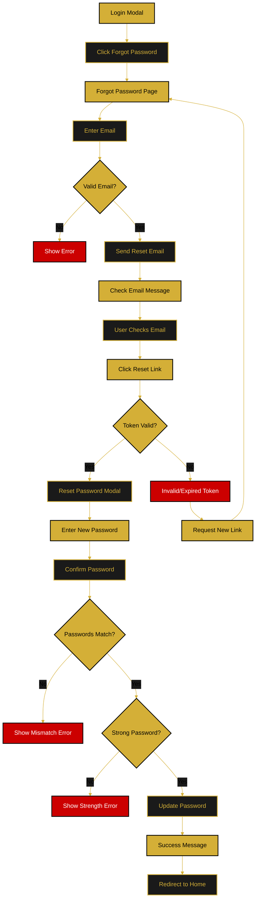

# Password Reset Flow

This document describes the planned forgot password and password reset functionality.

**Status:** 🔄 Planned Feature

---

## Flow Diagram



---

## Process Steps

### 1. Forgot Password Request
- User clicks "Forgot Password" link in login modal
- Redirected to Forgot Password page
- Enter email address
- Validate email exists in system

### 2. Reset Email
- Generate secure reset token (15-minute expiration)
- Send email with reset link
- Display "Check your email" message
- Token stored in database

### 3. Reset Link Click
- User clicks link in email
- Validate token (not expired, not used)
- Show Reset Password modal if valid
- Show error and option to request new link if invalid

### 4. Password Reset
- Enter new password
- Confirm new password
- Validate password strength
- Validate passwords match
- Update password in database
- Invalidate reset token

### 5. Completion
- Show success message
- Redirect to home page
- User can now login with new password

---

## Security Features

- **Token Expiration:** 15 minutes
- **Single Use:** Token invalidated after use
- **Secure Storage:** Hashed tokens in database
- **Email Verification:** Confirms email ownership
- **Password Requirements:** Same as registration

---

## Email Template

Subject: Reset Your Orbis Password

Body:
```
Hi [Name],

We received a request to reset your password. Click the link below to create a new password:

[Reset Password Link]

This link expires in 15 minutes.

If you didn't request this, please ignore this email.

- The Orbis Team
```

---

**Related Documents:**
- [Authentication Flow](./authentication-flow.md)
- [Main Application Flow](./main-application-flow.md)
