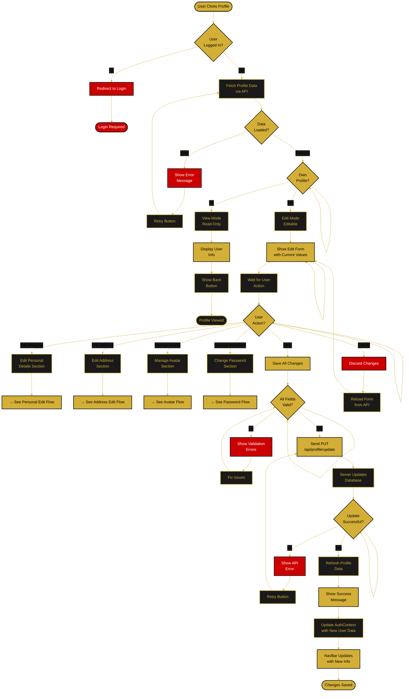

---

<!--
  ORBIS Profile Management Flow
  
  Document Type: System Flow Diagram & Documentation
  Purpose: Detailed description of user profile access, viewing, and editing
  Last Updated: December 29, 2025
  
  For implementation details: see /docs/quickstart/authentication.md
  For UI charts: see /docs/charts/profile-management-flow-chart.md
-->

# 👤 Profile Management Flow

This comprehensive document describes how users access, view, and edit their profiles, including avatar management, address updates, and settings changes.

---

## 📋 Overview

### Key Features
- ✅ View own complete profile with all sections
- ✅ Edit personal information (name, email, nickname)
- ✅ Avatar upload, preview, and deletion
- ✅ Address management with validation
- ✅ Password change functionality
- ✅ Account status and member since info
- ✅ Session-based access control
- ✅ Real-time validation feedback
- ✅ File upload progress tracking

### Access Requirements
- Must be logged in (authenticated)
- Own profile: Full edit access
- Other profiles: View-only mode (future)
- Guest users: Redirected to login

---

## 🔄 Main Profile Access Flow

---

## ✏️ Personal Details Edit Flow

```mermaid
%%{init: {'theme':'base', 'themeVariables': { 'primaryColor':'#D4AF37','primaryTextColor':'#000','primaryBorderColor':'#000','lineColor':'#D4AF37','secondaryColor':'#1a1a1a','tertiaryColor':'#333'}}}%%
graph TD
    Start([Edit Personal<br/>Details]):::gold -->
    
    FirstNameSection[First Name Section]:::black -->
    FNInput["<input type='text'<br/>maxLength='50'>"]:::gold -->
    FNCheck{Valid Name?}:::gold -->
    FNCheck -->|No| FNError[Show: Required<br/>Max 50 chars]:::error -->
    FNInput
    FNCheck -->|Yes| FNSuccess[✓ Valid]:::gold -->
    
    LastNameSection[Last Name Section]:::black -->
    LNInput["<input type='text'<br/>maxLength='50'>"]:::gold -->
    LNCheck{Valid Name?}:::gold -->
    LNCheck -->|No| LNError[Show: Required<br/>Max 50 chars]:::error -->
    LNInput
    LNCheck -->|Yes| LNSuccess[✓ Valid]:::gold -->
    
    EmailSection[Email Section]:::black -->
    EmailInput["<input type='email'<br/>required>"]:::gold -->
    EmailCheck{Email Valid?}:::gold -->
    EmailCheck -->|Invalid Format| EmailFmtErr[Show: Invalid<br/>Email Format]:::error -->
    EmailInput
    EmailCheck -->|Valid Format| CheckUnique{Email Unique<br/>or Same as<br/>Current?}:::gold -->
    CheckUnique -->|No| EmailExistsErr[Show: Email<br/>Already In Use]:::error -->
    EmailInput
    CheckUnique -->|Yes| EmailSuccess[✓ Valid]:::gold -->
    
    NicknameSection[Nickname Section]:::black -->
    NNInput["<input type='text'<br/>maxLength='100'<br/>Optional>"]:::gold -->
    NNCheck{Valid Length?}:::gold -->
    NNCheck -->|No| NNError[Show: Max<br/>100 chars]:::error -->
    NNInput
    NNCheck -->|Yes| NNSuccess[✓ Valid]:::gold -->
    
    FNSuccess --> CheckSave{Save<br/>Personal<br/>Info?}:::gold -->
    LNSuccess --> CheckSave
    EmailSuccess --> CheckSave
    NNSuccess --> CheckSave
    
    CheckSave -->|No| Cancel[Cancel Edit]:::error -->
    CancelDone([Discard Changes]):::error
    
    CheckSave -->|Yes| Update[Prepare Update<br/>Payload]:::gold -->
    UpdatePayload["<br/>{<br/>firstName,<br/>lastName,<br/>email,<br/>nickname<br/>}"]:::black -->
    
    UpdatePayload --> Validate{All Fields<br/>Present?}:::gold -->
    Validate -->|No| MissingErr[Show: All<br/>Fields Required]:::error -->
    Update
    Validate -->|Yes| Send[Send PATCH<br/>/api/profile/personal]:::gold -->
    
    Send --> ServerCheck[Server Validates<br/>& Checks Unique]:::black -->
    ServerValid{Server<br/>Validation<br/>Pass?}:::gold -->
    
    ServerValid -->|No| ServerErr[Server Returns<br/>Error Details]:::error -->
    ShowServerErr[Show Error<br/>Message]:::error -->
    Update
    
    ServerValid -->|Yes| UpdateDB[Update User<br/>in Database]:::black -->
    ReturnData[Return Updated<br/>User Object]:::gold -->
    ClientSuccess[Client Receives<br/>Updated Data]:::black -->
    UpdateContext[Update AuthContext]:::gold -->
    UpdateStorage[Update LocalStorage]:::black -->
    ShowSuccess[Show Success<br/>Message]:::gold -->
    DonePersonal([Personal Info<br/>Updated]):::gold
    
    classDef gold fill:#D4AF37,stroke:#000,stroke-width:2px,color:#000
    classDef black fill:#1a1a1a,stroke:#D4AF37,stroke-width:2px,color:#D4AF37
    classDef error fill:#cc0000,stroke:#000,stroke-width:2px,color:#fff
```

---

## 📱 Profile Component Structure

### Main Components

#### ProfilePage Component
- **Route:** `/profile`
- **State:** User data, edit mode, loading, errors
- **Protected:** Yes (requires authentication)
- **Layout:** Form with collapsible sections

#### Profile Sections
1. **Personal Details Section**
   - First Name input
   - Last Name input
   - Email input
   - Nickname input

2. **Avatar Section**
   - Current avatar display
   - Upload button
   - Delete button
   - Preview before save

3. **Address Section**
   - Street address
   - Apartment/Unit (optional)
   - City
   - State dropdown
   - Zip code
   - Country (display only, USA)

4. **Password Section**
   - Current password
   - New password with strength indicator
   - Confirm new password

5. **Account Section**
   - Member since date
   - Account status
   - Last login date
   - Email verified status

---

## 🔒 Security Features

### Password Security
- **Current Password Check:** Always verify before allowing change
- **Strength Requirements:** Min 8 chars, uppercase, lowercase, number
- **Hash Storage:** bcrypt with 10 salt rounds
- **Confirmation:** Must match new password

### File Upload Security
- **Type Validation:** JPG, PNG, GIF only
- **Size Limit:** 5MB maximum
- **Server Validation:** Double-check file type and size
- **Malware Scan:** Recommended for production
- **Unique Names:** Store with unique identifiers

### Data Validation
- **Email Uniqueness:** Check against all users
- **Format Validation:** All inputs validated client-side
- **Server Validation:** All inputs re-validated server-side
- **XSS Prevention:** All inputs sanitized

---

## 🎯 User Experience Flow

### Viewing Profile
1. Click profile icon/name in navbar
2. Profile page loads with current data
3. Display all sections with current values
4. If own profile → show edit buttons
5. If other profile → show view-only content

### Editing Profile
1. Click "Edit" button
2. Form becomes editable
3. Make changes to any section
4. Real-time validation feedback
5. Click "Save Changes"
6. Show success message
7. UI updates with new values

---

## 🔗 Related Documentation

- **[Authentication System Quickstart](../quickstart/authentication.md)** - Auth implementation details
- **[Authentication Flow](./authentication-flow.md)** - Login and registration flows
- **[Main Application Flow](./main-application-flow.md)** - Overall app navigation
- **[Profile Management Chart](../charts/profile-management-flow-chart.md)** - Visual diagrams

---

**Document Version:** 2.0  
**Last Updated:** December 29, 2025  
**Status:** ✅ Comprehensive