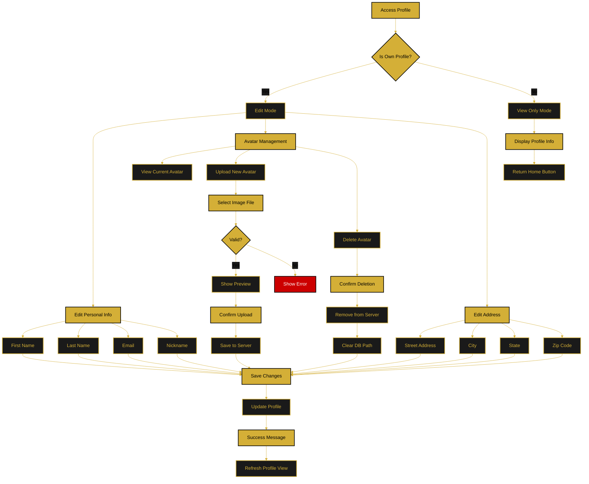

# Profile Management Flow

This document describes how users view and edit their profiles, including avatar management.

---

## Flow Diagram

---

## Profile Sections

### Personal Details
- First Name (required)
- Last Name (required)
- Email (required, validated)
- Nickname (required)

### Avatar Management
- **Upload:** 5MB max, image files only (JPG, PNG, GIF)
- **Delete:** Removes file from server and clears DB reference
- **Preview:** Shows before confirming upload
- **Current:** Displays existing avatar or default

### Address Information
- Street Address
- Apartment/Unit (optional)
- City
- State/Region
- Zip/Postal Code

---

## Access Control

- **Own Profile:** Full edit access
- **Other Profiles:** View only (future feature)
- **Guest Users:** Redirect to login

---

**Related Documents:**
- [Authentication Flow](./authentication-flow.md)
- [Main Application Flow](./main-application-flow.md)
