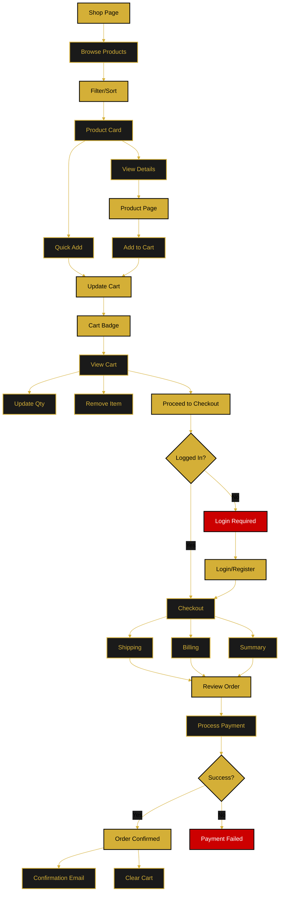

# Shop & Cart Flow

This document describes the planned e-commerce functionality including product browsing, cart management, and checkout process.

**Status:** 🔄 Planned Feature

---

## Flow Diagram

---

## Features

### Product Browsing
- Grid view with product cards
- Filter by category, price, etc.
- Sort by relevance, price, name
- Search functionality

### Cart Management
- Add/remove items
- Update quantities
- View cart total
- Cart badge shows item count
- Persistent cart (local storage)

### Checkout Process
1. **Authentication Check** - Login required
2. **Shipping Information** - Address form
3. **Billing Information** - Payment details
4. **Order Review** - Final confirmation
5. **Payment Processing** - Secure payment
6. **Order Confirmation** - Success page and email

---

## Implementation Notes

- Cart stored in localStorage for guests
- Full checkout requires authentication
- Payment gateway integration (Stripe/PayPal)
- Email confirmation after successful order
- Order history for registered users

---

**Related Documents:**
- [Gallery Flow](./gallery-flow.md)
- [Main Application Flow](./main-application-flow.md)
